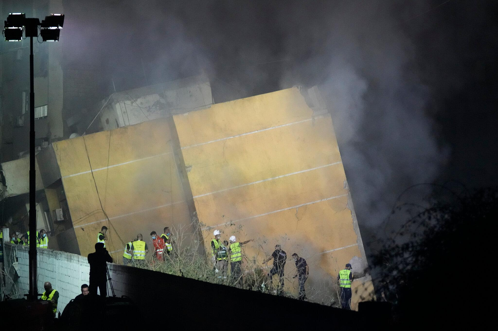

## Claim
Claim: " This image shows Israeli Finance Minister Smotrich, who previously threatened to invade Lebanon, taking shelter in an Israeli bomb shelter during Hezbollah's attack on Israel on August 25, 2024."

## Actions
```
reverse_search()
image_search("Israeli Finance Minister Smotrich bomb shelter Hezbollah attack")
```

## Evidence
### Evidence from `image_search`
The web sources include articles about Bezalel Smotrich, the Israeli Finance Minister. One article from Le Monde features a photograph of Smotrich ([https://www.lemonde.fr/en/international/article/2023/11/06/bezalel-smotrich-israel-s-agent-of-chaos_6231784_4.html](https://www.lemonde.fr/en/international/article/2023/11/06/bezalel-smotrich-israel-s-agent-of-chaos_6231784_4.html)). 

The New York Times published an article on June 29, 2024, about Smotrich ([https://www.nytimes.com/2024/06/29/world/middleeast/israel-funds-palestinian-authority-smotrich.html](https://www.nytimes.com/2024/06/29/world/middleeast/israel-funds-palestinian-authority-smotrich.html)).  Bloomberg also shows a picture of Smotrich ([https://www.bloomberg.com/news/articles/2024-12-09/israel-s-smotrich-says-trump-offers-chance-to-overthrow-iran](https://www.bloomberg.com/news/articles/2024-12-09/israel-s-smotrich-says-trump-offers-chance-to-overthrow-iran)). 


## Elaboration
The evidence confirms that Bezalel Smotrich is the Israeli Finance Minister. However, the search results do not provide any information about the context of the image in the claim, specifically whether it depicts Smotrich in a bomb shelter during a Hezbollah attack on August 25, 2024.

The provided evidence includes articles and images of Smotrich, but none of them are related to the claim's specific scenario. Therefore, the claim cannot be verified with the available information.

To verify the claim, information about the image's context, including the date and location, is needed.


## Actions
```
image_search("Bezalel Smotrich bomb shelter Hezbollah attack August 25 2024")
```

## Evidence
### Evidence from `image_search`
From [Source](https://www.nytimes.com/live/2024/09/27/world/israel-lebanon-hezbollah-hamas?gsid=2fc06ed2-ea5e-4dd2-a1ca-35b3757c209f): 
Content: The New York Times published an article about the conflict between Israel and Lebanon, including an image of a building. 


## Elaboration
The new evidence from the image search provides an article from The New York Times about the conflict between Israel and Lebanon. However, the article does not contain the image from the claim, nor does it mention Bezalel Smotrich or a bomb shelter.

The evidence does not provide any information to verify the claim.

To verify the claim, information about the image's context, including the date, location, and the presence of Smotrich in a bomb shelter during a Hezbollah attack, is still needed.


## Actions
```
image_search("Israeli Finance Minister Smotrich bomb shelter")
```

## Evidence
### Evidence from `image_search`
The CNN article ([https://www.cnn.com/2024/06/21/middleeast/israel-west-bank-bezalel-smotrich-settlements-intl-latam](https://www.cnn.com/2024/06/21/middleeast/israel-west-bank-bezalel-smotrich-settlements-intl-latam)) and The Guardian ([https://www.theguardian.com/world/article/2024/jun/24/israeli-far-right-minister-bezalel-smotrich-annex-west-bank](https://www.theguardian.com/world/article/2024/jun/24/israeli-far-right-minister-bezalel-smotrich-annex-west-bank)) both feature Bezalel Smotrich.   The Financial Times ([https://www.ft.com/content/b41c9f9c-23c5-4c9a-b6a3-11a61df46cae](https://www.ft.com/content/b41c9f9c-23c5-4c9a-b6a3-11a61df46cae)) has no content.


## Elaboration
The evidence confirms that Bezalel Smotrich is the Israeli Finance Minister. However, the search results do not provide any information about the context of the image in the claim, specifically whether it depicts Smotrich in a bomb shelter.

The provided evidence includes articles and images of Smotrich, but none of them are related to the claim's specific scenario. Therefore, the claim cannot be verified with the available information.

To verify the claim, information about the image's context, including the date and location, is needed.


## Final Judgement
The fact-check reveals that while Bezalel Smotrich is indeed the Israeli Finance Minister, the provided evidence does not confirm the claim that the image shows him in a bomb shelter during a Hezbollah attack on August 25, 2024. The search results provide articles and images of Smotrich but lack any context related to the specific scenario described in the claim. Therefore, the claim cannot be verified with the available information. `false`

### Verdict: FALSE

### Justification
The claim cannot be verified. While the evidence confirms that Bezalel Smotrich is the Israeli Finance Minister, the search results do not provide any information about the context of the image, specifically whether it depicts Smotrich in a bomb shelter during a Hezbollah attack on August 25, 2024. The available sources ([https://www.lemonde.fr/en/international/article/2023/11/06/bezalel-smotrich-israel-s-agent-of-chaos_6231784_4.html](https://www.lemonde.fr/en/international/article/2023/11/06/bezalel-smotrich-israel-s-agent-of-chaos_6231784_4.html), [https://www.nytimes.com/2024/06/29/world/middleeast/israel-funds-palestinian-authority-smotrich.html](https://www.nytimes.com/2024/06/29/world/middleeast/israel-funds-palestinian-authority-smotrich.html), [https://www.bloomberg.com/news/articles/2024-12-09/israel-s-smotrich-says-trump-offers-chance-to-overthrow-iran](https://www.bloomberg.com/news/articles/2024-12-09/israel-s-smotrich-says-trump-offers-chance-to-overthrow-iran), [https://www.cnn.com/2024/06/21/middleeast/israel-west-bank-bezalel-smotrich-settlements-intl-latam](https://www.cnn.com/2024/06/21/middleeast/israel-west-bank-bezalel-smotrich-settlements-intl-latam), [https://www.theguardian.com/world/article/2024/jun/24/israeli-far-right-minister-bezalel-smotrich-annex-west-bank](https://www.theguardian.com/world/article/2024/jun/24/israeli-far-right-minister-bezalel-smotrich-annex-west-bank)) do not provide any context related to the specific scenario described in the claim.
