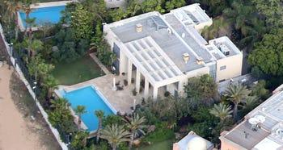

## Claim
Claim: " This image shows Israeli PM Benjamin Netanyahu's house taken by a Hezbollah drone in August 2024."

## Actions
```
reverse_search()
geolocate()
image_search("Benjamin Netanyahu house aerial view")
```

## Evidence
### Evidence from `reverse_search`
The image () is of Benjamin Netanyahu's house. According to a fact-check, the image is from 2019 and was featured in a Times of Israel article. The image is attributed to Kan public broadcaster. The Times of Israel website has a topic page dedicated to the Prime Minister's Residence, which includes articles about the residence, including those from 2024 and 2025.

The image was also found on the website [https://pesacheck.org/missing-context-this-image-of-israeli-prime-minister-benjamin-netanyahus-home-was-not-captured-by-9d48e97d86b7](https://pesacheck.org/missing-context-this-image-of-israeli-prime-minister-benjamin-netanyahus-home-was-not-captured-by-9d48e97d86b7) and [https://www.timesofisrael.com/topic/prime-ministers-residence/](https://www.timesofisrael.com/topic/prime-ministers-residence/).


### Evidence from `geolocate`
The most likely countries where the image was taken are: {'Israel': 0.17, 'Mexico': 0.15, 'Tunisia': 0.11, 'Malta': 0.1, 'Palestine': 0.07, 'Bermuda': 0.05, 'Jordan': 0.05, 'United Arab Emirates': 0.04, 'Dominican Republic': 0.03, 'Pakistan': 0.03}

### Evidence from `image_search`
Haaretz published an article about Benjamin Netanyahu's seaside villa, including an aerial view of the house (). Siasat.com also contains an image of Benjamin Netanyahu's house (). The Aviationist published an article about an attack on Benjamin Netanyahu's house, including an image of the house ().

The sources are: [https://www.haaretz.com/israel-news/security-aviation/2023-01-19/ty-article/.premium/detailed-building-plan-for-netanyahus-seaside-villa-were-available-online/00000185-c4f6-d279-a9b7-ccf770210000](https://www.haaretz.com/israel-news/security-aviation/2023-01-19/ty-article/.premium/detailed-building-plan-for-netanyahus-seaside-villa-were-available-online/00000185-c4f6-d279-a9b7-ccf770210000), [https://www.siasat.com/hezbollah-drone-flies-over-films-netanyahus-residence-report-3080894/](https://www.siasat.com/hezbollah-drone-flies-over-films-netanyahus-residence-report-3080894/), and [https://theaviationist.com/2024/10/19/netanyahus-house-attacked-by-drone/](https://theaviationist.com/2024/10/19/netanyahus-house-attacked-by-drone/).


## Elaboration
The claim that the image was taken by a Hezbollah drone in August 2024 is not supported by the evidence. The image is of Benjamin Netanyahu's house and was taken in 2019, according to a fact-check. The image was featured in a Times of Israel article. The image was also found on the website [https://pesacheck.org/missing-context-this-image-of-israeli-prime-minister-benjamin-netanyahus-home-was-not-captured-by-9d48e97d86b7](https://pesacheck.org/missing-context-this-image-of-israeli-prime-minister-benjamin-netanyahus-home-was-not-captured-by-9d48e97d86b7).

The evidence suggests that the image is of Benjamin Netanyahu's house, but the claim about the source and date of the image is false. The image was not taken by a Hezbollah drone in August 2024.


## Final Judgement
The image is of Benjamin Netanyahu's house, but the claim about the source and date of the image is false. The image was not taken by a Hezbollah drone in August 2024.

`false`

### Verdict: FALSE

### Justification
The image depicts Benjamin Netanyahu's house, but the claim that it was taken by a Hezbollah drone in August 2024 is false. The image is from 2019 and was featured in a Times of Israel article, as indicated by the fact-check and sources like [https://pesacheck.org/missing-context-this-image-of-israeli-prime-minister-benjamin-netanyahus-home-was-not-captured-by-9d48e97d86b7](https://pesacheck.org/missing-context-this-image-of-israeli-prime-minister-benjamin-netanyahus-home-was-not-captured-by-9d48e97d86b7).
