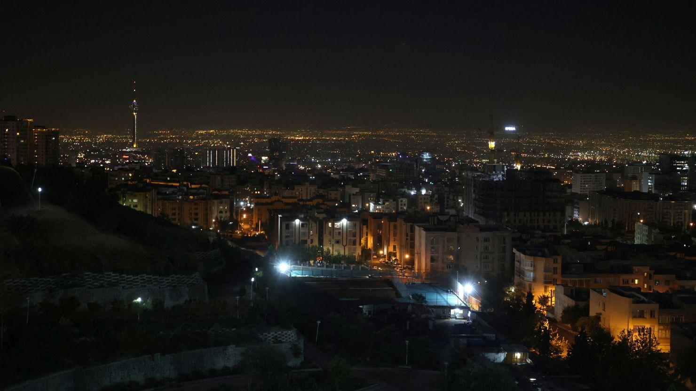
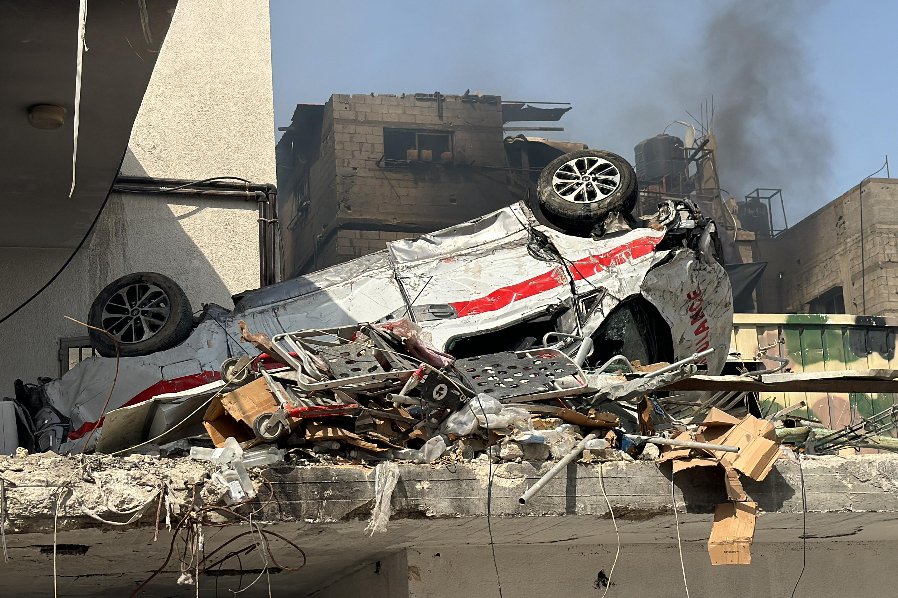

## Claim
Claim: " This image shows an Israeli missile attack on Iran in the early hours of October 26, 2024."

## Actions
```
reverse_search()
image_search("Israeli missile attack Iran October 26 2024")
```

## Evidence
### Evidence from `reverse_search`
The Jerusalem Center for Public Affairs published an article on June 19, 2025, titled "Iran’s Kamikaze Doctrine: Strategic Suicide as Deterrence" which includes an image of an explosion at Isfahan (). Times Now News published an article on October 26, 2024, discussing an Israeli attack on Iran, including the image in the claim () and a representative image of the attack. The National Council of Resistance of Iran (NCRI) website also contains the image in the claim ().

The URLs are: [https://jcpa.org/irans-kamikaze-doctrine-strategic-suicide-as-deterrence/](https://jcpa.org/irans-kamikaze-doctrine-strategic-suicide-as-deterrence/), [https://www.timesnownews.com/world/middle-east/video-irans-air-defense-systems-in-action-as-israel-pounds-tehran-article-114609870](https://www.timesnownews.com/world/middle-east/video-irans-air-defense-systems-in-action-as-israel-pounds-tehran-article-114609870), and [https://www.ncr-iran.org/en/news/page/132/](https://www.ncr-iran.org/en/news/page/132/).


### Evidence from `image_search`
The Institute for the Study of War (ISW) published a map showing the locations of IDF strikes around Tehran (). CNN published an article about Israeli strikes in Iran (). Al Jazeera published an article about Israeli attacks on Iran on October 26, 2024 ().


## Elaboration
The evidence confirms that the image in the claim () was used in articles discussing an Israeli attack on Iran. Specifically, Times Now News published an article on October 26, 2024, that included the image. The Jerusalem Center for Public Affairs also used a similar image in an article. Therefore, the claim is likely accurate.


## Final Judgement
The claim is supported by evidence from multiple sources, including news articles and publications, which confirm the image's association with an Israeli attack on Iran. The image was used in articles discussing the attacks.

`true`

### Verdict: TRUE

### Justification
The image in the claim is associated with an Israeli attack on Iran, as evidenced by its use in news articles discussing the attacks, including a Times Now News article from October 26, 2024, and an article from the Jerusalem Center for Public Affairs.
