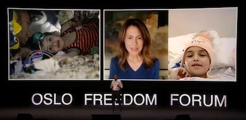

## Claim
Claim: " This image shows a palestinian child stuck under the rubble in Gaza after an Israeli airstrike in July 2024."

## Actions
```
reverse_search()
image_search("Palestinian child rubble Gaza Israeli airstrike")
```

## Evidence
### Evidence from `reverse_search`
The image shows a Syrian child named Sham who was rescued from the rubble in Armanaz, Idlib, after an earthquake on February 7, 2023. The image was taken by the Syria Civil Defense teams. The child's journey from under the rubble to a hospital in Abu Dhabi is detailed in articles from [Enab Baladi](https://english.enabbaladi.net/archives/2023/03/shams-journey-from-under-the-rubble-to-abu-dhabis-burjeel-hospital/) and [UAE Times](https://uaetimes.ae/shams-journey-from-under-the-rubble-to-abu-dhabis-burjeel-hospital/).

The image was also used in an article from [El País](https://english.elpais.com/international/2023-07-20/the-manual-of-repression-shared-by-modern-tyrants.html) about the Oslo Freedom Forum.    


### Evidence from `image_search`
Al Jazeera published an article about the war against Gaza's children (). Another source discusses the situation of Palestinian children in Gaza (). NBC News shows a video of rescue workers trying to save children trapped in Gaza City after an airstrike ().


## Elaboration
The image in the claim depicts a Syrian child, Sham, rescued from the rubble in Armanaz, Idlib, after an earthquake on February 7, 2023. This contradicts the claim that the image shows a Palestinian child in Gaza after an Israeli airstrike in July 2024. The evidence also includes images and articles about the situation of children in Gaza, but none of them are related to the image in the claim.

Therefore, the claim is false.


## Final Judgement
The image is of a Syrian child rescued after an earthquake in February 2023, not a Palestinian child in Gaza after an Israeli airstrike in July 2024. The claim misrepresents the origin and context of the image. `false`

### Verdict: FALSE

### Justification
The image in the claim shows a Syrian child, Sham, rescued from the rubble in Armanaz, Idlib, after an earthquake in February 2023, as reported by [Enab Baladi](https://english.enabbaladi.net/archives/2023/03/shams-journey-from-under-the-rubble-to-abu-dhabis-burjeel-hospital/) and [UAE Times](https://uaetimes.ae/shams-journey-from-under-the-rubble-to-abu-dhabis-burjeel-hospital/). This contradicts the claim that the image depicts a Palestinian child in Gaza after an Israeli airstrike in July 2024.
