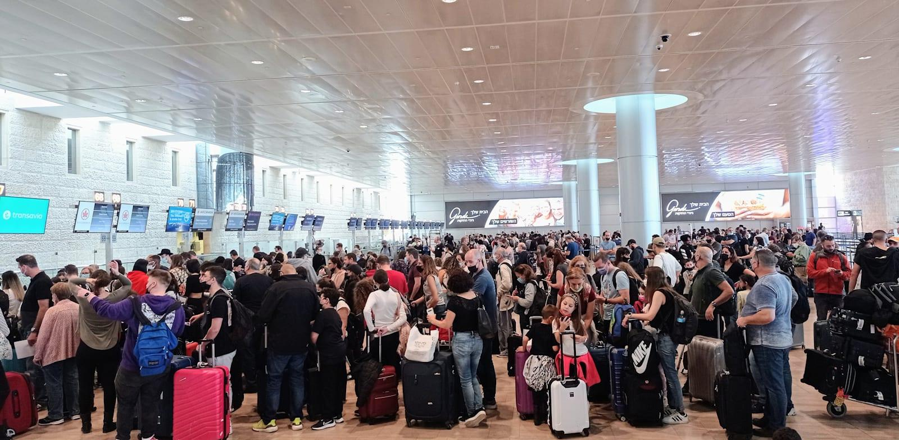

## Claim
Claim: " This image shows Israelis fleeing the airport after the Houthis attack on July 19, 2024."

## Actions
```
reverse_search()
image_search("airport crowded israel")
```

## Evidence
### Evidence from `reverse_search`
The image 

### Evidence from `image_search`
From [Source](https://en.globes.co.il/en/article-israels-crowded-airports-boost-iaa-results-1001458704): 
Content: The search result from Globes.co.il shows a crowded airport in Israel. 


## Elaboration
The image search results confirm that the image depicts a crowded airport in Israel. However, the provided evidence does not mention any attacks by Houthis or Israelis fleeing the airport.

Therefore, the claim cannot be verified based on the available evidence. Additional information is needed to confirm the context of the image, including the date and the reason for the crowd.


## Actions
```
image_search("Israel airport crowded July 19 2024")
```

## Evidence
### Evidence from `image_search`
CNN discusses the airlines impacted by the global tech outage ([https://www.cnn.com/2024/07/19/travel/the-airlines-impacted-by-the-global-tech-outage](https://www.cnn.com/2024/07/19/travel/the-airlines-impacted-by-the-global-tech-outage)). The Times of Israel published an article about thousands of people rallying nationwide ([https://www.timesofisrael.com/thousands-rally-nationwide-urge-pm-not-to-leave-for-us-before-finalizing-hostage-deal/](https://www.timesofisrael.com/thousands-rally-nationwide-urge-pm-not-to-leave-for-us-before-finalizing-hostage-deal/)). Middle East Monitor published an article stating that over 82,000 Israelis left the country in 2024 ([https://www.middleeastmonitor.com/20241231-over-82000-israelis-left-country-in-2024-official-figures-show/](https://www.middleeastmonitor.com/20241231-over-82000-israelis-left-country-in-2024-official-figures-show/)).

The provided sources do not mention the Houthis or any attacks. The images show crowded airports and rallies, but do not confirm the claim. , , 


## Elaboration
The evidence confirms that the image depicts a crowded airport in Israel. However, the provided sources do not mention any attacks by Houthis or Israelis fleeing the airport. The search results show crowded airports and rallies, but do not confirm the claim.

Therefore, the claim cannot be verified based on the available evidence.


## Actions
```
image_search("Houthi attack Israel airport July 19 2024")
```

## Evidence
### Evidence from `image_search`
Al-Monitor reports on an Israeli strike on Houthi targets in Yemen, one day after a drone attack on Tel Aviv, with an image of a fire . Al Jazeera published an article on July 21, 2024, discussing the US foreign policy failures against the Houthis, including an image of explosions . The search results do not mention any attacks on the airport.


## Elaboration
The evidence indicates that there were attacks and explosions related to the Houthis around the time frame mentioned in the claim. However, there is no evidence to support the claim that the image shows Israelis fleeing the airport after a Houthi attack.

Therefore, the claim is unverified.


## Final Judgement
The image shows a crowded airport in Israel, but there is no evidence to support the claim that it depicts Israelis fleeing after a Houthi attack on July 19, 2024. The search results show attacks and explosions related to the Houthis, but not at the airport.

`false`

### Verdict: FALSE

### Justification
The image depicts a crowded airport in Israel, but there is no evidence to support the claim that it shows Israelis fleeing after a Houthi attack on July 19, 2024. While there were attacks and explosions related to the Houthis around that time, the search results do not mention any attacks on the airport. Therefore, the claim is unverified.
