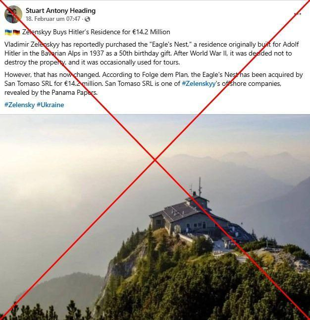
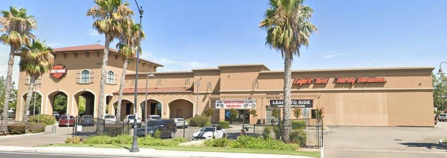
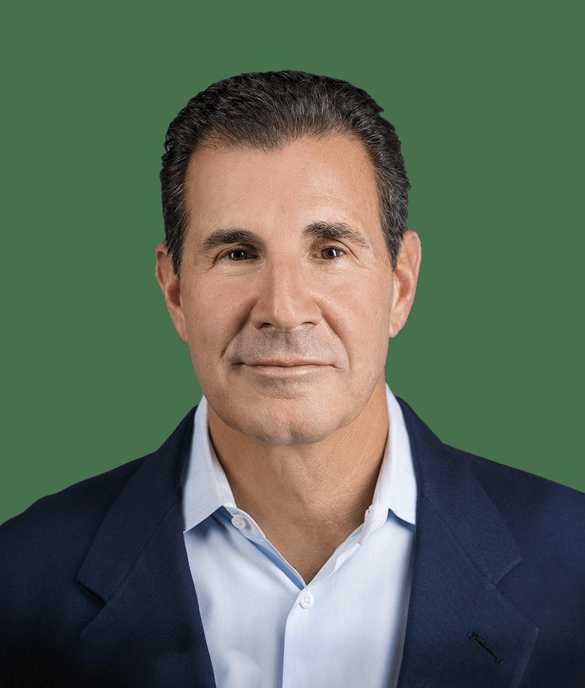

## Claim
Claim: "Ukrainian President Volodymyr Zelenskyy purchased the Eagle's Nest, or Kehlsteinhaus, in Berchtesgaden in the southern German state of Bavaria, for 14.2 million euros."

## Actions
```
web_search("Volodymyr Zelenskyy Eagle's Nest purchase")
```

## Evidence
### Evidence from `web_search`
A fact-check from aol.com, published on February 20, 2025, states that the claim that Volodymyr Zelenskyy purchased the Eagle's Nest is false, and that the Eagle's Nest is still owned by the Free State of Bavaria (). An article from EADaily, published on February 8, 2025, claims that Zelenskyy purchased the Eagle's Nest for €14.2 million through an offshore company ().

Another article, published on February 27, 2025, debunks a claim that Zelenskyy purchased a villa on Saint Barthelemy island, stating that the claim originated from pro-Russian sources. The article includes images of the villa (, ) and a document that was confirmed as fake ().


## Elaboration
The evidence presents conflicting information. A fact-check from aol.com states that the claim is false, and the Eagle's Nest is still owned by the Free State of Bavaria. However, an article from EADaily claims that Zelenskyy purchased the Eagle's Nest for €14.2 million through an offshore company.

The evidence also includes information about a debunked claim regarding Zelenskyy purchasing a villa, which originated from pro-Russian sources. This suggests that claims about Zelenskyy's property purchases may be subject to misinformation.

Given the conflicting information, the claim's veracity cannot be definitively determined. Further investigation is needed to verify the ownership of the Eagle's Nest.


## Actions
```
web_search("Eagle's Nest ownership")
```

## Evidence
### Evidence from `web_search`
A fact-check from cedmohub.eu states that the claim that Volodymyr Zelenskyy purchased the Eagle's Nest is false, and the Bavarian state still owns it (, ). The Eagle's Nest is a building in Obersalzberg, Germany, now a restaurant and tourist destination, as stated by Wikipedia (, , ). Another source discusses the sale of Eagle's Nest Harley-Davidson in Lathrop, California, to Jay and Andrew Westbrook, with the seller being the Davis family (, , , ).


## Elaboration
The evidence from cedmohub.eu and aol.com confirms that the claim is false, and the Bavarian state still owns the Eagle's Nest. The additional search results also mention the Eagle's Nest as a tourist destination and a Harley-Davidson dealership, but they do not provide any information to support the claim.


## Final Judgement
The claim that Volodymyr Zelenskyy purchased the Eagle's Nest is demonstrably false. Multiple sources, including fact-checkers, confirm that the Bavarian state still owns the property. `false`

### Verdict: FALSE

### Justification
The claim is false. Fact-checks from aol.com and cedmohub.eu ([cedmohub.eu](https://www.cedmohub.eu/en/news/did-zelenskyy-buy-the-eagles-nest-in-bavaria/)) confirm that the Eagle's Nest is still owned by the Free State of Bavaria.
