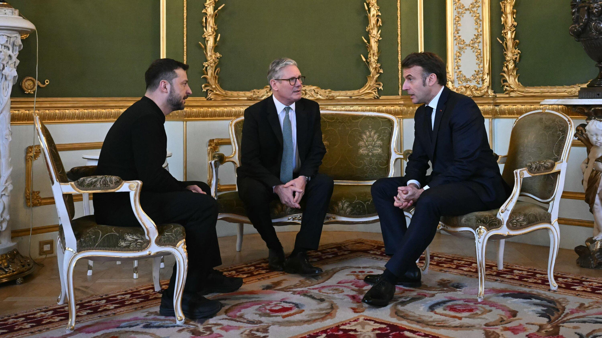
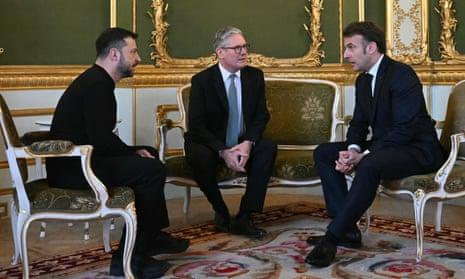

## Claim
Claim: " This is an authentic image of world leaders taking off their suits to symbolically support Ukraine at the London summit on Ukraine on March 2, 2025."

## Actions
```
image_search("European leaders take off suits Ukraine")
web_search("London summit on Ukraine March 2 2023")
```

## Evidence
### Evidence from `image_search`
The Los Angeles Times published an image of European leaders with Volodymyr Zelenskyy. () The New York Times published an article about the London summit on Ukraine on March 2, 2025, which includes a photograph of a meeting between Zelensky, Starmer, and Macron. ()

PBS NewsHour published an article about Ukraine and European allies urging Putin to commit to a 30-day ceasefire, which includes a photograph of Zelenskyy and Macron. ()


### Evidence from `web_search`
The 2025 London Summit on Ukraine, officially titled the Securing Our Future London Summit, was held on March 2, 2025, in London, hosted by British Prime Minister Keir Starmer. The summit aimed to create a "coalition of the willing" to present a peace plan for the Russian invasion of Ukraine. Participants included leaders from 16 states, the EU, and NATO. The summit resulted in a four-point plan and commitments, including £1.6 billion in UK export finances for air defense missiles manufactured in Belfast and a £2.2 billion loan for military aid to Ukraine backed by frozen Russian assets. The summit followed a meeting between Ukrainian President Volodymyr Zelenskyy and U.S. President Donald Trump.

The summit was attended by several European leaders, including Volodymyr Zelensky, Keir Starmer, and Emmanuel Macron. Reuters reports on the summit, mentioning that Russian parliamentarians dismissed the summit, stating it produced no plan to settle the war in Ukraine.   

Relevant URLs:
*   [https://en.wikipedia.org/wiki/2025_London_Summit_on_Ukraine](https://en.wikipedia.org/wiki/2025_London_Summit_on_Ukraine)
*   [https://www.lemonde.fr/en/international/article/2025/03/03/at-london-summit-starmer-defends-french-british-peace-plan-for-ukraine_6738743_4.html](https://www.lemonde.fr/en/international/article/2025/03/03/at-london-summit-starmer-defends-french-british-peace-plan-for-ukraine_6738743_4.html)
*   [https://www.reuters.com/world/europe/russian-lawmaker-says-ukraine-can-only-count-improved-moscow-washington-ties-2025-03-02/](https://www.reuters.com/world/europe/russian-lawmaker-says-ukraine-can-only-count-improved-moscow-washington-ties-2025-03-02/)


## Elaboration
The evidence confirms the existence of the London Summit on Ukraine on March 2, 2025, attended by European leaders, including Zelenskyy, Starmer, and Macron. The summit aimed to create a peace plan for the Russian invasion of Ukraine. The image search results show various photos of the summit, including meetings between Zelenskyy, Starmer, and Macron. However, the evidence does not explicitly confirm that the image in the claim is authentic or that the leaders took off their suits to support Ukraine.

Therefore, the claim's veracity cannot be fully confirmed based on the provided evidence. Additional information is needed to verify the authenticity of the image and the context of the leaders removing their suits.


## Actions
```
reverse_search()
```

## Evidence
No new evidence found.

## Elaboration
The evidence confirms the London Summit on Ukraine occurred on March 2, 2025, and that Zelenskyy, Starmer, and Macron attended. However, the reverse image search did not yield any results. Therefore, the claim's veracity cannot be confirmed. More information is needed to verify the authenticity of the image and the context of the leaders removing their suits.


## Actions
```
web_search("London summit on Ukraine March 2 2025 leaders suits")
```

## Evidence
### Evidence from `web_search`
The Prime Minister of Canada, Justin Trudeau, participated in the Securing our Future Summit in London, United Kingdom, on March 2, 2025. The summit, hosted by the Prime Minister of the United Kingdom, Sir Keir Starmer, brought together Euro-Atlantic and NATO leaders to support Ukraine. The summit resulted in new sanctions against individuals and entities. The Guardian published an article about the London summit on Ukraine on March 2, 2025, hosted by Keir Starmer, mentioning the attendance of Volodymyr Zelenskyy, Emmanuel Macron, and other leaders. Neither article mentions leaders taking off their suits. ()

Relevant URLs:
*   [https://www.pm.gc.ca/en/news/news-releases/2025/03/02/standing-united-in-support-of-ukraine](https://www.pm.gc.ca/en/news/news-releases/2025/03/02/standing-united-in-support-of-ukraine)
*   [https://www.theguardian.com/world/2025/mar/02/keir-starmer-peace-talks-ukraine-key-takeaways-london-summit](https://www.theguardian.com/world/2025/mar/02/keir-starmer-peace-talks-ukraine-key-takeaways-london-summit)


## Elaboration
The evidence confirms the London Summit on Ukraine on March 2, 2025, and the attendance of several leaders. However, the search results do not mention leaders taking off their suits. Therefore, the claim cannot be verified.


## Final Judgement
The evidence confirms the London Summit on Ukraine on March 2, 2025, and the attendance of several leaders. However, the search results do not mention leaders taking off their suits. The image search did not yield any results. Therefore, the claim cannot be verified.

`not enough information`

### Verdict: NEI

### Justification
The claim that European leaders took off their suits to support Ukraine at the London summit on March 2, 2025, cannot be verified. While the summit did occur and was attended by several leaders, including Zelenskyy, Starmer, and Macron, the provided evidence, including image and web searches, does not mention or depict leaders removing their suits.
