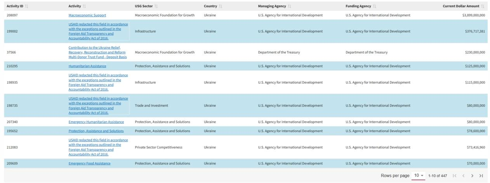
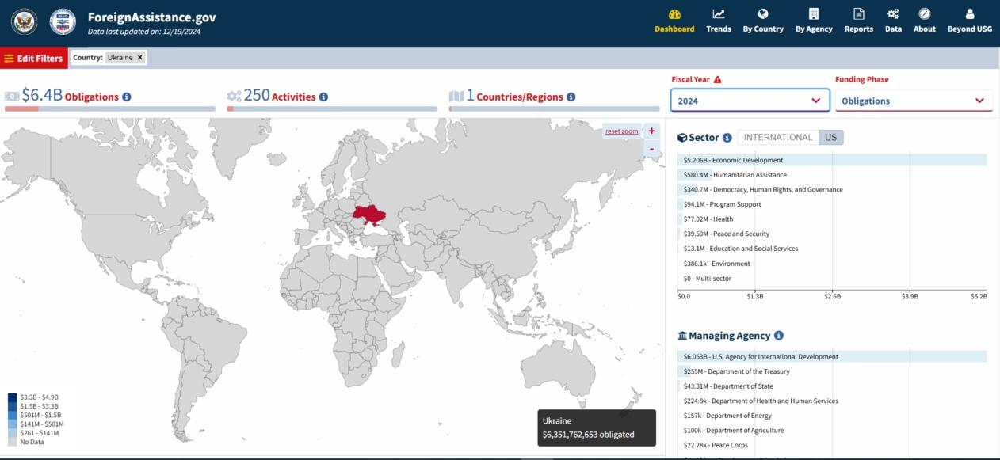

## Claim
Claim: " This image shows a screenshot of an authentic Fox News article with the title 'Psychological and Information Warfare Center of Ukraine received $140,000,000 per month from USAID'."

## Actions
```
web_search("Aubrie Spady Fox News")
web_search("Psychological and Information Warfare Center of Ukraine USAID")
```

## Evidence
### Evidence from `web_search`
The search results include a Fox News article written by Aubrie Spady about the "Psychological and Information Warfare Center of Ukraine" receiving $140,000,000 per month from USAID.  Aubrie Spady is a writer for Fox News Digital, who joined in 2021.

Another article discusses Aubrie Spady's work at Fox News, her coverage of energy and environmental issues, and her father's conservative connections. 


### Evidence from `web_search`
The claim that Fox News published an article stating that the "Psychological and Information Warfare Center of Ukraine" received $140,000,000 per month from USAID is false. The article was not found on the Fox News website, and the author, Aubrie Spady, did not publish any articles on February 10, 2025, mentioning the Ukrainian center. The claim is a manipulated screenshot of an alleged Fox News article. The 72nd Psychological and Information Warfare Center is a unit of the Ukrainian Special Operations Forces.

The article from [gwaramedia.com](https://gwaramedia.com/en/debunking-russian-fakes-no-fox-news-didnt-write-about-ukraines-center-for-information-operations-receiving-140m-per-month-from-the-usaid/) debunks the claim. The article from [dw.com](https://www.dw.com/en/fact-check-disinformation-spikes-after-trump-zelenskyy-row/a-71832118) fact-checks the claim. The Wikipedia article ([en.wikipedia.org/wiki/72nd_Psychological_and_Information_Warfare_Center_(Ukraine)](https://en.wikipedia.org/wiki/72nd_Psychological_and_Information_Warfare_Center_(Ukraine))) discusses the 72nd Psychological and Information Warfare Center. , , , , , , 


## Elaboration
The claim is false. The provided evidence indicates that the image is a manipulated screenshot of an alleged Fox News article. The article was not found on the Fox News website, and Aubrie Spady did not publish any articles on February 10, 2025, mentioning the Ukrainian center.


## Final Judgement
The claim is demonstrably false because the article in the image is a manipulated screenshot. The article was not found on the Fox News website, and the author did not publish any articles on the date mentioned in the claim. `false`

### Verdict: FALSE

### Justification
The claim is false. The image is a manipulated screenshot of a purported Fox News article that did not exist. The article was not found on the Fox News website, and the author, Aubrie Spady, did not publish any articles on February 10, 2025, mentioning the Ukrainian center, as confirmed by multiple sources, including [gwaramedia.com](https://gwaramedia.com/en/debunking-russian-fakes-no-fox-news-didnt-write-about-ukraines-center-for-information-operations-receiving-140m-per-month-from-the-usaid/) and [dw.com](https://www.dw.com/en/fact-check-disinformation-spikes-after-trump-zelenskyy-row/a-71832118).
