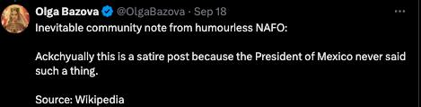
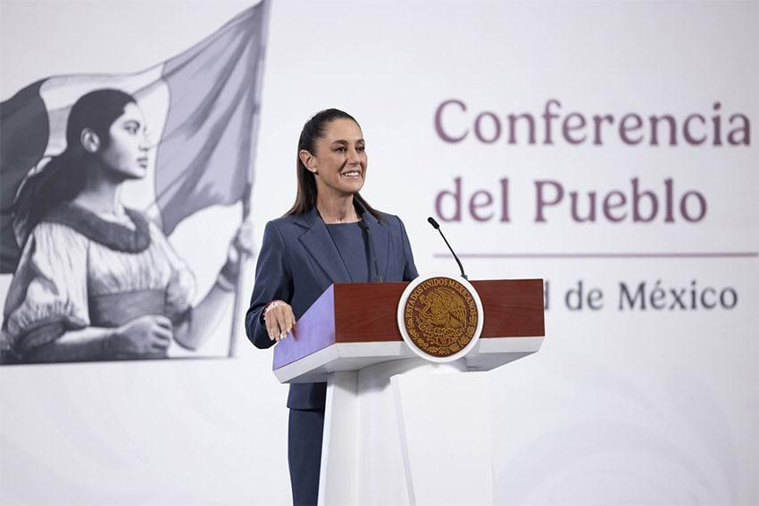

## Claim
Claim: "Mexican President-elect Claudia Sheinbaum rejected an invitation to Ukraine by Volodymr Zelenskyy and said towards him on September 17, 2024: 'If I wanted to see a drug addict, I'd just take a walk around Tijuana.'"

## Actions
```
web_search("Claudia Sheinbaum Zelenskyy Ukraine invitation")
web_search("Claudia Sheinbaum Tijuana drug addict")
```

## Evidence
### Evidence from `web_search`
Claudia Sheinbaum, the Mexican President-elect, declined an invitation from Ukrainian President Volodymyr Zelenskyy to visit Ukraine, according to reports from IntelliNews ([https://www.intellinews.com/mexico-s-president-elect-sheinbaum-turns-down-zelensky-s-invitation-to-ukraine-344262/](https://www.intellinews.com/mexico-s-president-elect-sheinbaum-turns-down-zelensky-s-invitation-to-ukraine-344262/)), Euromaidan Press ([https://euromaidanpress.com/2024/09/18/mexican-president-elect-declines-zelenskyys-invitation-to-visit-ukraine/](https://euromaidanpress.com/2024/09/18/mexican-president-elect-declines-zelenskyys-invitation-to-visit-ukraine/)), and NV.ua ([https://english.nv.ua/nation/sheinbaum-declines-zelenskyy-s-invitation-focuses-on-domestic-issues-50451798.html](https://english.nv.ua/nation/sheinbaum-declines-zelenskyy-s-invitation-focuses-on-domestic-issues-50451798.html)). Sheinbaum cited her focus on domestic issues as the reason. The articles do not contain the quote in the claim. , , 


### Evidence from `web_search`
The claim that Claudia Sheinbaum made a statement about Volodymyr Zelenskyy is false. According to [mimikama.org](https://www.mimikama.org/en/sheinbaum-fake-quote-zelenskyj-drugs/), the quote was fabricated, and a spokeswoman confirmed this. [StopFake.org](https://www.stopfake.org/en/fake-mexican-president-refuses-to-visit-ukraine-calling-zelensky-a-drug-addict/) also reports the claim as false, stating that while Sheinbaum did reject an invitation to visit Ukraine, the attributed quote is a fabrication. <image:k>, 

Additionally, a tweet from Olga Bazova confirms that the statement is satire. [Mexico News Daily](https://mexiconewsdaily.com/politics/sheinbaum-trump-mexico-petrified-of-cartels/) reports on Sheinbaum's response to Donald Trump's claims about drug cartels in Mexico. 


## Elaboration
The evidence confirms that the quote attributed to Claudia Sheinbaum is false. Multiple sources, including mimikama.org ([https://www.mimikama.org/en/sheinbaum-fake-quote-zelenskyj-drugs/](https://www.mimikama.org/en/sheinbaum-fake-quote-zelenskyj-drugs/)) and StopFake.org ([https://www.stopfake.org/en/fake-mexican-president-refuses-to-visit-ukraine-calling-zelensky-a-drug-addict/](https://www.stopfake.org/en/fake-mexican-president-refuses-to-visit-ukraine-calling-zelensky-a-drug-addict/)), explicitly state that the quote is a fabrication. Additionally, a tweet from Olga Bazova confirms the statement is satire.


## Final Judgement
The claim is demonstrably false. While Claudia Sheinbaum did decline an invitation to visit Ukraine, the quote attributed to her is a fabrication, as confirmed by multiple fact-checking sources.

`false`


### Verdict: FALSE

### Justification
The claim is false. While Claudia Sheinbaum declined an invitation to visit Ukraine, the quote attributed to her is fabricated, as confirmed by fact-checking sources like [mimikama.org](https://www.mimikama.org/en/sheinbaum-fake-quote-zelenskyj-drugs/) and [StopFake.org](https://www.stopfake.org/en/fake-mexican-president-refuses-to-visit-ukraine-calling-zelensky-a-drug-addict/).
