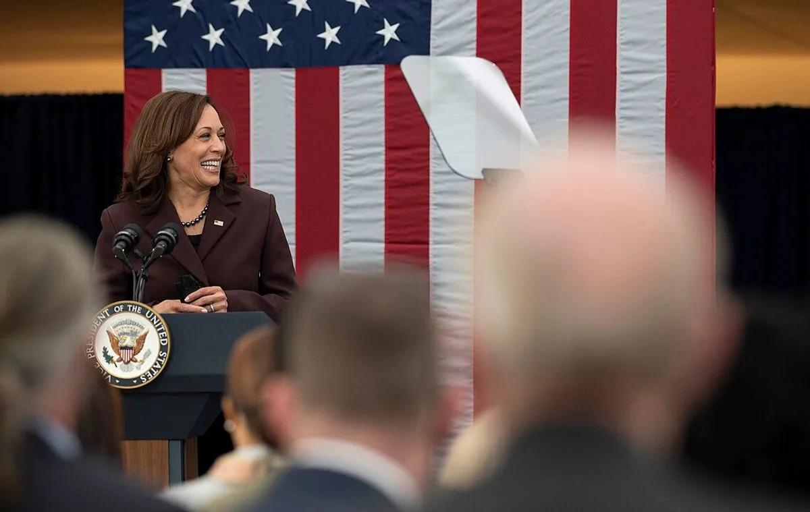

## Claim
Claim: "On July 22, 2024, Vice President Kamala Harris said, 'Our support for Israel will continue' amid Israeli Prime Minister Benjamin Netanyahu’s visit to the United States."

## Actions
```
web_search("Kamala Harris Israel support July 22 2024")
```

## Evidence
### Evidence from `web_search`
Yahoo News ([https://www.yahoo.com/news/fact-check-kamala-harris-didnt-220500437.html](https://www.yahoo.com/news/fact-check-kamala-harris-didnt-220500437.html)) fact-checks the claim and rates it as "False". It states that while Harris did not use those exact words on July 22, 2024, she has continuously supported Israel. NPR ([https://www.npr.org/2024/08/23/g-s1-19232/kamala-harris-israel-gaza-dnc](https://www.npr.org/2024/08/23/g-s1-19232/kamala-harris-israel-gaza-dnc)) reports that on July 25, 2024, Harris met with Israeli Prime Minister Benjamin Netanyahu and said she held an “unwavering commitment to Israel.” CNN ([https://www.cnn.com/2024/07/25/politics/kamala-harris-israel-policy](https://www.cnn.com/2024/07/25/politics/kamala-harris-israel-policy)) also mentions the July 25, 2024 meeting and that Harris reiterated her "unwavering support for Israel." , , , , , <image:i>, <image:j>, <image:k>


## Elaboration
The claim is false. According to a fact-check by Yahoo News ([https://www.yahoo.com/news/fact-check-kamala-harris-didnt-220500437.html](https://www.yahoo.com/news/fact-check-kamala-harris-didnt-220500437.html)), Harris did not make the specific statement on July 22, 2024.

However, the evidence indicates that Harris has expressed support for Israel. On July 25, 2024, she met with Israeli Prime Minister Benjamin Netanyahu and reiterated her commitment to Israel, as reported by NPR ([https://www.npr.org/2024/08/23/g-s1-19232/kamala-harris-israel-gaza-dnc](https://www.npr.org/2024/08/23/g-s1-19232/kamala-harris-israel-gaza-dnc)) and CNN ([https://www.cnn.com/2024/07/25/politics/kamala-harris-israel-policy](https://www.cnn.com/2024/07/25/politics/kamala-harris-israel-policy)).


## Final Judgement
The claim that Kamala Harris made the specific statement "Our support for Israel will continue" on July 22, 2024, is false. Fact-checks from Yahoo News confirm that she did not use those exact words on that date. However, she has expressed support for Israel on other occasions, including a meeting with Benjamin Netanyahu on July 25, 2024.

`false`


### Verdict: FALSE

### Justification
The claim is false. While Kamala Harris has expressed support for Israel, she did not make the specific statement on July 22, 2024, according to a fact-check by Yahoo News ([https://www.yahoo.com/news/fact-check-kamala-harris-didnt-220500437.html](https://www.yahoo.com/news/fact-check-kamala-harris-didnt-220500437.html)).
