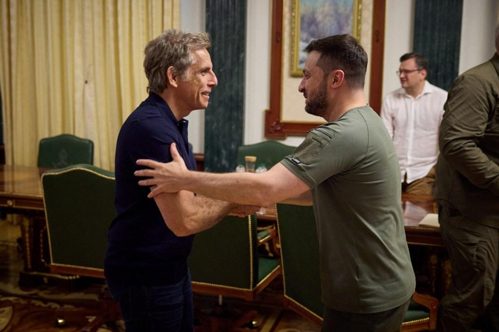

## Claim
Claim: " This image shows Ben Stiller and Ukrainian President Volodymyr Zelensky at their meeting on June 20, 2022, for which Stiller received $4 million from USAID."

## Actions
```
web_search("Ben Stiller Volodymyr Zelensky meeting June 20 2022")
web_search("Ben Stiller USAID Ukraine")
```

## Evidence
### Evidence from `web_search`
Ben Stiller met with Ukrainian President Volodymyr Zelenskyy in Kyiv on June 20, 2022, as part of his visit as a goodwill ambassador for the United Nations High Commissioner for Refugees (UNHCR) according to ABC News ([https://abcnews.go.com/International/ben-stiller-meets-volodymyr-zelenskyy-ukraine-world-refugee/story?id=85517989](https://abcnews.go.com/International/ben-stiller-meets-volodymyr-zelenskyy-ukraine-world-refugee/story?id=85517989)), The New York Post ([https://nypost.com/2022/06/20/ben-stiller-met-with-zelensky-in-ukraine-on-world-refugee-day/](https://nypost.com/2022/06/20/ben-stiller-met-with-zelensky-in-ukraine-on-world-refugee-day/)), and the BBC ([https://www.bbc.com/news/av/world-61875351](https://www.bbc.com/news/av/world-61875351)).

The sources do not mention Stiller receiving $4 million from USAID. , , , , , 


### Evidence from `web_search`
The sources discuss Ben Stiller's visit to Ukraine in June 2022 and refute claims that he received $4 million from USAID for the trip. Stiller stated that he self-funded his humanitarian trip. The sources include articles from Vanity Fair ([https://www.vanityfair.com/hollywood/story/ben-stiller-denies-elon-musks-retweet-claiming-usaid-funded-the-stars-trip-to-ukraine?srsltid=AfmBOoqmZtyUwoMPiFsX8zL7DdXJOT30rVSXIZLNyC8z9NQ6jnf-Uufb](https://www.vanityfair.com/hollywood/story/ben-stiller-denies-elon-musks-retweet-claiming-usaid-funded-the-stars-trip-to-ukraine?srsltid=AfmBOoqmZtyUwoMPiFsX8zL7DdXJOT30rVSXIZLNyC8z9NQ6jnf-Uufb)), IMDB ([https://www.imdb.com/news/ni65111956/](https://www.imdb.com/news/ni65111956/)), and MSNBC ([https://www.msnbc.com/morning-joe/watch/-totally-false-actor-ben-stiller-debunks-claims-usaid-funded-ukraine-trip-231285317684](https://www.msnbc.com/morning-joe/watch/-totally-false-actor-ben-stiller-debunks-claims-usaid-funded-ukraine-trip-231285317684)).

The articles mention a video alleging that Stiller received money from USAID, which he denied.  The UNHCR confirmed that Stiller is not compensated for his work with UNHCR and self-funds his travel. 


## Elaboration
The claim that Ben Stiller received $4 million from USAID is false. Multiple sources confirm that Stiller met with Zelensky on June 20, 2022, but they also state that Stiller self-funded his humanitarian trip and denied receiving any money from USAID.


## Final Judgement
The claim is false because the evidence indicates that Ben Stiller did not receive $4 million from USAID for his meeting with Zelensky. Stiller self-funded his trip.

`false`

### Verdict: FALSE

### Justification
The claim is false. While Ben Stiller did meet with Volodymyr Zelenskyy on June 20, 2022, as confirmed by sources like [ABC News](https://abcnews.go.com/International/ben-stiller-meets-volodymyr-zelenskyy-ukraine-world-refugee/story?id=85517989), [The New York Post](https://nypost.com/2022/06/20/ben-stiller-met-with-zelensky-in-ukraine-on-world-refugee-day/), and the [BBC](https://www.bbc.com/news/av/world-61875351), there is no evidence to support the assertion that he received $4 million from USAID. Stiller himself denied receiving any such funds, and sources like [Vanity Fair](https://www.vanityfair.com/hollywood/story/ben-stiller-denies-elon-musks-retweet-claiming-usaid-funded-the-stars-trip-to-ukraine?srsltid=AfmBOoqmZtyUwoMPiFsX8zL7DdXJOT30rVSXIZLNyC8z9NQ6jnf-Uufb) and MSNBC confirm that he self-funded the trip.
