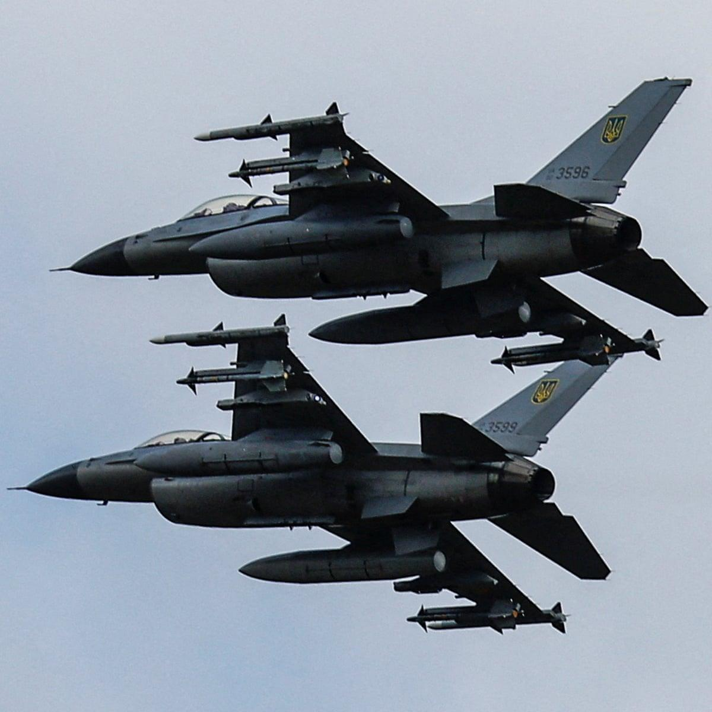

## Claim
Claim: " This image shows a US F-16 fighter jet which was shot down in August 2024 in airspace over the Black Sea after refusing to obey Russian orders."

## Actions
```
image_search("F-16 shot down Black Sea August 2024")
reverse_search()
```

## Evidence
### Evidence from `image_search`
NPR published an article about a Ukrainian F-16 warplane crash (). The Guardian published an article on August 28, 2024, about the war in Ukraine, including a photograph of F-16 fighter jets ().


### Evidence from `reverse_search`
The image () shows a Russian MiG-29S Fulcrum, not a US F-16. The image depicts a mid-air collision between two Russian MiG-29s during an airshow in Fairford, United Kingdom, on July 24, 1993. The pilot can be seen ejecting.

The image is available on [Airteamimages.com](https://www.airteamimages.com/mikoyan-gurevich-mig-29_925_russia---russian-air-force_48672), [Peakpx.com](https://www.peakpx.com/en/hd-wallpaper-desktop-oyvnm), and [Factcheckkorea.afp.com](https://factcheckkorea.afp.com/doc.afp.com.324U6AA).


## Elaboration
The claim is false. The image depicts a Russian MiG-29, not a US F-16. The image shows a mid-air collision during an airshow in 1993.


## Final Judgement
The image shows a Russian MiG-29, not a US F-16, and the event depicted is a mid-air collision during an airshow in 1993, not a shooting down in 2024. The claim misrepresents the aircraft, the event, and the date.

`misleading`

### Verdict: MISLEADING

### Justification
The image in the claim depicts a Russian MiG-29, not a US F-16, and shows a mid-air collision during an airshow in 1993, not a shooting down in 2024. The claim is therefore misleading.
