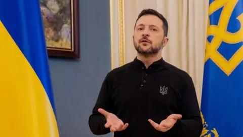

## Claim
Claim: "Russian President Vladimir Putin has declared war on the United States."

## Actions
```
web_search("Vladimir Putin declares war on United States")
```

## Evidence
### Evidence from `web_search`
Fact Crescendo states that there has been no official declaration of war by Russia against the USA, and the claim is unfounded and incorrect. The article can be found here: [Source](https://srilanka.factcrescendo.com/english/did-russia-declare-war-against-the-usa/) .

The BBC article discusses the war in Ukraine, Putin's goals, and his claims about NATO expansion. The article can be found here: [Source](https://www.bbc.com/news/articles/cj0q964851po) , , . The article "What Putin Fears Most" discusses Putin's policies towards the United States and his blaming of the United States for assisting democratic breakthroughs in other countries. The article can be found here: [Source](https://www.journalofdemocracy.org/articles/what-putin-fears-most/) .


## Elaboration
The evidence indicates that the claim is false. Fact Crescendo explicitly states that there has been no official declaration of war by Russia against the USA, and the claim is unfounded and incorrect.


## Final Judgement
The search results confirm that there has been no official declaration of war by Russia against the United States. The evidence provided by Fact Crescendo directly refutes the claim.

`false`


### Verdict: FALSE

### Justification
Based on the fact-check, the claim is false. A search result from [Fact Crescendo](https://srilanka.factcrescendo.com/english/did-russia-declare-war-against-the-usa/) explicitly states that there has been no official declaration of war by Russia against the USA.
