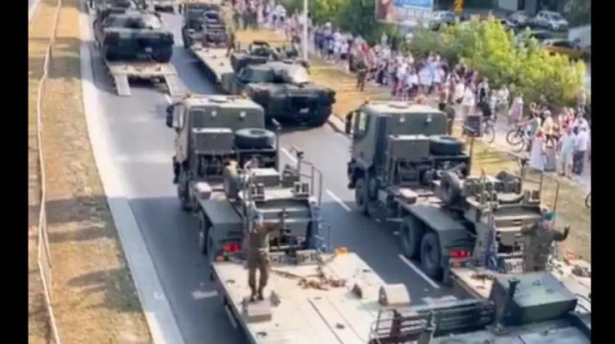

## Claim
Claim: " This image shows a military parade of Poland's army on August 14, 2024, preparing for war with Russia."

## Actions
```
reverse_search()
web_search("Poland military parade August 14 2024")
```

## Evidence
### Evidence from `web_search`
The Associated Press reported on Poland's military parade on August 15, 2024, which was part of the annual Armed Forces Day observances in Warsaw, Poland (). The Polish Ministry of Defence announced a military parade on August 15, 2024, as part of a four-day celebration from August 14 to 17, showcasing military hardware and expressing "strength, agency and unity" in the face of "threats from the East" ().

The parade is an annual event on August 15, commemorating the 1920 victory over Soviet Russia at the Battle of Warsaw.


## Elaboration
The claim that the image shows a military parade on August 14, 2024, is partially correct. The evidence indicates that the parade was part of a four-day celebration that started on August 14, 2024, and the parade itself took place on August 15, 2024.

The evidence also suggests that the parade was an annual event, part of the Armed Forces Day observances, and commemorated the 1920 victory over Soviet Russia. The Polish Ministry of Defence stated that the parade was to showcase military hardware and express "strength, agency and unity" in the face of "threats from the East."

The evidence does not explicitly state that the parade was preparing for war with Russia, but it does mention "threats from the East."


## Final Judgement
The image is of a military parade in Poland, which aligns with the claim. However, the claim incorrectly states the date as August 14, 2024, when the parade was on August 15, 2024. The claim also suggests the parade was preparing for war with Russia, which is not explicitly stated in the evidence, although the context of "threats from the East" is mentioned. Therefore, the claim is misleading.

`misleading`

### Verdict: MISLEADING

### Justification
The image depicts a military parade in Poland, which was part of the annual Armed Forces Day observances. The parade took place on August 15, 2024, not August 14, as the claim states. While the parade showcased military hardware and expressed unity in the face of "threats from the East" ([Associated Press](https://apnews.com/article/poland-military-parade-warsaw-russia-ukraine-099696999999)), the evidence does not explicitly state that it was preparing for war with Russia.
