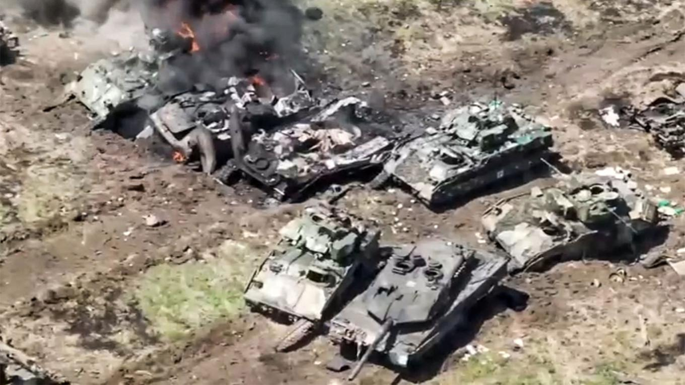

## Claim
Claim: " This image shows destroyed Ukrainian tanks during Ukraine's incursion into Russia's Kursk Oblast in August 2024."

## Actions
```
reverse_search()
web_search("Ukraine Russia Kursk Oblast August 2024")
```

## Evidence
### Evidence from `reverse_search`
The image in the claim () appears in multiple articles. One article from Sputnik Africa, published on October 17, 2024, discusses Ukraine's loss of Leopard tanks since February 2022, including images of Leopard 2 tanks (, ). Another article from The Moscow Times, published on June 13, 2023, mentions the capture of German Leopard tanks and U.S. Bradley infantry fighting vehicles in the Zaporizhzhia region and includes the same image as the claim (). A third article from Defence Security Asia, published on May 19, 2024, discusses the destruction of German-made Leopard tanks in Ukraine and includes an image of a captured Leopard 2A6 tank (). None of the articles mention Ukraine's incursion into Russia's Kursk Oblast in August 2024.


### Evidence from `web_search`
The web sources discuss the Ukrainian incursion into Russia's Kursk Oblast in August 2024. One source, from Wikipedia, details the Kursk campaign, which began on August 6, 2024, and involved Ukrainian, Russian, and North Korean forces. The article also mentions the White House seeking an understanding from Ukraine regarding the incursion. Another source, from CNN, discusses the incursion and a Russian counteroffensive. The Al Jazeera article, published on August 29, 2024, discusses Ukraine's ground offensive inside Russian territory, specifically in the Kursk region. <image:k> shows a building on fire in Sudzha, Russia, after a cross-border incursion of Ukrainian troops on August 7, 2024.

The image 

## Elaboration
The claim states that the image shows destroyed Ukrainian tanks during Ukraine's incursion into Russia's Kursk Oblast in August 2024. The reverse image search reveals that the image has been used in articles discussing the destruction of Leopard tanks in Ukraine. The web search confirms that there was an incursion into the Kursk Oblast in August 2024. However, the evidence does not explicitly confirm that the image depicts destroyed Ukrainian tanks during the incursion.

Insufficient information is available to verify the claim.


## Actions
```
image_search("destroyed tanks Kursk Oblast August 2024")
```

## Evidence
### Evidence from `image_search`
The web sources discuss the incursion into the Kursk Oblast. The Center for European Policy Analysis (CEPA) published an article about the second battle of Kursk, including an image of a tank (

## Elaboration
The image search provides an image of a tank, but it does not match the image in the claim. The evidence still does not confirm that the image in the claim depicts destroyed Ukrainian tanks during the incursion into the Kursk Oblast.

Insufficient information is available to verify the claim.


## Actions
```
web_search("Kursk Oblast tank destruction August 2024")
```

## Evidence
### Evidence from `web_search`
The web sources discuss the Kursk campaign, which began on August 6, 2024, involving Ukrainian, Russian, and North Korean forces. The BBC article, published on March 17, 2025, discusses the Ukrainian retreat from the Kursk region in August 2024 and includes a map showing the Ukrainian advance and subsequent Russian control (

## Elaboration
The evidence confirms the incursion into the Kursk Oblast in August 2024. However, the image in the claim has been used in articles discussing the destruction of Leopard tanks in Ukraine, but not specifically in the context of the Kursk incursion. The additional searches did not provide any direct evidence to support the claim that the image depicts destroyed Ukrainian tanks during the Kursk incursion.

Insufficient information is available to verify the claim.


## Final Judgement
The image in the claim has been used in articles discussing the destruction of Leopard tanks in Ukraine, but not specifically in the context of the Kursk incursion. While the web searches confirm the incursion into the Kursk Oblast in August 2024, no direct evidence supports the claim that the image depicts destroyed Ukrainian tanks during this specific event.

`not enough information`


### Verdict: NEI

### Justification
The image in the claim appears in articles discussing the destruction of Leopard tanks in Ukraine, but not specifically in the context of the Kursk incursion. While the incursion into the Kursk Oblast in August 2024 is confirmed by multiple sources, there is no direct evidence to support the claim that the image depicts destroyed Ukrainian tanks during this specific event. Therefore, the claim is marked as not enough information.
