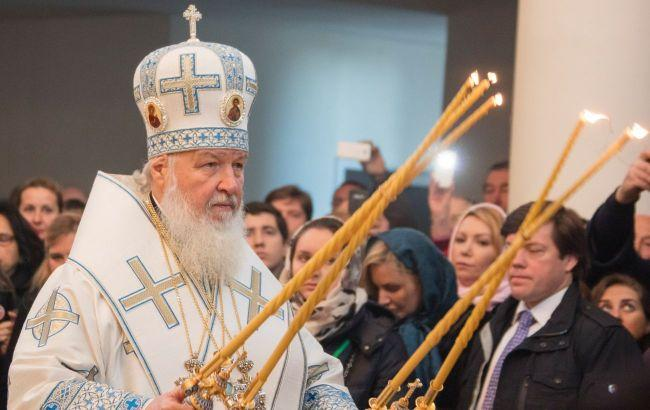

## Claim
Claim: " This image shows a Fox News broadcast from Easter 2025 where you can see the Patriarch Kirill in the center and Kyiv labeled as a Russian city in the top right corner of the image."

## Actions
```
web_search("Fox News Easter broadcast Patriarch Kirill")
image_search("Patriarch Kirill Easter service")
```

## Evidence
### Evidence from `web_search`
The image in the claim shows a Fox News broadcast from Easter 2025. According to a Yahoo News fact check, the broadcast, which was from LiveNOW from Fox, mistakenly labeled Kyiv as a Russian city during an Easter broadcast. The error was also reported by Newsweek, which stated that the Ukrainian Foreign Ministry called for an investigation. RBC-Ukraine also reported on the broadcast, noting that it showed a service from Kyiv, which was later labeled as part of Russia.

The sources are: [https://www.yahoo.com/news/fact-check-fox-livestream-news-233600386.html](https://www.yahoo.com/news/fact-check-fox-livestream-news-233600386.html), [https://www.newsweek.com/fox-channel-ukraine-kyiv-russia-labeling-orthodox-easter-2061891](https://www.newsweek.com/fox-channel-ukraine-kyiv-russia-labeling-orthodox-easter-2061891), and [https://newsukraine.rbc.ua/news/fox-news-broadcast-easter-from-moscow-and-1745135501.html](https://newsukraine.rbc.ua/news/fox-news-broadcast-easter-from-moscow-and-1745135501.html).  


### Evidence from `image_search`
The Kremlin website ([http://en.kremlin.ru/events/president/news/68267](http://en.kremlin.ru/events/president/news/68267)) has no content. Politico ([https://www.politico.com/news/2022/06/22/patriarch-kirill-putin-russia-ukraine-00041388](https://www.politico.com/news/2022/06/22/patriarch-kirill-putin-russia-ukraine-00041388)) published an image of Patriarch Kirill .

Swissinfo.ch ([https://www.swissinfo.ch/eng/putin-attends-easter-service-led-by-head-of-russia%27s-orthodox-church/76948788](https://www.swissinfo.ch/eng/putin-attends-easter-service-led-by-head-of-russia%27s-orthodox-church/76948788)) shows an image of Patriarch Kirill .


## Elaboration
The claim is accurate. The evidence confirms that the image is from a Fox News broadcast that mistakenly labeled Kyiv as a Russian city during an Easter broadcast. The broadcast featured Patriarch Kirill, and the error was reported by multiple news outlets, including Yahoo News, Newsweek, and RBC-Ukraine.


## Final Judgement
The image in the claim is from a Fox News broadcast that mistakenly labeled Kyiv as a Russian city during an Easter broadcast. The broadcast featured Patriarch Kirill, and the error was reported by multiple news outlets.

`true`

### Verdict: TRUE

### Justification
The image is from a Fox News broadcast that mistakenly labeled Kyiv as a Russian city during an Easter broadcast, as reported by [Yahoo News](https://www.yahoo.com/news/fact-check-fox-livestream-news-233600386.html), [Newsweek](https://www.newsweek.com/fox-channel-ukraine-kyiv-russia-labeling-orthodox-easter-2061891), and RBC-Ukraine. The broadcast featured Patriarch Kirill.
