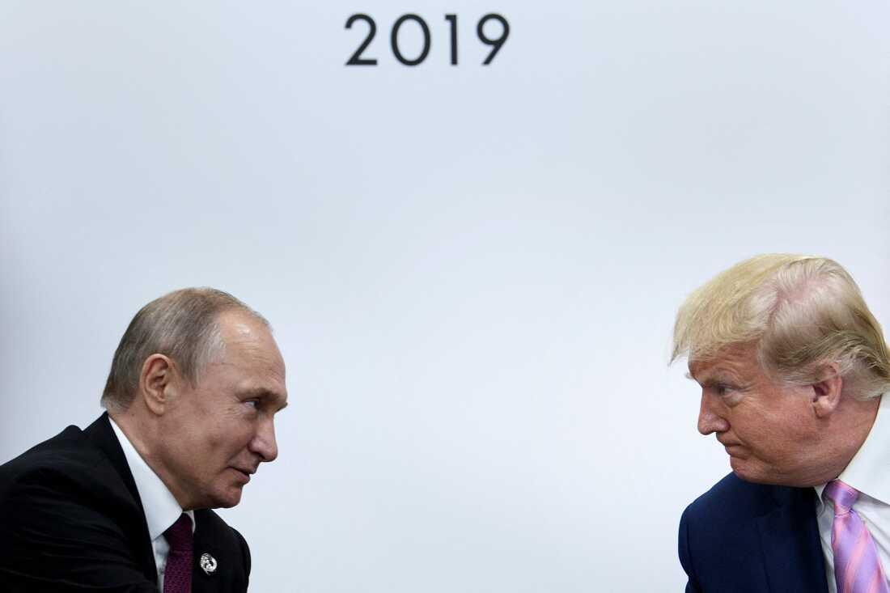

## Claim
Claim: "After a call with Russia's President Vladimir Putin on February 12, 2025, US President Donald Trump announced that he had reached an agreement to end the war in Ukraine."

## Actions
```
web_search("Donald Trump Vladimir Putin call February 12 2025 Ukraine war")
```

## Evidence
### Evidence from `web_search`
On February 12, 2025, Donald Trump and Vladimir Putin had a phone call. According to a [CNN article](https://www.cnn.com/2025/02/12/politics/putin-trump-phone-call), they agreed to have their teams start negotiations immediately to end the war in Ukraine. Trump also mentioned he would call President Zelenskyy to inform him of the conversation. An [NPR article](https://www.npr.org/2025/03/18/nx-s1-5331887/trump-putin-ukraine-call) from March 18, 2025, states that they agreed to start talks toward a ceasefire in Ukraine during the phone call. The Kremlin said it would begin with a 30-day halt to strikes on energy infrastructure. The [Wikipedia article](https://en.wikipedia.org/wiki/February_2025_Putin%E2%80%93Trump_phone_call) mentions that Trump shared details of the conversation and agreed to begin peace talks. The Moscow Exchange rose by over 6 percent following the news of the conversation. , , , 


## Elaboration
The evidence indicates that after the call between Trump and Putin on February 12, 2025, they agreed to begin negotiations to end the war in Ukraine and start talks toward a ceasefire. However, the evidence does not state that Trump announced he had reached an agreement to end the war.

The CNN article ([https://www.cnn.com/2025/02/12/politics/putin-trump-phone-call](https://www.cnn.com/2025/02/12/politics/putin-trump-phone-call)) states that they agreed to have their teams start negotiations immediately. The NPR article ([https://www.npr.org/2025/03/18/nx-s1-5331887/trump-putin-ukraine-call](https://www.npr.org/2025/03/18/nx-s1-5331887/trump-putin-ukraine-call)) mentions that they agreed to start talks toward a ceasefire. The Wikipedia article ([https://en.wikipedia.org/wiki/February_2025_Putin%E2%80%93Trump_phone_call](https://en.wikipedia.org/wiki/February_2025_Putin%E2%80%93Trump_phone_call)) mentions that Trump shared details of the conversation and agreed to begin peace talks.


## Final Judgement
The evidence confirms that Trump and Putin had a call on February 12, 2025, and agreed to begin negotiations and peace talks. However, the evidence does not support the claim that Trump announced he had reached an agreement to end the war.

`false`


### Verdict: FALSE

### Justification
Following the phone call between Trump and Putin on February 12, 2025, they agreed to begin negotiations and peace talks, as reported by [CNN](https://www.cnn.com/2025/02/12/politics/putin-trump-phone-call), [NPR](https://www.npr.org/2025/03/18/nx-s1-5331887/trump-putin-ukraine-call), and [Wikipedia](https://en.wikipedia.org/wiki/February_2025_Putin%E2%80%93Trump_phone_call). However, the evidence does not support the claim that Trump announced he had reached an agreement to end the war.
