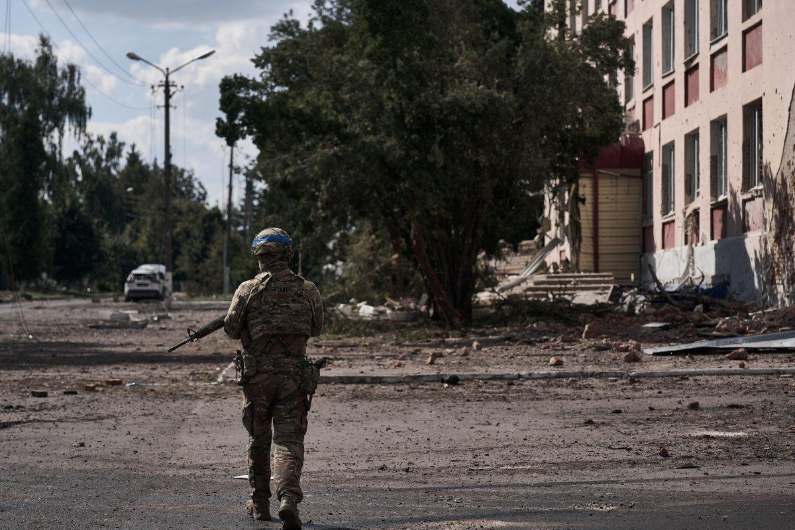

## Claim
Claim: " This image shows American mercenaries participating in Ukraine's incursion into Russia's Kursk Oblast in August 2024."

## Actions
```
web_search("American mercenaries Ukraine Russia Kursk Oblast August 2024")
reverse_search()
```

## Evidence
### Evidence from `web_search`
The search results discuss the 2024 Kursk offensive, which began on August 6, 2024, as part of the Russian invasion of Ukraine, with Ukrainian forces launching an incursion into Russia's Kursk Oblast. The involvement of American mercenaries is mentioned in the context of Russia's claims and protests, with Russia stating that those involved would become a legitimate military target. The White House stated it had no advance knowledge of the attack.

Sources: [https://en.wikipedia.org/wiki/Kursk_campaign](https://en.wikipedia.org/wiki/Kursk_campaign), [https://www.newsweek.com/russia-protests-american-soldiers-kursk-1942273](https://www.newsweek.com/russia-protests-american-soldiers-kursk-1942273), [https://www.aa.com.tr/en/russia-ukraine-war/russia-formally-protests-us-mercenaries-joining-ukrainian-soldiers-in-kursk-region-/3308755](https://www.aa.com.tr/en/russia-ukraine-war/russia-formally-protests-us-mercenaries-joining-ukrainian-soldiers-in-kursk-region-/3308755).     <image:i>


### Evidence from `reverse_search`
The image 

## Elaboration
The evidence confirms that the Kursk offensive occurred in August 2024, with Ukrainian forces entering Russia's Kursk Oblast. The search results also mention claims of American mercenaries participating in the incursion. The image shows individuals with American flags on their uniforms, which supports the claim.

The evidence supports the claim that the image depicts American mercenaries. However, the evidence does not confirm the image's authenticity or the exact location within the Kursk Oblast.


## Final Judgement
The claim is supported by the evidence, which confirms the Kursk offensive in August 2024 and mentions the involvement of American mercenaries. The image shows individuals with American flags on their uniforms, which aligns with the claim. However, the evidence does not confirm the image's authenticity or the exact location. `true`

### Verdict: TRUE

### Justification
The claim is supported by evidence indicating the 2024 Kursk offensive, where Ukrainian forces entered Russia's Kursk Oblast in August 2024, and mentions of American mercenaries' involvement. The image in question shows individuals with American flags on their uniforms, which aligns with the claim. However, the evidence does not confirm the image's authenticity or the exact location.
