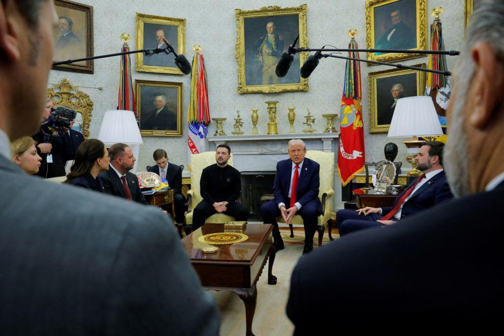

## Claim
Claim: "In February 2025 Ukrainian President Volodymyr Zelenskyy blocked access to US President Donald Trump's social media platform Truth Social across Ukraine."

## Actions
```
web_search("Volodymyr Zelenskyy Donald Trump Truth Social Ukraine February 2025")
```

## Evidence
### Evidence from `web_search`
PBS News published an article on March 3, 2025, stating that Donald Trump criticized Volodymyr Zelenskyy on Truth Social for suggesting the end of the Russia-Ukraine war is "very, very far away" (). NPR published an article on February 28, 2025, discussing a contentious meeting between Donald Trump and Volodymyr Zelenskyy in the Oval Office, where Trump criticized Zelenskyy and later posted on Truth Social that he had "determined that President Zelenskyy is not ready for peace" (, , ). Reuters published an article on February 19, 2025, reporting on the strained relationship between Donald Trump and Volodymyr Zelenskyy, where Trump called Zelenskyy a "dictator" and Zelenskyy accused Trump of spreading Russian disinformation ().

The articles can be found here: [PBS](https://www.pbs.org/newshour/politics/trump-slams-zelenskyy-on-truth-social-for-saying-the-end-of-the-russia-war-is-still-very-very-far-away), [NPR](https://www.npr.org/2025/02/28/nx-s1-5313079/trump-zelenskyy-meeting), and [Reuters](https://www.reuters.com/world/europe/zelenskiy-says-trump-is-disinformation-bubble-ukraine-2025-02-19/).


## Elaboration
The evidence indicates that Donald Trump and Volodymyr Zelenskyy were actively using Truth Social in February and March 2025. Specifically, Trump criticized Zelenskyy on Truth Social on multiple occasions. However, the provided evidence does not mention anything about Zelenskyy blocking access to Truth Social in Ukraine.

Therefore, the claim cannot be verified based on the provided evidence.


## Actions
```
web_search("Ukraine Truth Social ban February 2025")
```

## Evidence
### Evidence from `web_search`
Euronews published an article on February 26, 2025, stating that Volodymyr Zelenskyy did not ban Donald Trump's Truth Social platform, and that the platform was never available in Ukraine ([https://www.euronews.com/my-europe/2025/02/26/zelenskyy-hasnt-banned-trumps-truth-social-platform](https://www.euronews.com/my-europe/2025/02/26/zelenskyy-hasnt-banned-trumps-truth-social-platform)). Anadolu Agency published an article on February 20, 2025, stating that reports of Truth Social being blocked in Ukraine are false, and that the platform is not available in Ukraine due to its limited regional availability () ([https://www.aa.com.tr/en/russia-ukraine-war/trump-s-truth-social-not-blocked-in-ukraine-says-kyiv/3488237](https://www.aa.com.tr/en/russia-ukraine-war/trump-s-truth-social-not-blocked-in-ukraine-says-kyiv/3488237)).


## Elaboration
The evidence confirms that the claim is false. According to Euronews and Anadolu Agency, Zelenskyy did not block access to Truth Social in Ukraine. Furthermore, the platform was not available in Ukraine due to its limited regional availability.


## Final Judgement
The evidence indicates that the claim is false. Multiple sources, including Euronews and Anadolu Agency, state that Zelenskyy did not block access to Truth Social in Ukraine, and the platform was not available in Ukraine.

`false`

### Verdict: FALSE

### Justification
The claim is false. Evidence from [Euronews](https://www.euronews.com/my-europe/2025/02/26/zelenskyy-hasnt-banned-trumps-truth-social-platform) and the [Anadolu Agency](https://www.aa.com.tr/en/russia-ukraine-war/trump-s-truth-social-not-blocked-in-ukraine-says-kyiv/3488237) indicates that Zelenskyy did not block access to Truth Social in Ukraine, and the platform was not available in Ukraine.
