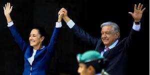

## Claim
Claim: "Mexican President-elect Claudia Sheinbaum rejected an invitation to Ukraine by Volodymr Zelenskyy and said towards him on September 17, 2024: 'If I wanted to see a drug addict, I'd just take a walk around Tijuana.'"

## Actions
```
web_search("Claudia Sheinbaum Zelenskyy Ukraine invitation")
web_search("Claudia Sheinbaum Tijuana drug addict")
```

## Evidence
### Evidence from `web_search`
Claudia Sheinbaum, the Mexican President-elect, declined an invitation from Ukrainian President Volodymyr Zelenskyy to visit Ukraine, according to reports from IntelliNews ([https://www.intellinews.com/mexico-s-president-elect-sheinbaum-turns-down-zelensky-s-invitation-to-ukraine-344262/](https://www.intellinews.com/mexico-s-president-elect-sheinbaum-turns-down-zelensky-s-invitation-to-ukraine-344262/)) , Euromaidan Press ([https://euromaidanpress.com/2024/09/18/mexican-president-elect-declines-zelenskyys-invitation-to-visit-ukraine/](https://euromaidanpress.com/2024/09/18/mexican-president-elect-declines-zelenskyys-invitation-to-visit-ukraine/)) , and NV.ua ([https://english.nv.ua/nation/sheinbaum-declines-zelenskyy-s-invitation-focuses-on-domestic-issues-50451798.html](https://english.nv.ua/nation/sheinbaum-declines-zelenskyy-s-invitation-to-visit-ukraine/)) . Sheinbaum cited her focus on domestic issues and Mexico's policy of non-intervention in foreign affairs.

The provided sources do not contain the quote attributed to Sheinbaum in the claim.


### Evidence from `web_search`
The claim that Claudia Sheinbaum made a statement about Volodymyr Zelenskyy and Tijuana is false, according to [mimikama.org](https://www.mimikama.org/en/sheinbaum-fake-quote-zelenskyj-drugs/) and [StopFake.org](https://www.stopfake.org/en/fake-mexican-president-refuses-to-visit-ukraine-calling-zelensky-a-drug-addict/). The quote is part of a disinformation campaign and was confirmed as invented by a spokeswoman for the President.  

An article from [Mexico News Daily](https://mexiconewsdaily.com/politics/sheinbaum-trump-mexico-petrified-of-cartels/) discusses Sheinbaum's response to Donald Trump's claims about drug cartels. 


## Elaboration
The claim is false. Evidence indicates that Claudia Sheinbaum declined an invitation to visit Ukraine. However, the quote attributed to her is part of a disinformation campaign and has been confirmed as fabricated.


## Final Judgement
The claim that Claudia Sheinbaum made the specific statement about Zelenskyy and Tijuana is demonstrably false. Multiple sources confirm the quote is fabricated and part of a disinformation campaign.

`false`

### Verdict: FALSE

### Justification
The claim is false. While Claudia Sheinbaum did decline an invitation to visit Ukraine, the statement attributed to her is fabricated, as confirmed by fact-checkers like [mimikama.org](https://www.mimikama.org/en/sheinbaum-fake-quote-zelenskyj-drugs/) and [StopFake.org](https://www.stopfake.org/en/fake-mexican-president-refuses-to-visit-ukraine-calling-zelensky-a-drug-addict/).
