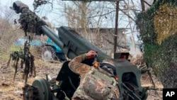

## Claim
Claim: " This image shows a chemical attack by the Armed Forces of Ukraine during the Kursk offensive in August 2024."

## Actions
```
reverse_search()
web_search("Kursk offensive chemical attack")
```

## Evidence
### Evidence from `web_search`
Al Jazeera published an article on July 4, 2025, stating that Dutch and German intelligence agencies reported Russia's intensified use of chemical weapons against Ukrainian soldiers, including chloropicrin. The article also mentions a large-scale Russian drone and missile attack on Ukraine. The BBC article, published on December 17, 2024, discusses the death of Igor Kirillov, the head of Russia's Radiation, Chemical and Biological Protection troops, and mentions claims about Ukraine's alleged use of chemical weapons.

The image 

## Elaboration
The evidence suggests that both Russia and Ukraine have been accused of using chemical weapons. However, the provided evidence does not confirm the claim that the image depicts a chemical attack by the Armed Forces of Ukraine during the Kursk offensive in August 2024.

The Al Jazeera article ([https://www.aljazeera.com/news/2025/7/4/dutch-german-intelligence-report-russian-chemical-weapons-use-in-ukraine](https://www.aljazeera.com/news/2025/7/4/dutch-german-intelligence-report-russian-chemical-weapons-use-in-ukraine)) mentions Russia's use of chemical weapons, while the BBC article ([https://www.bbc.com/news/world-europe-70669684](https://www.bbc.com/news/world-europe-70669684)) discusses claims about Ukraine's alleged use of chemical weapons.

To verify the claim, information about the image's origin, the specific chemical agent used, and the location and date of the event is needed.


## Actions
```
image_search("chemical explosion road military vehicle")
web_search("Kursk offensive 2024 chemical attack")
```

## Evidence
### Evidence from `image_search`
The search results include an article from Wired ([https://www.wired.com/2007/05/military-dragge/](https://www.wired.com/2007/05/military-dragge/)) with an image of a military vehicle in an explosion  and an article from the New York Post ([https://nypost.com/2021/12/20/blaze-erupts-as-truck-slams-us-military-convoy-on-german-highway/](https://nypost.com/2021/12/20/blaze-erupts-as-truck-slams-us-military-convoy-on-german-highway/)) about a fire after a truck crashed into a US military convoy .


### Evidence from `web_search`
Reuters published an article on August 12, 2024, stating that the SBU said Russia was trying to falsely accuse Kyiv's military of war crimes, including the use of chemical weapons in the Kursk region. Reuters could not independently verify the claim. The article includes an image . RFE/RL reported on December 17, 2024, about Russia's intensified offensive in the Kursk region, with the involvement of North Korean troops, but did not mention any chemical attacks. 


## Elaboration
The evidence suggests that Russia accused Ukraine of using chemical weapons in the Kursk region in August 2024. However, Reuters could not independently verify this claim. The provided image search results do not provide any information about the image in the claim.

The claim cannot be verified due to a lack of evidence. The evidence does not confirm that the image depicts a chemical attack by the Armed Forces of Ukraine during the Kursk offensive in August 2024.


## Final Judgement
The fact-check reveals that while there are accusations of chemical weapons use in the region, the specific claim about the image depicting a Ukrainian chemical attack during the Kursk offensive in August 2024 cannot be verified. The evidence includes reports of Russia accusing Ukraine of war crimes, including chemical weapons use, but these claims are not independently verified. The image search results do not provide any information about the image in the claim.

`false`

### Verdict: FALSE

### Justification
The claim that the image depicts a chemical attack by the Armed Forces of Ukraine during the Kursk offensive in August 2024 is not supported by the evidence. While there are reports of accusations of chemical weapons use in the region, including claims by Russia against Ukraine, these claims are not independently verified, and the image's origin and context remain unconfirmed. The Reuters article ([https://www.reuters.com/world/europe/sbu-says-russia-trying-falsely-accuse-kyiv-war-crimes-2024-08-12/](https://www.reuters.com/world/europe/sbu-says-russia-trying-falsely-accuse-kyiv-war-crimes-2024-08-12/)) mentions the accusations, but the claim cannot be verified.
