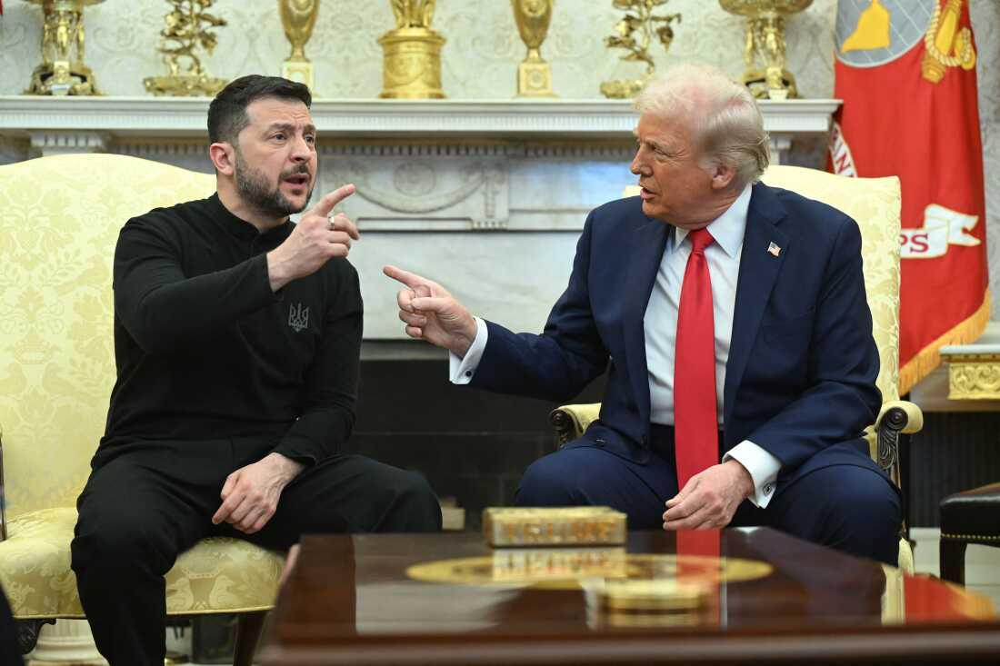
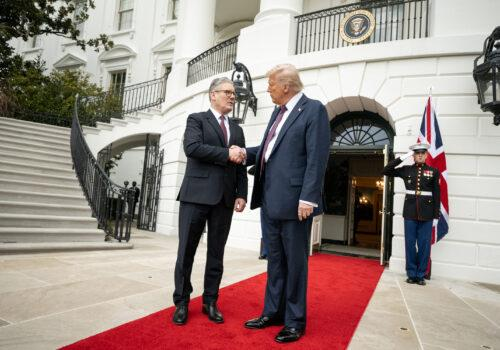
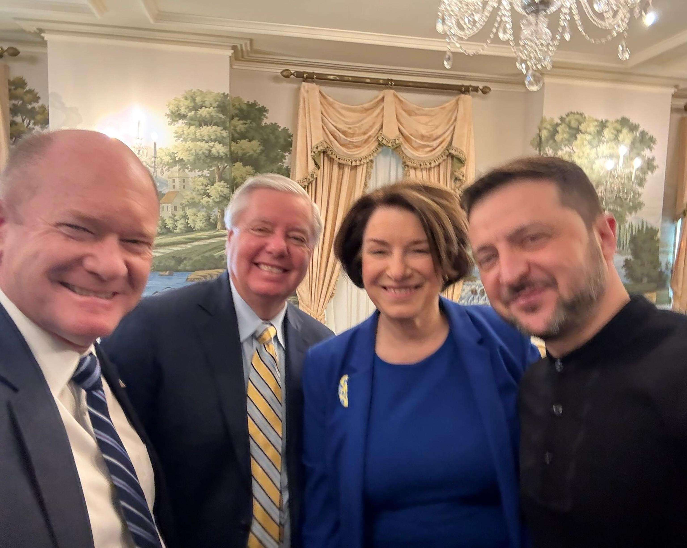

## Claim
Claim: "On Feb. 28, 2025, before a meeting with U.S. President Donald Trump, Ukraine President Volodymyr Zelenskyy met with Democrats."

## Actions
```
web_search("Volodymyr Zelenskyy Donald Trump meeting February 2025")
web_search("Volodymyr Zelenskyy meeting Democrats February 2025")
```

## Evidence
### Evidence from `web_search`
On February 28, 2025, Volodymyr Zelenskyy met with Donald Trump in the Oval Office, according to a Wikipedia article ([https://en.wikipedia.org/wiki/2025_Trump%E2%80%93Zelenskyy_Oval_Office_meeting](https://en.wikipedia.org/wiki/2025_Trump%E2%80%93Zelenskyy_Oval_Office_meeting)) <image:i>. The meeting was contentious, and Senator Lindsey Graham advised Zelenskyy to focus on the minerals agreement before the meeting.

NPR ([https://www.npr.org/2025/02/28/nx-s1-5313079/trump-zelenskyy-meeting](https://www.npr.org/2025/02/28/nx-s1-5313079/trump-zelenskyy-meeting)) ,  and The Atlantic Council ([https://www.atlanticcouncil.org/content-series/fastthinking/the-trump-zelenskyy-meeting-just-blew-up-what-now/](https://www.atlanticcouncil.org/content-series/fastthinking/the-trump-zelenskyy-meeting-just-blew-up-what-now/))  also reported on the meeting, with the NPR article mentioning criticism from top Democratic lawmakers. The Atlantic Council article mentions that Zelenskyy spoke with European leaders after the meeting.


### Evidence from `web_search`
On February 28, 2025, Volodymyr Zelenskyy met with a bipartisan delegation of the U.S., as reported by Yahoo News (). Zelenskyy posted a video of the meeting on X. The article discusses claims that Democrats persuaded Zelenskyy to reject a deal. Zelenskyy said they discussed his upcoming meeting with President Trump.

ABC News reports that on March 1, 2025, a group of bipartisan senators met with Zelenskyy ahead of his meeting with President Donald Trump on February 28, 2025 (, ). The meeting with the senators included Chris Coons, Amy Klobuchar, and Lindsey Graham.


## Elaboration
The evidence indicates that Volodymyr Zelenskyy met with Donald Trump on February 28, 2025. Additionally, Zelenskyy met with a bipartisan delegation of U.S. officials, including Democrats, before the meeting with Trump. ABC News reports that a group of bipartisan senators met with Zelenskyy ahead of his meeting with President Donald Trump on February 28, 2025.

Therefore, the claim is supported by the evidence.


## Final Judgement
The evidence confirms that Zelenskyy met with Donald Trump on February 28, 2025, and also met with a bipartisan delegation of U.S. officials, including Democrats, before the meeting with Trump.

`true`


### Verdict: TRUE

### Justification
On February 28, 2025, Volodymyr Zelenskyy met with Donald Trump, as reported by multiple sources, including a Wikipedia article ([https://en.wikipedia.org/wiki/2025_Trump%E2%80%93Zelenskyy_Oval_Office_meeting](https://en.wikipedia.org/wiki/2025_Trump%E2%80%93Zelenskyy_Oval_Office_meeting)). Evidence also shows that Zelenskyy met with a bipartisan delegation of U.S. officials, including Democrats, before his meeting with Trump, as reported by Yahoo News and ABC News.
