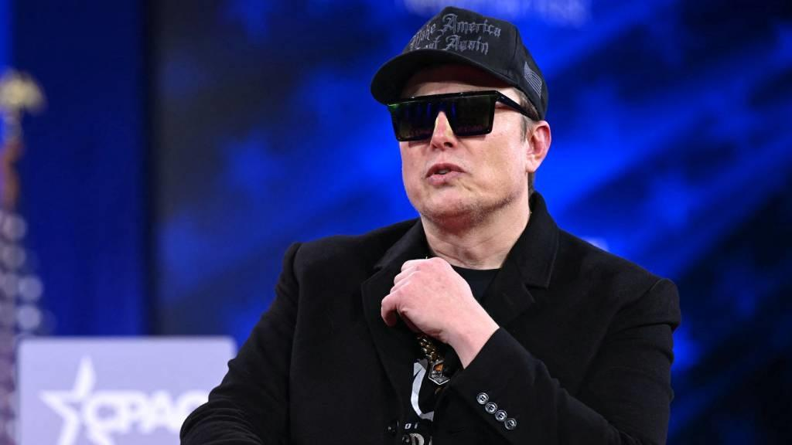

## Claim
Claim: "In February 2025 Elon Musk posted on X that he is planning to suspend Ukraine President Volodymyr Zelenskyy’s X account."

## Actions
```
web_search("Elon Musk Volodymyr Zelenskyy X account suspension")
```

## Evidence
### Evidence from `web_search`
In February 2025, Elon Musk made several statements on X regarding Ukrainian President Volodymyr Zelenskyy. According to an article from Al Jazeera ([Source](https://www.aljazeera.com/economy/2025/2/21/musk-vows-to-fix-x-after-polls-show-high-support-for-ukraines-zelenskyy)), Musk questioned the credibility of polling data on Zelenskyy's popularity and claimed Zelenskyy is "despised by the people of Ukraine." The Independent ([Source](https://www.independent.co.uk/news/world/americas/us-politics/elon-musk-x-ukraine-trump-zelensky-b2702216.html)) reports that Musk accused Zelenskyy of "feeding off the dead bodies of Ukrainian soldiers."

News24 ([Source](https://www.news24.com/world/ironic-elon-musk-vows-to-fix-x-after-polls-show-high-support-for-ukraine-president-zelensky-20250221)) reported that Musk vowed to "fix" X's fact-checking tool. The articles include images of Elon Musk , .


## Elaboration
The evidence does not mention Elon Musk planning to suspend Volodymyr Zelenskyy's X account. Instead, it reports that Musk made statements questioning Zelenskyy's popularity and accusing him of exploiting the deaths of Ukrainian soldiers.


## Final Judgement
The search results show that Elon Musk made statements about Volodymyr Zelenskyy in February 2025, but they do not include any mention of Musk planning to suspend Zelenskyy's X account. The evidence focuses on Musk's criticism of Zelenskyy and his comments on polling data.

`false`


### Verdict: FALSE

### Justification
The search results from Al Jazeera ([Source](https://www.aljazeera.com/economy/2025/2/21/musk-vows-to-fix-x-after-polls-show-high-support-for-ukraines-zelenskyy)) and The Independent ([Source](https://www.independent.co.uk/news/world/americas/us-politics/elon-musk-x-ukraine-trump-zelensky-b2702216.html)) indicate that in February 2025, Elon Musk made statements criticizing Volodymyr Zelenskyy, but there is no evidence to support the claim that Musk planned to suspend Zelenskyy's X account.
