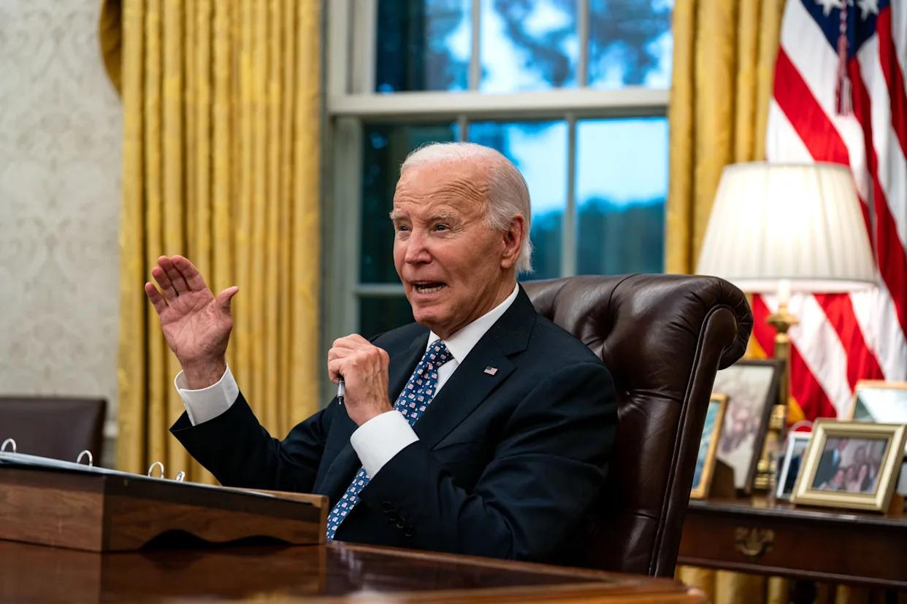

## Claim
Claim: "In remarks to reporters on September 29, 2024 US President Joe Biden announced that no more aid would be provided for the areas affected by Hurrican Helene, but 2.4 billion US-$ more for Ukraine."

## Actions
```
web_search("Joe Biden remarks September 29 2024 Hurricane Helene Ukraine aid")
```

## Evidence
### Evidence from `web_search`
The Yahoo News article, published by Fox News, discusses a claim that Biden said no more aid would be provided for Hurricane Helene victims. The article states that Biden announced a new $8 billion military aid package for Ukraine on Sept. 26, 2024. The article also mentions that Biden said he would be asking Congress for a supplemental aid bill for those affected by the storm. ([https://www.yahoo.com/news/no-biden-didnt-hes-done-162918340.html](https://www.yahoo.com/news/no-biden-didnt-hes-done-162918340.html)) 

The France 24 article reports on President Biden's response to Hurricane Helene. <image:k> Biden visited North Carolina to assess rescue efforts. The article mentions the death toll reached 130. Biden refuted claims that the government was slow to respond. The Le Monde article reports on President Joe Biden's remarks on the response to Hurricane Helene.  The article mentions that Biden will travel to North Carolina to monitor rescue efforts. It also mentions that the death toll from the storm climbed to at least 130. ([https://www.france24.com/en/americas/20241001-biden-defends-government-response-as-hurricane-helene-death-toll-reaches-118](https://www.france24.com/en/americas/20241001-biden-defends-government-response-as-hurricane-helene-death-toll-reaches-118)) and ([https://www.lemonde.fr/en/united-states/article/2024/09/30/biden-pledges-to-aid-victims-of-hurrican-helene-as-long-as-it-takes_6727795_133.html](https://www.lemonde.fr/en/united-states/article/2024/09/30/biden-pledges-to-aid-victims-of-hurrican-helene-as-long-as-it-takes_6727795_133.html))


## Elaboration
The evidence contradicts the claim. According to a Yahoo News article, Biden did not announce that no more aid would be provided for Hurricane Helene victims. Instead, he stated he would ask Congress for a supplemental aid bill for those affected by the storm. The same article mentions that Biden announced an $8 billion military aid package for Ukraine on September 26, 2024, not $2.4 billion.


## Final Judgement
The evidence indicates that the claim is false. Biden did not announce that no more aid would be provided for Hurricane Helene victims. Instead, he stated he would ask Congress for a supplemental aid bill. The amount of aid for Ukraine mentioned in the claim is also incorrect.

`false`


### Verdict: FALSE

### Justification
The claim is false. According to a Yahoo News article, Biden did not announce that no more aid would be provided for Hurricane Helene victims; instead, he stated he would ask Congress for a supplemental aid bill ([https://www.yahoo.com/news/no-biden-didnt-hes-done-162918340.html](https://www.yahoo.com/news/no-biden-didnt-hes-done-162918340.html)). The article also mentions an $8 billion military aid package for Ukraine, not $2.4 billion.
