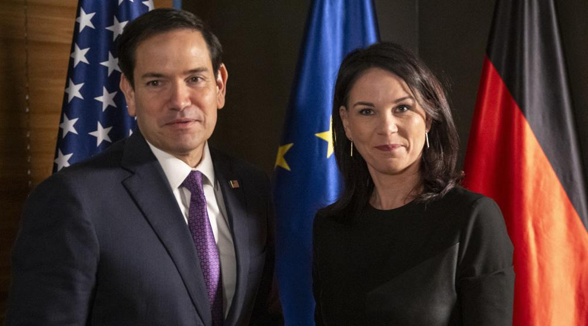
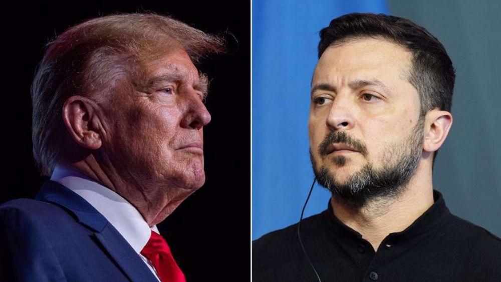

## Claim
Claim: "In February 2025 German Foreign Minister Annalena Baerbock threatened the US with severing ties amid US President Donald Trump's comments on Ukrainian President Volodymyr Zelenskyy and Ukraine."

## Actions
```
web_search("Annalena Baerbock Donald Trump Ukraine February 2025")
```

## Evidence
### Evidence from `web_search`
In February 2025, Reuters published an article where German Foreign Minister Annalena Baerbock stated that there must be no peace in Ukraine over the heads of Ukrainians and Europeans (<image:k>). The Guardian reported on February 12, 2025, that Baerbock said Ukraine’s interests must be protected in the upcoming negotiations regarding a ceasefire in Ukraine (). A Wikipedia article mentions that Baerbock said Trump's conduct represented a "new era of ruthlessness" and called on European countries to "defend the rules-based international order" (<image:i>).

The articles can be found at the following URLs: [https://www.reuters.com/world/europe/no-peace-over-heads-ukrainians-europeans-says-german-foreign-minister-2025-02-14/](https://www.reuters.com/world/europe/no-peace-over-heads-ukrainians-europeans-says-german-foreign-minister-2025-02-14/), [https://www.theguardian.com/us-news/2025/feb/12/trump-putin-ukraine-ceasefire](https://www.theguardian.com/us-news/2025/feb/12/trump-putin-ukraine-ceasefire), and [https://en.wikipedia.org/wiki/2025_Trump%E2%80%93Zelenskyy_Oval_Office_meeting](https://en.wikipedia.org/wiki/2025_Trump%E2%80%93Zelenskyy_Oval_Office_meeting).


## Elaboration
The evidence confirms that in February 2025, Annalena Baerbock made statements regarding the situation in Ukraine, including comments on a potential ceasefire and the need to protect Ukraine's interests. The evidence also shows that Baerbock criticized Donald Trump's conduct, referring to it as a "new era of ruthlessness."

However, the provided evidence does not mention Baerbock threatening the US with severing ties. Therefore, the claim cannot be fully verified based on the available information.

To verify the claim, information about whether Baerbock threatened to sever ties with the US is missing.


## Actions
```
web_search("Annalena Baerbock sever ties US February 2025")
```

## Evidence
### Evidence from `web_search`
In February 2025, a fact-check from aol.com ([https://www.aol.com/fact-check-germany-did-not-142747218.html](https://www.aol.com/fact-check-germany-did-not-142747218.html)) stated that German Foreign Minister Annalena Baerbock did not threaten to cut ties with the US (, ). Press TV ([https://www.presstv.ir/Detail/2025/02/22/743256/German-FM--Europeans-to-put-pressure-on-US,-keep-US-from-bilateral-relations-with-Russia](https://www.presstv.ir/Detail/2025/02/22/743256/German-FM--Europeans-to-put-pressure-on-US,-keep-US-from-bilateral-relations-with-Russia)) reported that Baerbock urged European allies to pressure the US to prevent it from allying with Russia (, ). Yahoo News ([https://www.yahoo.com/news/europeans-ramp-pressure-us-german-143422657.html](https://www.yahoo.com/news/europeans-ramp-pressure-us-german-143422657.html)) stated that Baerbock said European allies should put more pressure on the US to avoid losing Washington as a partner ().


## Elaboration
The evidence indicates that the claim is false. A fact-check from aol.com ([https://www.aol.com/fact-check-germany-did-not-142747218.html](https://www.aol.com/fact-check-germany-did-not-142747218.html)) explicitly states that Baerbock did not threaten to cut ties with the US. Instead, Baerbock urged European allies to pressure the US to prevent it from allying with Russia and to avoid losing Washington as a partner.


## Final Judgement
The evidence shows that Annalena Baerbock did not threaten to sever ties with the US in February 2025. Instead, she urged European allies to pressure the US.

`false`

### Verdict: FALSE

### Justification
The claim is false. Fact-checks from aol.com ([https://www.aol.com/fact-check-germany-did-not-142747218.html](https://www.aol.com/fact-check-germany-did-not-142747218.html)) explicitly state that Baerbock did not threaten to cut ties with the US. Instead, she urged European allies to pressure the US.
