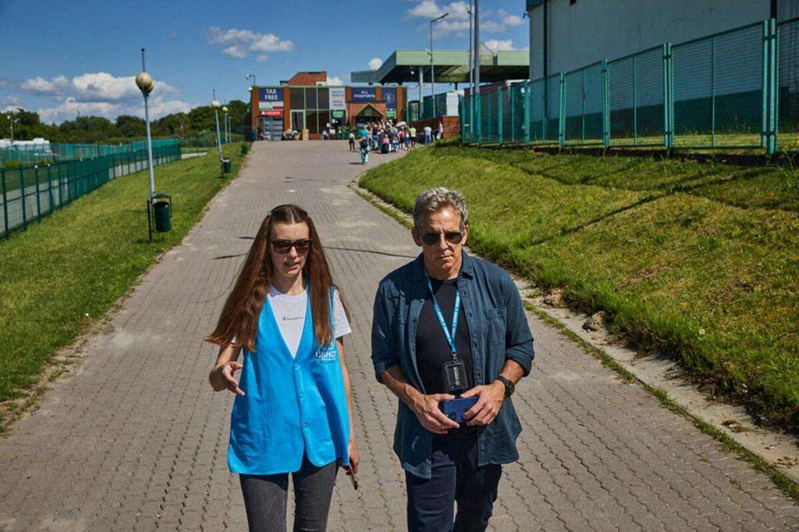

## Claim
Claim: " This image shows Ben Stiller and Ukrainian President Volodymyr Zelensky at their meeting on June 20, 2022, for which Stiller received $4 million from USAID."

## Actions
```
web_search("Ben Stiller Volodymyr Zelensky meeting June 20 2022")
web_search("Ben Stiller Zelensky USAID funding")
```

## Evidence
### Evidence from `web_search`
The search results confirm that Ben Stiller met with Ukrainian President Volodymyr Zelenskyy in Kyiv on June 20, 2022, as part of his role as a goodwill ambassador for the United Nations High Commissioner for Refugees (UNHCR) (, , , , , ). The sources do not mention any USAID funding.

The meeting was reported by ABC News ([https://abcnews.go.com/International/ben-stiller-meets-volodymyr-zelenskyy-ukraine-world-refugee/story?id=85517989](https://abcnews.go.com/International/ben-stiller-meets-volodymyr-zelenskyy-ukraine-world-refugee/story?id=85517989)), The New York Post ([https://nypost.com/2022/06/20/ben-stiller-met-with-zelensky-in-ukraine-on-world-refugee-day/](https://nypost.com/2022/06/20/ben-stiller-met-with-zelensky-in-ukraine-on-world-refugee-day/)), and the BBC ([https://www.bbc.com/news/av/world-61875351](https://www.bbc.com/news/av/world-61875351)).


### Evidence from `web_search`
The provided sources refute the claim that Ben Stiller received $4 million from USAID for his meeting with Ukrainian President Volodymyr Zelensky in June 2022. Articles from Vanity Fair ([https://www.vanityfair.com/hollywood/story/ben-stiller-denies-elon-musks-retweet-claiming-usaid-funded-the-stars-trip-to-ukraine?srsltid=AfmBOooBmd8sz0yCyDJlhTRv5sE2nx9jNIWo6n-0ayi2r3QTDglGEgTw](https://www.vanityfair.com/hollywood/story/ben-stiller-denies-elon-musks-retweet-claiming-usaid-funded-the-stars-trip-to-ukraine?srsltid=AfmBOooBmd8sz0yCyDJlhTRv5sE2nx9jNIWo6n-0ayi2r3QTDglGEgTw)) and The Hollywood Reporter ([https://www.hollywoodreporter.com/news/politics-news/fake-online-usaid-paid-hollywood-stars-debunked-1236129713/](https://www.hollywoodreporter.com/news/politics-news/fake-online-usaid-paid-hollywood-stars-debunked-1236129713/)) debunk a video that falsely claimed USAID funded Stiller's trip.

Gwara Media ([https://gwaramedia.com/en/debunking-fakes-no-enews-didnt-release-video-about-hollywood-stars-receiving-usaid-money-for-visits-to-ukraine/](https://gwaramedia.com/en/debunking-fakes-no-enews-didnt-release-video-about-hollywood-stars-receiving-usaid-money-for-visits-to-ukraine/)) also debunks the video and states that Stiller does not receive compensation for his work with UNHCR and funds his trips himself. The image  shows the meeting between Stiller and Zelensky.


## Elaboration
The claim that Ben Stiller received $4 million from USAID for his meeting with Volodymyr Zelensky is false. Multiple sources, including Vanity Fair and The Hollywood Reporter, debunked this claim, stating that it originated from a false video. Furthermore, Gwara Media confirms that Stiller does not receive compensation for his work with UNHCR and funds his trips himself.


## Final Judgement
The image accurately depicts Ben Stiller and Volodymyr Zelenskyy meeting on June 20, 2022. However, the claim that Stiller received $4 million from USAID for this meeting is false. Multiple sources debunk this claim, stating it originated from a false video.

`false`

### Verdict: FALSE

### Justification
The image accurately depicts Ben Stiller and Volodymyr Zelenskyy meeting on June 20, 2022. However, the claim that Stiller received $4 million from USAID for this meeting is false. Multiple sources, including [Vanity Fair](https://www.vanityfair.com/hollywood/story/ben-stiller-denies-elon-musks-retweet-claiming-usaid-funded-the-stars-trip-to-ukraine?srsltid=AfmBOooBmd8sz0yCyDJlhTRv5sE2nx9jNIWo6n-0ayi2r3QTDglGEgTw) and [The Hollywood Reporter](https://www.hollywoodreporter.com/news/politics-news/fake-online-usaid-paid-hollywood-stars-debunked-1236129713/), debunk this claim, stating it originated from a false video.
