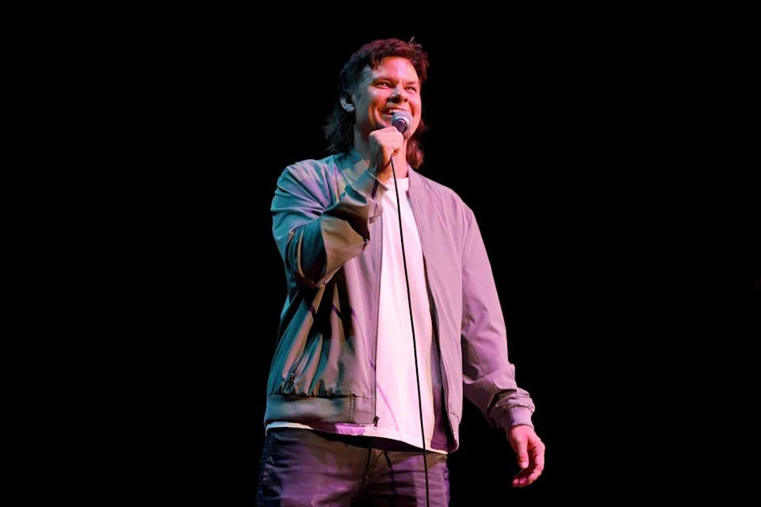

## Claim
Claim: "In an interview with podcaster Theo Von in August 2024, Donald Trump criticized British Prime Minister Keir Starmer over a 100-year deal between the U.K. and Ukraine."

## Actions
```
web_search("Donald Trump Theo Von interview August 2024 Keir Starmer Ukraine deal")
```

## Evidence
### Evidence from `web_search`
The University of California, Berkeley, published an article on January 29, 2025, discussing an AI-generated audio of Donald Trump criticizing Keir Starmer, overlaid on a video interview with Theo Von from August 21, 2024, where the UK and Ukraine were not discussed. The article references a fact-check by Full Fact. Grabien published a fact check on February 5, 2025, stating that Trump did not criticize Keir Starmer over a 100-year deal between the U.K. and Ukraine in an interview with Theo Von in August 2024.

A Yahoo article discusses an interview with Donald Trump on Theo Von's podcast, which was posted on Tuesday, where Trump discussed various topics, including the 2024 presidential election, but did not mention Keir Starmer or a deal between the U.K. and Ukraine. 

*   [https://www.ischool.berkeley.edu/news/2025/hany-farid-discusses-circulating-trump-video-criticizing-keir-starmer](https://www.ischool.berkeley.edu/news/2025/hany-farid-discusses-circulating-trump-video-criticizing-keir-starmer)
*   [https://news.grabien.com/wire-fact-check-no-donald-trump-did-not-criticize-keir-starmer-over-a-100-y](https://news.grabien.com/wire-fact-check-no-donald-trump-did-not-criticize-keir-starmer-over-a-100-y)
*   [https://www.yahoo.com/entertainment/thats-down-dirty-donald-trump-170420799.html](https://www.yahoo.com/entertainment/thats-down-dirty-donald-trump-170420799.html)


## Elaboration
The evidence indicates that the claim is false. Fact-check articles from Grabien and the University of California, Berkeley, confirm that Donald Trump did not criticize Keir Starmer in an interview with Theo Von in August 2024. The Yahoo article also supports this, stating that the interview did not mention Keir Starmer or a deal between the U.K. and Ukraine.


## Final Judgement
The evidence from multiple sources, including fact-checks and news articles, demonstrates that Donald Trump did not criticize Keir Starmer regarding a deal between the U.K. and Ukraine in an interview with Theo Von in August 2024. Therefore, the claim is demonstrably false.

`false`


### Verdict: FALSE

### Justification
The claim is false. Multiple sources, including a fact-check by [Grabien](https://news.grabien.com/wire-fact-check-no-donald-trump-did-not-criticize-keir-starmer-over-a-100-y), confirm that Donald Trump did not criticize Keir Starmer in an interview with Theo Von in August 2024.
