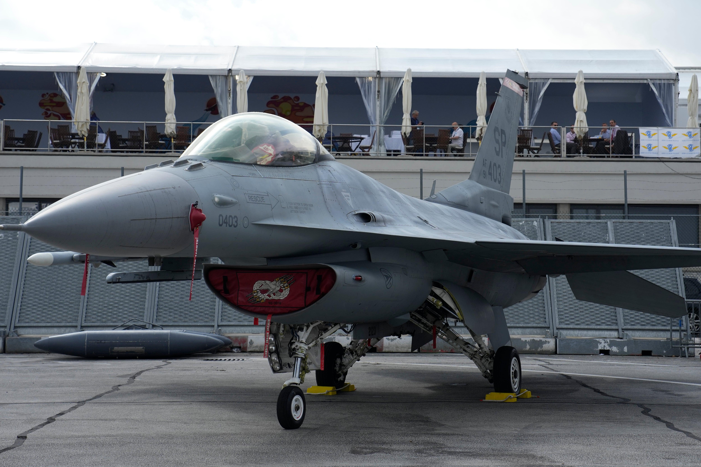

## Claim
Claim: " This image shows a US F-16 fighter jet which was shot down in August 2024 in airspace over the Black Sea after refusing to obey Russian orders."

## Actions
```
reverse_search()
web_search("F-16 shot down Black Sea August 2024")
```

## Evidence
### Evidence from `reverse_search`
The image 

### Evidence from `web_search`
Defense News reported on August 29, 2024, that an F-16 jet crashed in Ukraine during a Russian attack, killing the pilot (, ). The War Zone discusses claims about a Ukrainian F-16 shooting down a Russian Su-35S Flanker fighter, mentioning the death of F-16 pilot Oleksiy Mes in August 2024 (, ). The Guardian reported on August 28, 2024, that Volodymyr Zelenskiy said F-16s were used to shoot down Russian missiles ().

The provided sources are: [Defense News](https://www.defensenews.com/global/europe/2024/08/29/ukraine-f-16-jet-crashes-during-russian-attack-killing-pilot/), [The War Zone](https://www.twz.com/air/claims-swirl-around-russian-su-35s-flanker-shootdown), and [The Guardian](https://www.theguardian.com/world/article/2024/aug/28/ukraine-war-briefing-zelenskiy-says-f16s-shooting-down-russian-missiles).


## Elaboration
The evidence indicates that an F-16 jet crashed in Ukraine during a Russian attack in August 2024, and there are claims of Ukrainian F-16s shooting down Russian missiles and a Russian Su-35S Flanker fighter. However, the evidence does not mention a US F-16 being shot down over the Black Sea after refusing Russian orders.

The claim is not supported by the provided evidence.


## Final Judgement
The claim is demonstrably false. While there is evidence of F-16s being involved in combat in August 2024, the specific scenario described in the claim, involving a US F-16 shot down over the Black Sea after disobeying Russian orders, is not supported by the provided evidence. The image itself appears to depict a MiG-29, not an F-16. `false`

### Verdict: FALSE

### Justification
The claim is false. While there were reports of F-16s being involved in combat in Ukraine in August 2024, the specific scenario described in the claim, involving a US F-16 shot down over the Black Sea, is not supported by the evidence. The image appears to depict a MiG-29, not an F-16.
