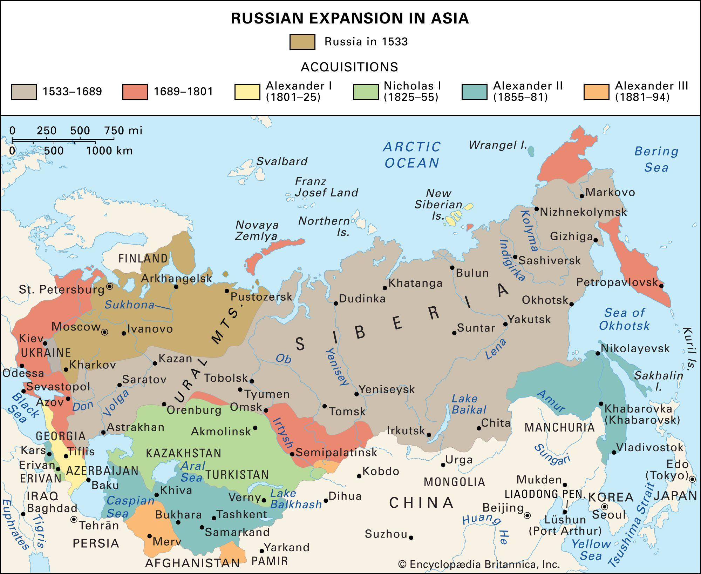
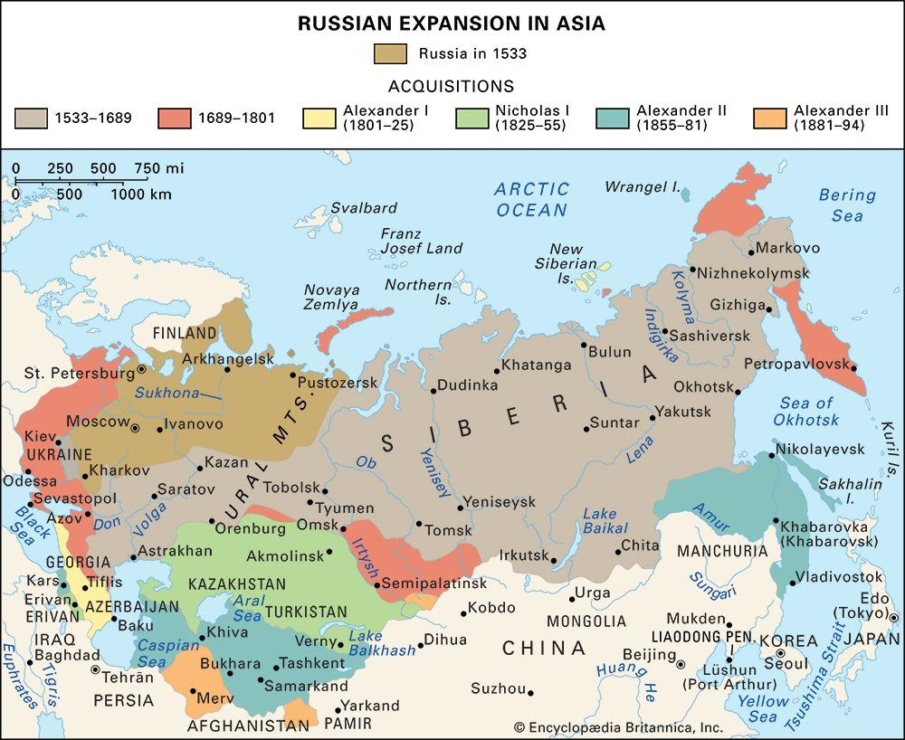

## Claim
Claim: "China and Japan plan to invade the Russian Federation."

## Actions
```
web_search("China Japan invade Russia")
```

## Evidence
### Evidence from `web_search`
The Soviet Union invaded Manchuria in August 1945, defeating the Japanese Kwantung Army, as detailed in an article from [Wikipedia](https://en.wikipedia.org/wiki/Soviet_invasion_of_Manchuria). This invasion led to the collapse of Japanese puppet states and the return of Manchuria and Inner Mongolia to China. History.com published an article on August 6, 2010, and last updated on May 27, 2025, discussing the Soviet Union's declaration of war on Japan on August 8, 1945, and the subsequent invasion of Manchuria the following day, as stated in [History.com](https://www.history.com/this-day-in-history/august-8/soviets-declare-war-on-japan-invade-manchuria) <image:i>.

The Russo-Japanese War (1904–05), in which Japan defeated Russia, is discussed in an article from [Britannica](https://www.britannica.com/event/Russo-Japanese-War) , . The war was caused by the rivalry between Russia and Japan for dominance in Korea and Manchuria. Japan forced Russia to abandon its expansionist policy in East Asia.


## Elaboration
The provided evidence does not support the claim that China and Japan plan to invade the Russian Federation. The search results detail historical conflicts between Russia and Japan, including the Russo-Japanese War and the Soviet invasion of Manchuria. However, these historical events do not indicate current plans for invasion.

The evidence highlights past conflicts and territorial disputes, but it does not provide any information about current military strategies or intentions of China or Japan towards Russia.

To verify the claim, information about current geopolitical relations, military strategies, and any official statements from China and Japan regarding Russia would be needed.


## Final Judgement
The search results describe historical conflicts between Russia, China, and Japan, but they do not provide any evidence to support the claim that China and Japan are currently planning to invade Russia. The evidence focuses on past wars and territorial disputes, not on present-day military strategies or intentions.

`false`


### Verdict: FALSE

### Justification
The search results reveal historical conflicts between Russia, Japan, and China, such as the [Russo-Japanese War](https://www.britannica.com/event/Russo-Japanese-War) and the Soviet invasion of Manchuria, but they do not provide any evidence to support the claim that China and Japan are currently planning to invade Russia.
