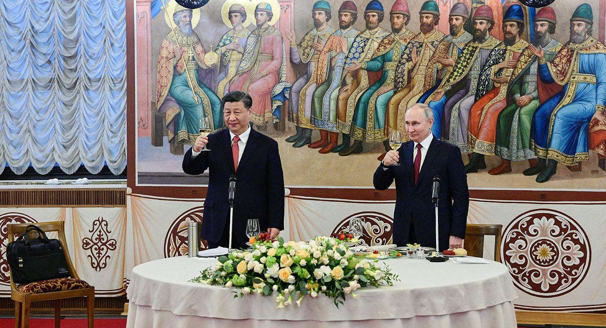

## Claim
Claim: "While serving as US President in 2024, Joe Biden ordered the US forces to prepare for possible nuclear confrontations with Russia, China, and North Korea."

## Actions
```
web_search("Joe Biden nuclear confrontation Russia China North Korea")
```

## Evidence
### Evidence from `web_search`
In March 2024, President Joe Biden approved a classified nuclear strategic plan, the "Nuclear Employment Guidance," to prepare the United States for potential nuclear challenges from China, Russia, and North Korea, according to reports from The New York Times ([https://www.nytimes.com/2024/08/20/us/politics/biden-nuclear-china-russia.html](https://www.nytimes.com/2024/08/20/us/politics/biden-nuclear-china-russia.html)) and The Guardian ([https://www.theguardian.com/us-news/article/2024/aug/20/biden-nuclear-strategy-china-threat](https://www.theguardian.com/us-news/article/2024/aug/20/biden-nuclear-strategy-china-threat)). The Guardian also notes the US is considering expanding its arsenal. 

The Carnegie Endowment for International Peace ([https://carnegieendowment.org/research/2024/10/cooperation-between-china-iran-north-korea-and-russia-current-and-potential-future-threats-to-america?lang=en](https://carnegieendowment.org/research/2024/10/cooperation-between-china-iran-north-korea-and-russia-current-and-potential-future-threats-to-america?lang=en)) discusses cooperation between China, Russia, Iran, and North Korea, and mentions that North Korea sent Russia munitions in exchange for food in February 2024. 


## Elaboration
The evidence confirms that in March 2024, President Joe Biden approved a classified nuclear strategic plan to prepare the United States for potential nuclear challenges from China, Russia, and North Korea ([https://www.nytimes.com/2024/08/20/us/politics/biden-nuclear-china-russia.html](https://www.nytimes.com/2024/08/20/us/politics/biden-nuclear-china-russia.html), [https://www.theguardian.com/us-news/article/2024/aug/20/biden-nuclear-strategy-china-threat](https://www.theguardian.com/us-news/article/2024/aug/20/biden-nuclear-strategy-china-threat)). This supports the claim that Biden ordered preparations for possible nuclear confrontations with these countries.

The evidence also highlights the ongoing cooperation between China, Russia, and North Korea, with North Korea providing munitions to Russia in exchange for food ([https://carnegieendowment.org/research/2024/10/cooperation-between-china-iran-north-korea-and-russia-current-and-potential-future-threats-to-america?lang=en](https://carnegieendowment.org/research/2024/10/cooperation-between-china-iran-north-korea-and-russia-current-and-potential-future-threats-to-america?lang=en)). This context suggests a potential for increased tensions and the need for strategic planning.


## Final Judgement
The evidence from multiple reliable sources confirms that President Biden approved a classified nuclear strategic plan in March 2024 to prepare for potential nuclear challenges from Russia, China, and North Korea. This directly supports the claim.

`true`


### Verdict: TRUE

### Justification
In March 2024, President Joe Biden approved a classified nuclear strategic plan, the "Nuclear Employment Guidance," to prepare the United States for potential nuclear challenges from China, Russia, and North Korea, as reported by The New York Times ([https://www.nytimes.com/2024/08/20/us/politics/biden-nuclear-china-russia.html](https://www.nytimes.com/2024/08/20/us/politics/biden-nuclear-china-russia.html)) and The Guardian ([https://www.theguardian.com/us-news/article/2024/aug/20/biden-nuclear-strategy-china-threat](https://www.theguardian.com/us-news/article/2024/aug/20/biden-nuclear-strategy-china-threat)).
