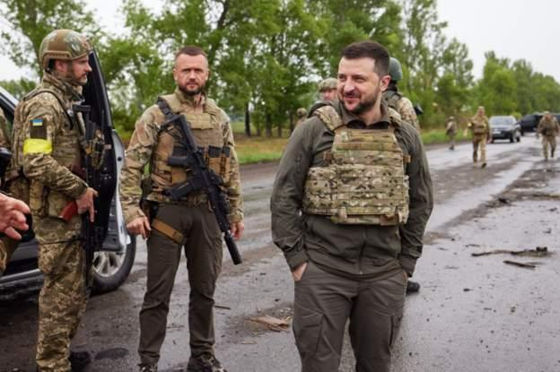
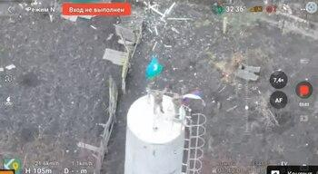

## Claim
Claim: " This image shows Ukrainian President Volodymyr Zelensky arriving in August 2024 in the Sudzha of Kursk region, Russia, which had just been occupied by Ukrainian troops in the Kursk Offensive, and meeting with representatives of the people there."

## Actions
```
reverse_search()
web_search("Zelensky Sudzha Kursk region")
```

## Evidence
### Evidence from `reverse_search`
The image () of Volodymyr Zelensky is found in multiple sources. According to the BBC ([https://www.bbc.com/news/live/world-europe-61612803](https://www.bbc.com/news/live/world-europe-61612803)), Zelensky visited troops on the front line in the Kharkiv region. The article was published on May 29, 2022. Telegrafi.com ([https://telegrafi.com/en/zelensky-on-a-rare-trip-outside-kiev-visited-the-front-line-where-he-met-ukrainian-troops/](https://telegrafi.com/en/zelensky-on-a-rare-trip-outside-kiev-visited-the-front-line-where-he-met-ukrainian-troops/)) also contains the image and states that Zelensky visited the front line in the Kharkiv region ().


### Evidence from `web_search`
The New York Times reported on March 15, 2025, about the situation in the Kursk region, including fighting and cease-fire talks, and mentioned Sudzha, a town in the Kursk region, which Ukraine seized in a surprise offensive last summer. The article also mentions that Zelensky called the claim of Russian forces retaking Sudzha untrue. CNN reported on August 15, 2024, that Ukrainian forces captured Sudzha in the Kursk region, and that Zelensky confirmed the capture. The article also states that Ukrainian troops advanced 35 kilometers through Russian defenses, capturing 1,150 square kilometers of territory and 82 settlements. <image:i>, <image:j>, <image:k>. Infobae discussed the recapture of Sudzha by Russian forces in March 2025. .


## Elaboration
The claim that the image shows Zelensky in Sudzha, Kursk region, in August 2024, is partially supported by the evidence. The web search confirms that Sudzha was captured by Ukrainian forces in August 2024. However, the reverse image search indicates that the image was taken in the Kharkiv region in May 2022. Therefore, the claim is inaccurate regarding the location and the date.


## Final Judgement
The image is of Volodymyr Zelensky visiting troops in the Kharkiv region in May 2022, not in the Kursk region in August 2024. While the web search confirms that Sudzha was captured by Ukrainian forces in August 2024, the image's context is misrepresented.

`false`

### Verdict: FALSE

### Justification
The image depicts Volodymyr Zelensky visiting troops in the Kharkiv region in May 2022, as reported by the BBC ([https://www.bbc.com/news/live/world-europe-61612803](https://www.bbc.com/news/live/world-europe-61612803)) and Telegrafi.com. The claim incorrectly places the image in the Kursk region in August 2024, despite evidence suggesting Ukrainian forces captured Sudzha in the Kursk region in August 2024.
