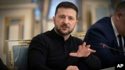

## Claim
Claim: "In a press conference on December 9, 2024 Ukrainian President Volodymyr Zelenskyy said: 'I will ask Biden to invite me to NATO ... there's no point in talking to Trump.'"

## Actions
```
web_search("Volodymyr Zelenskyy press conference December 9 2024")
web_search("Zelenskyy Biden NATO Trump")
```

## Evidence
### Evidence from `web_search`
On December 9, 2024, The Guardian reported that Volodymyr Zelenskyy would discuss NATO membership with Joe Biden in the coming days, and VOA News reported that Zelenskyy said, "I will ask Biden to invite me to NATO ... there's no point in talking to Trump." , , 

Reuters also reported on a press conference by Zelenskyy on December 9, 2024, where he stated that there was "no point in discussing with President Trump something that is not up to him today - while he is not yet in the White House." <image:k>

*   [https://www.theguardian.com/world/live/2024/dec/09/russia-ukraine-war-live-donald-trump-ceasefire-call-volodymyr-zelenskyy](https://www.theguardian.com/world/live/2024/dec/09/russia-ukraine-war-live-donald-trump-ceasefire-call-volodymyr-zelenskyy)
*   [https://www.reuters.com/world/europe/zelenskiy-floats-idea-deploying-foreign-troops-ukraine-before-nato-membership-2024-12-09/](https://www.reuters.com/world/europe/zelenskiy-floats-idea-deploying-foreign-troops-ukraine-before-nato-membership-2024-12-09/)
*   [https://www.voanews.com/a/zelenskyy-says-he-is-open-to-negotiated-end-to-war-with-russia-/7893258.html](https://www.voanews.com/a/zelenskyy-says-he-is-open-to-negotiated-end-to-war-with-russia-/7893258.html)


### Evidence from `web_search`
The BBC published an article on August 18, 2025, discussing Donald Trump's statements regarding Ukraine and NATO, including a meeting between Trump and Zelenskyy at the White House (, ). The Guardian also published an article on August 18, 2025, discussing a meeting between Volodymyr Zelenskyy, Donald Trump, and European leaders in Washington, noting that Trump has ruled out allowing Ukraine to join NATO. The Council on Foreign Relations (CFR) published an article discussing a meeting between Trump and Zelenskyy.

*   [https://www.bbc.com/news/articles/cm21j1ve817o](https://www.bbc.com/news/articles/cm21j1ve817o)
*   [https://www.cfr.org/article/major-takeaways-trumps-meeting-zelenskyy-and-european-leaders](https://www.cfr.org/article/major-takeaways-trumps-meeting-zelenskyy-and-european-leaders)
*   [https://www.theguardian.com/world/2025/aug/18/trump-ukraine-crimea-nato-zelesnkyy-washington-meeting](https://www.theguardian.com/world/2025/aug/18/trump-ukraine-crimea-nato-zelesnkyy-washington-meeting)


## Elaboration
The claim is supported by the evidence. Multiple sources, including The Guardian, VOA News, and Reuters, reported that Zelenskyy made the statement in a press conference on December 9, 2024. The evidence also shows that Zelenskyy met with Trump in the past.


## Final Judgement
The evidence confirms that Zelenskyy made the statement in a press conference on December 9, 2024, as reported by multiple news outlets. The search results provide direct quotes from Zelenskyy, supporting the claim's accuracy.

`true`


### Verdict: TRUE

### Justification
On December 9, 2024, Ukrainian President Volodymyr Zelenskyy stated, "I will ask Biden to invite me to NATO ... there's no point in talking to Trump," during a press conference, as reported by sources such as The Guardian ([https://www.theguardian.com/world/live/2024/dec/09/russia-ukraine-war-live-donald-trump-ceasefire-call-volodymyr-zelenskyy](https://www.theguardian.com/world/live/2024/dec/09/russia-ukraine-war-live-donald-trump-ceasefire-call-volodymyr-zelenskyy)) and VOA News ([https://www.voanews.com/a/zelenskyy-says-he-is-open-to-negotiated-end-to-war-with-russia-/7893258.html](https://www.voanews.com/a/zelenskyy-says-he-is-open-to-negotiated-end-to-war-with-russia-/7893258.html)).
