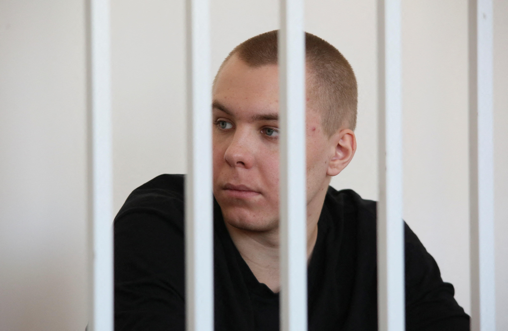

## Claim
Claim: "In November 2024 Russia sentenced a man to 14 years in prison for burning the Quran."

## Actions
```
web_search("Russia sentence man Quran burning November 2024")
```

## Evidence
### Evidence from `web_search`
In November 2024, Nikita Zhuravel was sentenced to 14 years in prison. Reuters ([Source](https://www.reuters.com/world/europe/russian-man-jailed-burning-koran-sentenced-14-years-separate-ukraine-treason-2024-11-25/)) reported that he was sentenced for treason, with the court finding him guilty of online communication with a member of the Security Service of Ukraine. The Moscow Times ([Source](https://www.themoscowtimes.com/2024/11/25/russian-man-jailed-for-quran-burning-sentenced-to-135-more-years-in-prison-for-treason-a87123)) and Meduza ([Source](https://meduza.io/en/news/2024/11/26/man-beaten-in-police-custody-for-burning-quran-gets-13-5-years-for-treason-against-russia-in-separate-case)) also reported on the sentencing, with Meduza stating that Zhuravel was arrested in May 2023 for burning a Quran.  

Zhuravel had previously been sentenced to 3.5 years in prison for burning the Quran. The recent sentence was for treason, with the Moscow Times stating that the additional sentence was 13 years and six months.


## Elaboration
The claim is partially accurate. In November 2024, Nikita Zhuravel was sentenced to 14 years in prison. However, the evidence indicates that this sentence was primarily for treason, not for burning the Quran.

Zhuravel was arrested in May 2023 for burning a Quran, and he received a separate sentence of 3.5 years for this act. The November 2024 sentence of 14 years was for treason, related to online communication with a member of the Security Service of Ukraine.


## Final Judgement
The claim is partially accurate. While the man was sentenced in November 2024, the primary charge leading to the 14-year sentence was treason, not the burning of the Quran, although he was also sentenced for burning the Quran.

`false`

### Verdict: FALSE

### Justification
In November 2024, Nikita Zhuravel was sentenced to 14 years in prison, as reported by Reuters ([Source](https://www.reuters.com/world/europe/russian-man-jailed-burning-koran-sentenced-14-years-separate-ukraine-treason-2024-11-25/)). However, the primary charge was treason, not the burning of the Quran, although he was also sentenced for burning the Quran.
