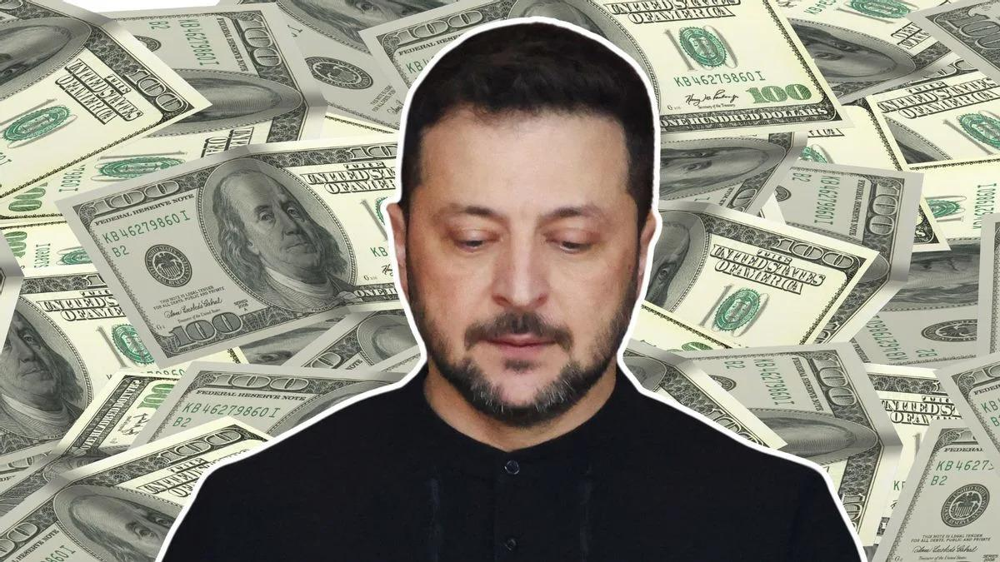

## Claim
Claim: "Ukrainian President Volodymyr Zelenskyy owns 15 homes including a $35 million home in Florida, has $1.2 billion in an overseas bank account, owns 15 homes, three private planes and has a monthly income of $11 million."

## Actions
```
web_search("Volodymyr Zelenskyy real estate holdings")
web_search("Volodymyr Zelenskyy financial assets")
```

## Evidence
### Evidence from `web_search`
A Yahoo News article fact-checked by Snopes rates the claim as "False". It states that Zelenskyy declared ownership of fewer than 15 properties, no planes, and an annual income of around $300,000. The article also mentions that there was no trace of a $35 million Florida mansion in Zelenskyy's name (, ).

The Times of India states that Zelenskyy's real estate portfolio is worth $4 million and includes two wholly owned apartments, two co-owned apartments, a commercial property, and five parking spaces (<image:k>). The OCCRP reported that Zelenskyy and his inner circle were beneficiaries of a network of offshore companies. The Pandora Papers show that Zelenskyy and his partners in comedy production owned a network of offshore companies related to their business based in the British Virgin Islands, Cyprus, and Belize (<image:k>).


### Evidence from `web_search`
The Myth Detector article ([https://mythdetector.com/en/change-during-the-russia-ukraine-war/](https://mythdetector.com/en/change-during-the-russia-ukraine-war/)) discusses Volodymyr Zelenskyy's wealth, mentioning a decrease in income after the war and the impact on his family's finances. It also states that Zelenskyy's net worth is less than $30 million, according to Forbes, and includes links to debunking articles. 

An AOL article ([https://www.aol.com/much-volodymyr-zelenskyy-worth-160047933.html](https://www.aol.com/much-volodymyr-zelenskyy-worth-160047933.html)) from April 24, 2022, reports that Zelenskyy's 2018 financial disclosure listed assets worth 37 million hryvnias. Celebrity Net Worth estimates his worth at roughly $1.5 million, with a monthly presidential income of $930. 


## Elaboration
The claim is demonstrably false. Multiple sources, including Snopes via a Yahoo News article, debunk the claim. The evidence indicates that Zelenskyy owns fewer than 15 properties, not three private planes, and his annual income is around $300,000, not $11 million monthly. There is no evidence of a $35 million home in Florida.

Zelenskyy's real estate portfolio is worth $4 million, according to The Times of India. His net worth is estimated to be less than $30 million by Forbes, and Celebrity Net Worth estimates his worth at roughly $1.5 million.

The evidence does not support the claim of $1.2 billion in an overseas bank account.


## Final Judgement
The claim that Volodymyr Zelenskyy owns 15 homes, a $35 million home in Florida, has $1.2 billion in an overseas bank account, three private planes, and a monthly income of $11 million is false. Fact-checks from multiple sources, including Snopes and The Times of India, contradict these assertions. Zelenskyy's actual assets and income are significantly lower than what the claim states.

`false`

### Verdict: FALSE

### Justification
The claim is false. Fact-checks from sources like Yahoo News, rated by Snopes, and The Times of India, contradict the claim that Volodymyr Zelenskyy owns 15 homes, a $35 million home in Florida, has $1.2 billion in an overseas bank account, three private planes, and a monthly income of $11 million. Zelenskyy's actual assets and income are significantly lower than what the claim states.
