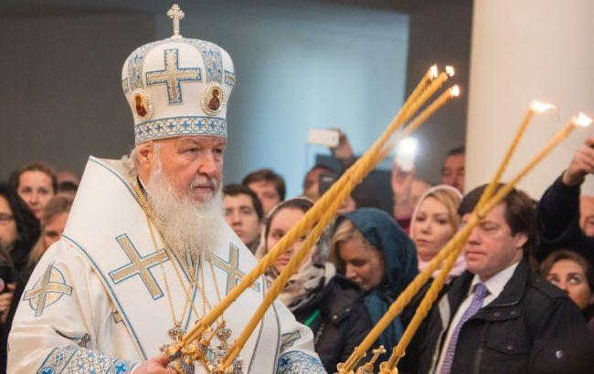
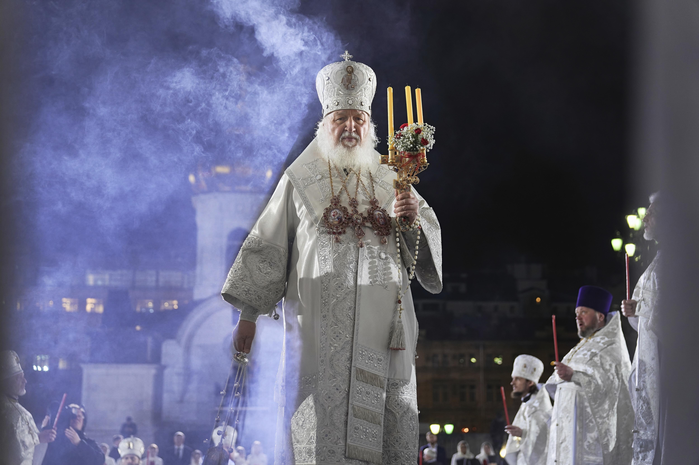

## Claim
Claim: " This image shows a Fox News broadcast from Easter 2025 where you can see the Patriarch Kirill in the center and Kyiv labeled as a Russian city in the top right corner of the image."

## Actions
```
web_search("Fox News Easter broadcast Patriarch Kirill")
image_search("Patriarch Kirill Easter service")
```

## Evidence
### Evidence from `web_search`
A Fox News broadcast on Easter 2025, from LiveNOW from Fox, mistakenly labeled Kyiv as a Russian city during its coverage of Easter services. The error, which appeared on screen for approximately 20 minutes, prompted the Ukrainian Foreign Ministry to call for an investigation. The broadcast also showed Patriarch Kirill and an Easter service from Moscow, attended by Vladimir Putin.

Sources: [Yahoo News](https://www.yahoo.com/news/fact-check-fox-livestream-news-233600386.html), [Newsweek](https://www.newsweek.com/fox-channel-ukraine-kyiv-russia-labeling-orthodox-easter-2061891), [RBC-Ukraine](https://newsukraine.rbc.ua/news/fox-news-broadcast-easter-from-moscow-and-1745135501.html).  


### Evidence from `image_search`
From [Source](https://www.politico.com/news/2022/06/22/patriarch-kirill-putin-russia-ukraine-00041388): 
Content: Politico published an image of Patriarch Kirill. 


## Elaboration
The evidence confirms the claim. The Fox News broadcast, from LiveNOW from Fox, mistakenly labeled Kyiv as a Russian city during its coverage of Easter services. The broadcast also showed Patriarch Kirill and an Easter service from Moscow, attended by Vladimir Putin. The image search also provided an image of Patriarch Kirill.


## Final Judgement
The claim is accurate. The provided evidence confirms that a Fox News broadcast mistakenly labeled Kyiv as a Russian city during an Easter service coverage, which also featured Patriarch Kirill and an Easter service from Moscow. `true`

### Verdict: TRUE

### Justification
The image depicts a Fox News broadcast from Easter 2025 that mistakenly labeled Kyiv as a Russian city during its coverage of Easter services, as reported by [Yahoo News](https://www.yahoo.com/news/fact-check-fox-livestream-news-233600386.html), [Newsweek](https://www.newsweek.com/fox-channel-ukraine-kyiv-russia-labeling-orthodox-easter-2061891), and [RBC-Ukraine](https://newsukraine.rbc.ua/news/fox-news-broadcast-easter-from-moscow-and-1745135501.html). The broadcast also showed Patriarch Kirill and an Easter service from Moscow.
