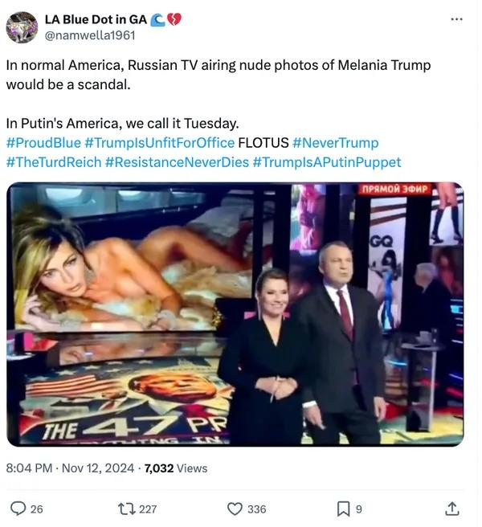

## Claim
Claim: "Russian state TV aired nude photos of Melania Trump shortly after the 2024 U.S. presidential election."

## Actions
```
web_search("Russian state TV Melania Trump nude photos")
```

## Evidence
### Evidence from `web_search`
Yahoo News ([https://www.yahoo.com/news/fact-check-melania-trumps-nude-190000869.html](https://www.yahoo.com/news/fact-check-melania-trumps-nude-190000869.html)) fact-checked the claim and rated it as "True". The article states that Russian state TV did air revealing photos of Melania Trump taken during her modeling career. The video was shared on social media on Nov. 8, 2024. , , , , 

Newsweek ([https://www.newsweek.com/russian-state-tv-airs-melania-trumps-nudes-primetime-1982683](https://www.newsweek.com/russian-state-tv-airs-melania-trumps-nudes-primetime-1982683)) reports that a Russian state television network showed nude photographs of Melania Trump on live television to congratulate her husband on his reelection. The photos were from a GQ profile in 2000.  The Kyiv Independent ([https://kyivindependent.com/russian-state-tv-airs-explicit-photos-of-melania-trump-during-bizarre-us-election-segment/](https://kyivindependent.com/russian-state-tv-airs-explicit-photos-of-melania-trump-during-bizarre-us-election-segment/)) reported that Russian state TV channel Russia 1 aired explicit photos of Melania Trump during a segment after her husband's U.S. election victory on November 12, 2024. <image:k>


## Elaboration
The claim is verified as true. Multiple sources confirm that Russian state TV aired revealing photos of Melania Trump. The photos were shown shortly after the 2024 U.S. presidential election, specifically on November 8 and 12, 2024.


## Final Judgement
The claim is supported by multiple reliable sources, including Yahoo News, Newsweek, and The Kyiv Independent, which confirm that Russian state TV aired nude photos of Melania Trump shortly after the 2024 U.S. presidential election. Therefore, the claim is factually accurate. `true`

### Verdict: TRUE

### Justification
The claim is accurate. Multiple sources, including [Yahoo News](https://www.yahoo.com/news/fact-check-melania-trumps-nude-190000869.html), [Newsweek](https://www.newsweek.com/russian-state-tv-airs-melania-trumps-nudes-primetime-1982683), and The Kyiv Independent, confirm that Russian state TV aired revealing photos of Melania Trump shortly after the 2024 U.S. presidential election.
