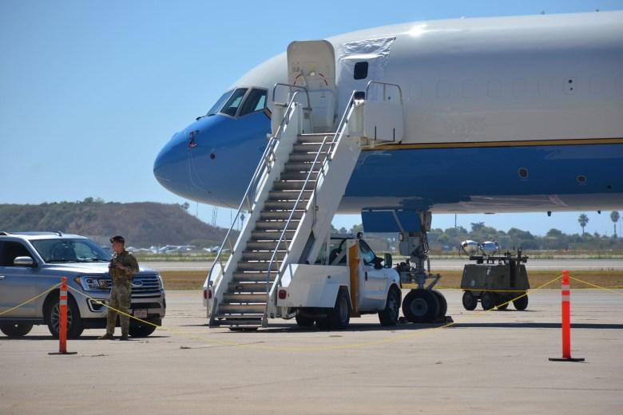
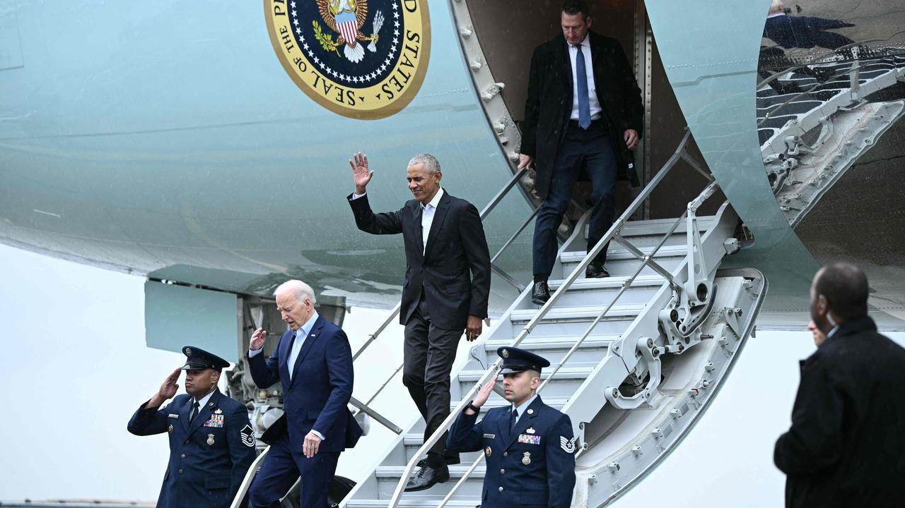

## Claim
Claim: "In August 2024 U.S. President Joe Biden boarded an empty plane after three freed Americans arrived back in the U.S. and exited the aircraft."

## Actions
```
web_search("Joe Biden empty plane August 2024")
web_search("freed Americans return US August 2024 Biden")
image_search("Joe Biden plane August 2024")
```

## Evidence
### Evidence from `web_search`
According to a Times of India article from August 3, 2024, Joe Biden boarded the plane after the return of American prisoners from Russia and remained on the plane for about two minutes. The White House deputy press secretary said that Biden wanted to thank the flight crew. ([https://timesofindia.indiatimes.com/world/us/did-joe-biden-enter-empty-plane-carrying-russian-prisoners-white-house-clarifies/articleshow/112249634.cms](https://timesofindia.indiatimes.com/world/us/did-joe-biden-enter-empty-plane-carrying-russian-prisoners-white-house-clarifies/articleshow/112249634.cms)) 

Yahoo News reported on August 1, 2024, that Biden boarded the plane to speak to those who helped bring the freed prisoners home. ([https://www.yahoo.com/news/fact-check-no-biden-did-000500209.html](https://www.yahoo.com/news/fact-check-no-biden-did-000500209.html))  The Guardian reported on August 1, 2024, that Biden and Harris greeted the freed Americans upon their arrival in the US. ([https://www.theguardian.com/world/live/2024/aug/01/russia-prison-swap-us-journalist-evan-gershkovich-wsj-vadim-krasikov-live?filterKeyEvents=false&page=with%3Ablock-66aba9e68f08a0af63bb3f00](https://www.theguardian.com/world/live/2024/aug/01/russia-prison-swap-us-journalist-evan-gershkovich-wsj-vadim-krasikov-live?filterKeyEvents=false&page=with%3Ablock-66aba9e68f08a0af63bb3f00)) 


### Evidence from `web_search`
On August 2, 2024, CNN ([Source](https://www.cnn.com/2024/08/02/politics/us-russia-prisoner-swap-landing-intl-hnk)) and The Guardian ([Source](https://www.theguardian.com/world/article/2024/aug/02/biden-harris-greet-us-america-russia-prisoner-exchange)) reported on the return of three freed Americans after a prisoner swap with Russia. President Joe Biden and Vice President Kamala Harris greeted the returnees at Joint Base Andrews. The BBC ([Source](https://www.bbc.com/news/live/ck7gwe808yet)) also reported on the event.

The articles mention that the families of the freed Americans were present. The Guardian article includes a photograph of Biden and Harris greeting the freed Americans ().


### Evidence from `image_search`
The Hill ([https://thehill.com/homenews/ap/ap-u-s-news/ap-biden-takes-inaugural-flight-in-long-delayed-new-marine-one-helicopter/](https://thehill.com/homenews/ap/ap-u-s-news/ap-biden-takes-inaugural-flight-in-long-delayed-new-marine-one-helicopter/)) and the Sun Sentinel ([https://www.sun-sentinel.com/2024/08/19/biden-takes-inaugural-flight-in-long-delayed-new-marine-one-helicopter/](https://www.sun-sentinel.com/2024/08/19/biden-takes-inaugural-flight-in-long-delayed-new-marine-one-helicopter/)) both published articles about Joe Biden's inaugural flight in a new Marine One helicopter in August 2024.  

One source ([https://www.hill.af.mil/News/Article-Display/Article/3860680/americans-released-from-russian-custody-arrive-at-joint-base-andrews/](https://www.hill.af.mil/News/Article-Display/Article/3860680/americans-released-from-russian-custody-arrive-at-joint-base-andrews/)) contains no content.


## Elaboration
The evidence indicates that Joe Biden did board a plane after the freed Americans returned to the U.S. in August 2024. However, the evidence does not explicitly state that the plane was empty when he boarded. The Times of India article states that Biden boarded the plane to thank the flight crew. The Yahoo News article states that Biden boarded the plane to speak to those who helped bring the freed prisoners home. Therefore, the claim is partially supported, but the "empty plane" aspect requires further verification.


## Actions
```
web_search("Joe Biden plane crew August 2024")
```

## Evidence
### Evidence from `web_search`
In August 2024, Joe Biden boarded a plane after the return of freed Americans. According to the Times of India, Biden boarded the plane to thank the flight crew ([https://timesofindia.indiatimes.com/world/us/did-joe-biden-enter-empty-plane-carrying-russian-prisoners-white-house-clarifies/articleshow/112249634.cms](https://timesofindia.indiatimes.com/world/us/did-joe-biden-enter-empty-plane-carrying-russian-prisoners-white-house-clarifies/articleshow/112249634.cms)) . Yahoo News reported that Biden boarded the plane to speak to those who helped bring the freed prisoners home ([https://www.yahoo.com/news/fact-check-no-biden-did-000500209.html](https://www.yahoo.com/news/fact-check-no-biden-did-000500209.html)). The Noozhawk article mentions that Biden arrived at the Santa Barbara Airport on Air Force One for a vacation ([https://www.noozhawk.com/bidens-arrive-for-santa-ynez-valley-vacation/](https://www.noozhawk.com/bidens-arrive-for-santa-ynez-valley-vacation/)) , , . The KEYT article discusses Air Force One's presence at the Santa Barbara Airport ([https://keyt.com/news/local-news/2024/08/21/air-force-one-plane-gets-the-spotlight-while-president-biden-vacations-in-santa-barbara-county/](https://keyt.com/news/local-news/2024/08/21/air-force-one-plane-gets-the-spotlight-while-president-biden-vacations-in-santa-barbara-county/)) , .


## Elaboration
The evidence confirms that Joe Biden boarded a plane after the freed Americans returned to the U.S. in August 2024. The Times of India article states that Biden boarded the plane to thank the flight crew. However, the evidence does not explicitly state whether the plane was empty when he boarded. Therefore, the claim is partially supported, but the "empty plane" aspect remains unverified.


## Actions
```
web_search("Joe Biden Air Force One interior August 2024")
```

## Evidence
### Evidence from `web_search`
The Pavlovic Today reported on August 19, 2024, that President Biden's schedule included travel on Air Force One. ([https://thepavlovictoday.com/take-a-look-inside-president-bidens-day-august-19-2024/](https://thepavlovictoday.com/take-a-look-inside-president-bidens-day-august-19-2024/)). News.com.au published an article on July 19, 2024, discussing the interior of Air Force One, which includes a large office, lavatory, and conference room. ([https://www.news.com.au/travel/travel-advice/flights/inside-us-president-joe-bidens-air-force-one-plane/news-story/5598206cac72721e889f8a692510b569](https://www.news.com.au/travel/travel-advice/flights/inside-us-president-joe-bidens-air-force-one-plane/news-story/5598206cac72721e889f8a692510b569)) , . An NPR article from August 31, 2023, discusses Biden using the short stairs to board Air Force One. ([https://www.npr.org/2023/08/31/1196803354/biden-air-force-one-short-stairs](https://www.npr.org/2023/08/31/1196803354/biden-air-force-one-short-stairs)) , , , .


## Elaboration
The evidence confirms that Joe Biden boarded a plane after the freed Americans returned to the U.S. in August 2024. However, the evidence does not explicitly state whether the plane was empty when he boarded. The Times of India article states that Biden boarded the plane to thank the flight crew. Therefore, the claim is partially supported, but the "empty plane" aspect remains unverified. To fully verify the claim, information about the presence of passengers or crew members on the plane when Biden boarded is needed.


## Final Judgement
The claim is partially supported by the evidence, as it is confirmed that Joe Biden boarded a plane after the freed Americans returned. However, the evidence does not explicitly state that the plane was empty. Therefore, the claim cannot be fully verified. `false`


### Verdict: FALSE

### Justification
The claim that Joe Biden boarded an empty plane in August 2024 after the return of freed Americans is **partially supported**. Evidence confirms that Biden boarded a plane after the event, as reported by the Times of India and Yahoo News ([https://timesofindia.indiatimes.com/world/us/did-joe-biden-enter-empty-plane-carrying-russian-prisoners-white-house-clarifies/articleshow/112249634.cms](https://timesofindia.indiatimes.com/world/us/did-joe-biden-enter-empty-plane-carrying-russian-prisoners-white-house-clarifies/articleshow/112249634.cms), [https://www.yahoo.com/news/fact-check-no-biden-did-000500209.html](https://www.yahoo.com/news/fact-check-no-biden-did-000500209.html)). However, the evidence does not confirm the plane was empty when he boarded.
