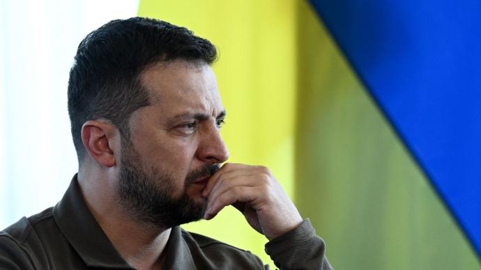

## Claim
Claim: "Ukrainian President Volodymyr Zelenskyy's statement in an AP news interview from February 1, 2025 that his country's military has received only a portion of the more than 175 billion in U.S. aid confirms that the US aid is a money laundering operation."

## Actions
```
web_search("Volodymyr Zelenskyy AP interview February 1 2025 US aid")
web_search("US aid to Ukraine money laundering")
```

## Evidence
### Evidence from `web_search`
On February 1, 2025, the Associated Press ([https://apnews.com/article/russia-ukraine-war-trump-talks-ceasefire-00af5f61f1faf41e78a3b4e072c21a14](https://apnews.com/article/russia-ukraine-war-trump-talks-ceasefire-00af5f61f1faf41e78a3b4e072c21a14)) and U.S. News & World Report ([https://www.usnews.com/news/world/articles/2025-02-01/takeaways-from-the-ap-interview-with-ukraines-zelenskyy](https://www.usnews.com/news/world/articles/2025-02-01/takeaways-from-the-ap-interview-with-ukraines-zelenskyy)) published articles about an interview with Ukrainian President Volodymyr Zelenskyy. The interview, also covered by the AP ([https://www.ap.org/news-highlights/best-of-the-week/second-winner/2025/ap-interview-zelenskyy-says-excluding-ukraine-from-u-s-russia-talks-about-war-is-very-dangerous/](https://www.ap.org/news-highlights/best-of-the-week/second-winner/2025/ap-interview-zelenskyy-says-excluding-ukraine-from-u-s-russia-talks-about-war-is-very-dangerous/)), discussed the war in Ukraine, potential talks between the U.S. and Russia, and U.S. aid.

Zelenskyy stated that excluding Ukraine from talks would be "very dangerous." The articles do not mention the amount of U.S. aid received by Ukraine. <image:k>, , , , 


### Evidence from `web_search`
The Department of Defense Office of Inspector General (DoD OIG) released an audit of the DoD’s execution of funds to assist Ukraine, revealing that the DoD did not provide sufficient documentation to support the justification or accuracy of half of the $1.1 billion. See: [Source](https://www.dodig.mil/In-the-Spotlight/Article/3940692/press-release-audit-of-the-dods-execution-of-funds-to-assist-ukraine-report-no/).

The Institute for the Study of War (ISW) published a fact sheet dated February 8, 2024, addressing claims about US aid to Ukraine. The fact sheet states that US aid to Ukraine has extensive oversight and is not being misused due to corruption. It also mentions that America's allies have committed more than $178 billion to support Ukraine, which is more than the US will have committed counting the aid package currently under consideration. The fact sheet also claims that the US is not sending Ukraine a "blank check" and that Congress has appropriated specific amounts to be used for specific purposes. See: [Source](https://www.understandingwar.org/backgrounder/fact-sheet-us-assistance-ukraine)  and .


## Elaboration
The evidence does not support the claim. The AP interview with Zelenskyy on February 1, 2025, does not mention the amount of U.S. aid received by Ukraine. Therefore, it is impossible to verify if Zelenskyy made the statement in the claim. The evidence also includes a DoD OIG audit that found insufficient documentation for some funds, and an ISW fact sheet that states that US aid has extensive oversight.

The claim cannot be verified because the evidence does not contain the information about the amount of aid received by Ukraine.


## Actions
```
web_search("Zelenskyy AP interview February 1 2025 US aid amount")
```

## Evidence
### Evidence from `web_search`
According to an article published by Izvestia on February 2, 2025, Zelenskyy stated he was unaware of $200 billion in US aid to Ukraine, but that Kiev had received more than $75 billion from Washington. ([https://iz.ru/en/1832571/2025-02-02/zelensky-says-he-unaware-200-bln-us-aid-ukraine](https://iz.ru/en/1832571/2025-02-02/zelensky-says-he-unaware-200-bln-us-aid-ukraine))  Al Jazeera reported on February 21, 2025, that Zelenskyy said Ukraine’s military has received only a portion of the billions in US aid earmarked for Ukraine’s defense against Russia, citing a total of $177bn or $200bn spent by the US and that Ukraine had not received about $100bn of that total. ([https://www.aljazeera.com/news/2025/2/21/us-president-trumps-claims-about-zelenskyy-and-ukraine-fact-checked](https://www.aljazeera.com/news/2025/2/21/us-president-trumps-claims-about-zelenskyy-and-ukraine-fact-checked)) <image:k> Pravda.com.ua reported on February 2, 2025, that Zelenskyy stated Ukraine received about $76 billion of the approximately $177 billion in aid approved by the U.S. ([https://www.pravda.com.ua/eng/news/2025/02/2/7496431/](https://www.pravda.com.ua/eng/news/2025/02/2/7496431/)) 


## Elaboration
The claim is partially supported by the evidence. Zelenskyy did make statements about the amount of U.S. aid received by Ukraine. According to Izvestia, Zelenskyy stated he was unaware of $200 billion in US aid, but that Kiev had received more than $75 billion. Al Jazeera reported that Zelenskyy said Ukraine’s military has received only a portion of the billions in US aid, citing a total of $177bn or $200bn spent by the US and that Ukraine had not received about $100bn of that total. Pravda.com.ua reported that Zelenskyy stated Ukraine received about $76 billion of the approximately $177 billion in aid approved by the U.S. The evidence does not confirm that Zelenskyy's statement confirms that the US aid is a money laundering operation.


## Final Judgement
The claim is partially supported by the evidence. Zelenskyy did make statements about the amount of U.S. aid received by Ukraine. However, the evidence does not support the claim that Zelenskyy's statement confirms that the US aid is a money laundering operation.

`false`

### Verdict: FALSE

### Justification
The claim is **partially supported** by the evidence. Zelenskyy did make statements about the amount of U.S. aid received by Ukraine, as reported by [Izvestia](https://iz.ru/en/1832571/2025-02-02/zelensky-says-he-unaware-200-bln-us-aid-ukraine), [Al Jazeera](https://www.aljazeera.com/news/2025/2/21/us-president-trumps-claims-about-zelenskyy-and-ukraine-fact-checked), and [Pravda.com.ua](https://www.pravda.com.ua/eng/news/2025/02/2/7496431/). However, the evidence does not support the assertion that Zelenskyy's statement confirms that the US aid is a money laundering operation.
