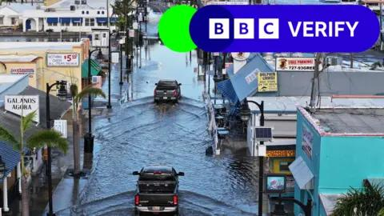

## Claim
Claim: "In remarks to reporters on September 29, 2024 US President Joe Biden announced that no more aid would be provided for the areas affected by Hurrican Helene, but 2.4 billion US-$ more for Ukraine."

## Actions
```
web_search("Joe Biden Hurricane Helene Ukraine aid September 29 2024")
```

## Evidence
### Evidence from `web_search`
The BBC published an article on October 9, 2024, discussing misinformation about the government's response to Hurricane Helene, including claims made by Donald Trump and JD Vance regarding government spending and rescue operations. The article also mentions President Biden approving the state governor’s request for military personnel and equipment to support rescue operations in North Carolina. ([https://www.bbc.com/news/articles/czd1q9q9gl9o](https://www.bbc.com/news/articles/czd1q9q9gl9o)) , , 

Yahoo News, originally from USA TODAY, fact-checks the claim that Biden said no more aid would be provided for Hurricane Helene victims, stating that Biden did not say this and that he announced a new aid package for Ukraine on September 30, 2024. ([https://www.yahoo.com/news/no-biden-didnt-hes-done-153402427.html](https://www.yahoo.com/news/no-biden-didnt-hes-done-153402427.html))  Le Monde reports on remarks made by US President Joe Biden on September 30, 2024, regarding the response to Hurricane Helene, where Biden announced he would travel to North Carolina to monitor rescue efforts. ([https://www.lemonde.fr/en/united-states/article/2024/09/30/biden-pledges-to-aid-victims-of-hurrican-helene-as-long-as-it-takes_6727795_133.html](https://www.lemonde.fr/en/united-states/article/2024/09/30/biden-pledges-to-aid-victims-of-hurrican-helene-as-long-as-it-takes_6727795_133.html)) 


## Elaboration
The evidence contradicts the claim. According to a Yahoo News fact-check, Biden did not say that no more aid would be provided for Hurricane Helene victims. Instead, he announced a new aid package for Ukraine on September 30, 2024. Furthermore, Le Monde reported that Biden pledged to aid victims of Hurricane Helene.


## Final Judgement
The claim is demonstrably false. Multiple sources, including Yahoo News and Le Monde, confirm that Biden did not announce the cessation of aid for Hurricane Helene victims. Instead, he pledged to aid the victims and announced a new aid package for Ukraine on September 30, 2024.

`false`


### Verdict: FALSE

### Justification
The claim is false. Fact-checks from sources like [Yahoo News](https://www.yahoo.com/news/no-biden-didnt-hes-done-153402427.html) and [Le Monde](https://www.lemonde.fr/en/united-states/article/2024/09/30/biden-pledges-to-aid-victims-of-hurrican-helene-as-long-as-it-takes_6727795_133.html) indicate that Biden did not make the statement in question and, in fact, pledged aid to Hurricane Helene victims.
