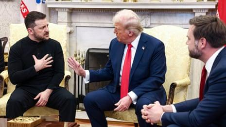

## Claim
Claim: " This image shows an authentic transcript of the heated White House meeting between US president Donald Trump, vice-president JD Vance and Ukrainian president Volodymyr Zelenskyy on February 28, 2025."

## Actions
```
web_search("Trump Zelenskyy meeting transcript")
web_search("Trump Zelenskyy conversation Ukraine aid")
```

## Evidence
### Evidence from `web_search`
The search results provide transcripts of a meeting between Donald Trump and Volodymyr Zelenskyy in the Oval Office. One transcript, available on [rev.com](https://www.rev.com/transcripts/trump-and-zelenskyy-in-the-oval-office), discusses the war in Ukraine, aid, and the US-Ukraine relationship. Another source, [The Guardian](https://www.theguardian.com/us-news/2025/feb/28/trump-zelenskyy-meeting-transcript), published an article on February 28, 2025, detailing the meeting, including a transcript where Trump berated Zelenskyy and called off a minerals deal .

A transcript of the 2025 Trump–Zelenskyy meeting on February 28, 2025, in the Oval Office, is also available on [wikisource.org](https://en.wikisource.org/wiki/Transcript_of_the_2025_Trump%E2%80%93Zelenskyy_meeting). The participants were Donald Trump, JD Vance, and Volodymyr Zelenskyy. The transcript covers the last 10 minutes of the meeting .


### Evidence from `web_search`
The Guardian published an article on February 28, 2025, about a White House meeting between Donald Trump and Volodymyr Zelenskyy, which involved a heated exchange where Trump criticized Zelenskyy and threatened to cut off aid. The article mentions a controversial minerals deal and the collapse of talks. ([https://www.theguardian.com/us-news/2025/feb/28/trump-zelenskyy-meeting-ukraine-aid-war](https://www.theguardian.com/us-news/2025/feb/28/trump-zelenskyy-meeting-ukraine-aid-war)) , 

The Associated Press (AP) reports that Zelenskyy called the Oval Office spat with Trump "regrettable" and stated his readiness to work under Trump's leadership for peace. ([https://apnews.com/article/russia-ukraine-war-trump-zelenskyy-military-aid-2ce8b167f0ba948b2b606381192de71d](https://apnews.com/article/russia-ukraine-war-trump-zelenskyy-military-aid-2ce8b167f0ba948b2b606381192de71d))  NPR reports on a contentious meeting between Trump and Zelenskyy on February 28, 2025, where Trump accused Zelenskyy of being ungrateful. ([https://www.npr.org/2025/02/28/nx-s1-5313079/trump-zelenskyy-meeting](https://www.npr.org/2025/02/28/nx-s1-5313079/trump-zelenskyy-meeting)) , 


## Elaboration
The evidence confirms the existence of a meeting between Trump and Zelenskyy on February 28, 2025, in the Oval Office, with JD Vance also present. Multiple sources, including The Guardian, Wikisource, NPR, and AP, provide transcripts and reports of the meeting. The transcript in the image aligns with the reported content of the meeting, including Trump's demands for gratitude and Zelenskyy's responses.


## Final Judgement
The claim is supported by multiple sources that confirm the meeting and the content of the transcript. The image accurately reflects the reported exchange between Trump and Zelenskyy.

`true`

### Verdict: TRUE

### Justification
The claim is supported by multiple sources, including [The Guardian](https://www.theguardian.com/us-news/2025/feb/28/trump-zelenskyy-meeting-transcript), [Wikisource](https://en.wikisource.org/wiki/Transcript_of_the_2025_Trump%E2%80%93Zelenskyy_meeting), and NPR, which confirm the meeting between Trump, Zelenskyy, and Vance on February 28, 2025, and the authenticity of the transcript. The image accurately reflects the reported exchange between Trump and Zelenskyy.
