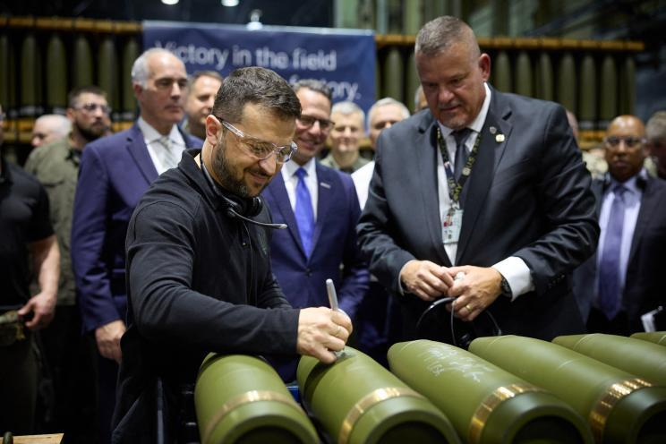
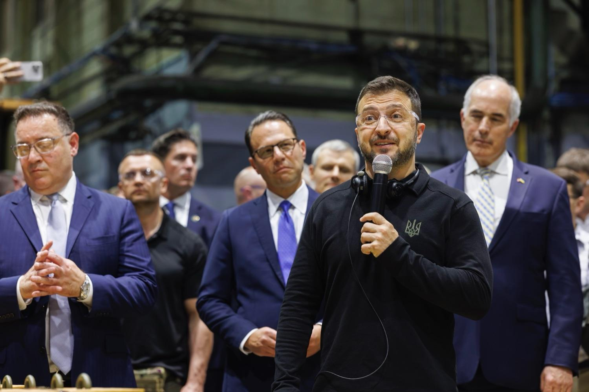

## Claim
Claim: " This image shows Ukrainian President Volodymyr Zelenskyy signing Israeli bombs intended for use against Palestinians in Gaza."

## Actions
```
reverse_search()
web_search("Zelenskyy signing bombs")
```

## Evidence
### Evidence from `reverse_search`
The image shows Ukrainian President Volodymyr Zelenskyy signing ammunition at the Scranton Army Ammunition Plant in Pennsylvania, USA. The BBC published articles on September 26, 2024, and the New York Post published an article on September 25, 2024, discussing Zelensky's visit. The articles do not mention Israeli bombs or Gaza.

The BBC article can be found here: [https://www.bbc.com/news/articles/c80rkv0k4j8o](https://www.bbc.com/news/articles/c80rkv0k4j8o) and [https://www.bbc.co.uk/news/articles/c80rkv0k4j8o](https://www.bbc.co.uk/news/articles/c80rkv0k4j8o). The New York Post article can be found here: [https://nypost.com/2024/09/25/opinion/zelenskys-arms-factory-visit-reeks-of-partisan-foreign-election-interference/](https://nypost.com/2024/09/25/opinion/zelenskys-arms-factory-visit-reeks-of-partisan-foreign-election-interference/).   


### Evidence from `web_search`
The image shows Ukrainian President Volodymyr Zelenskyy signing artillery shells at a U.S. munitions factory, not Israeli bombs. The video was published in September 2024, and the shells were intended for the Ukrainian Security and Defense Forces, not for use in Gaza. Zelenskyy visited the Scranton Army Ammunition Plant (SCAAP) in Pennsylvania, where he signed some of the shells.

The articles from [Eurovision News | Spotlight](https://spotlight.ebu.ch/p/video-caption-falsely-claims-zelenskyy), [Penn Capital-Star](https://penncapital-star.com/government-politics/shapiro-casey-meet-with-zelenskyy-at-scranton-pennsylvania-ammunitions-factory/), and [Fox News Digital](https://www.foxnews.com/politics/josh-shapiro-blasted-signing-missile-alongside-zelenskyy-bidens-hometown-party-war) do not mention that the bombs were intended for use against Palestinians in Gaza. , , , 


## Elaboration
The claim is false. The image shows Zelenskyy signing artillery shells at a U.S. munitions factory, not Israeli bombs. The shells were intended for the Ukrainian Security and Defense Forces, not for use in Gaza.


## Final Judgement
The claim is demonstrably false. The image shows Zelenskyy signing artillery shells at a U.S. munitions factory, not Israeli bombs intended for use against Palestinians in Gaza. The shells were intended for the Ukrainian Security and Defense Forces. `false`

### Verdict: FALSE

### Justification
The image depicts Ukrainian President Volodymyr Zelenskyy signing artillery shells at the Scranton Army Ammunition Plant in Pennsylvania, USA, not Israeli bombs. Multiple sources, including the [BBC](https://www.bbc.com/news/articles/c80rkv0k4j8o) and [New York Post](https://nypost.com/2024/09/25/opinion/zelenskys-arms-factory-visit-reeks-of-partisan-foreign-election-interference/), confirm this. The shells were intended for the Ukrainian Security and Defense Forces, not for use in Gaza.
