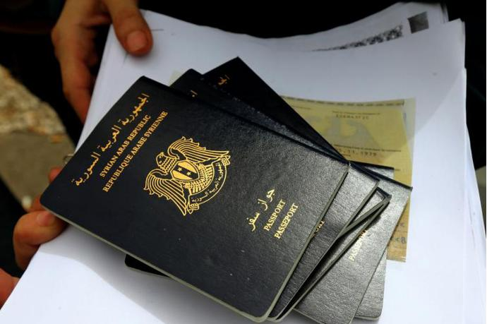

## Claim
Claim: " This image shows an authentic Russian passport of deposed Syrian dictator Bashar al-Assad."

## Actions
```
web_search("Bashar al-Assad Russian passport")
image_search("Bashar al-Assad passport")
```

## Evidence
### Evidence from `web_search`
An AOL article from January 8, 2025, fact-checks an image of a Russian passport claimed to belong to Bashar al-Assad and states that the image is fake and photoshopped. The article also mentions that Logically Facts debunked the claim. () The Wikipedia article discusses the Syrian civil war, including the 2024 Syrian opposition offensives and the fall of the Assad regime. It mentions Bashar al-Assad's birthdate (September 11, 1965) and that he fled to Moscow and was granted political asylum in November 2024. ()

NV.ua discusses the arrest of Bashar al-Assad's relatives at Beirut's airport on December 28, who were attempting to leave using fake passports. It also mentions that Bashar al-Assad's regime collapsed and he fled to Moscow. ()


### Evidence from `image_search`
The search results include a Wikipedia article on Syrian passports ([https://en.wikipedia.org/wiki/Syrian_passport](https://en.wikipedia.org/wiki/Syrian_passport)), an image of Syrian passports from Alestiklal.net (), and an image of a Libyan diplomatic passport from Libya Observer ().


## Elaboration
The evidence indicates that the image of the Russian passport is fake. An AOL article explicitly states that the image is photoshopped. Additionally, the evidence mentions that Bashar al-Assad fled to Moscow and was granted political asylum. However, the provided evidence does not confirm the authenticity of the passport in the image.


## Final Judgement
The claim that the image shows an authentic Russian passport of Bashar al-Assad is false. Multiple sources, including an AOL article, debunk the image as photoshopped.

`false`

### Verdict: FALSE

### Justification
The claim is false. An AOL article ([https://www.aol.com/](https://www.aol.com/)) explicitly states that the image of the Russian passport is photoshopped.
