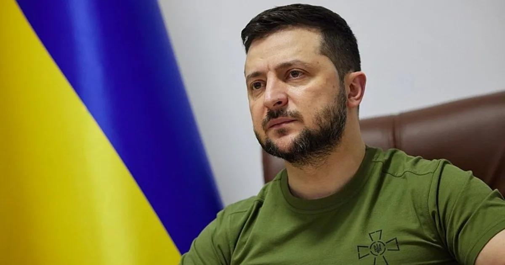

## Claim
Claim: " This image shows Ukrainian President Volodymyr Zelensky wearing a suit after the large-scale Russian invasion in Ukraine: in a talk with Klaus Schwab at the World Economic Forum."

## Actions
```
web_search("Volodymyr Zelensky Klaus Schwab World Economic Forum")
```

## Evidence
### Evidence from `web_search`
The World Economic Forum published an article about Volodymyr Zelenskyy's address at the Annual Meeting in Davos, Switzerland, from January 15–19, 2024, where he called on business leaders to invest in Ukraine. The article includes an image of Zelenskyy addressing participants at the World Economic Forum Annual Meeting 2024 .

Yahoo News states that the photo of Zelenskyy and Schwab in suits was taken in January 2020, before the Russian invasion of Ukraine. Since the invasion, Zelenskyy has stopped wearing suits publicly .


## Elaboration
The image shows Zelenskyy and Schwab at the World Economic Forum. However, the evidence indicates that the photo was taken in January 2020, before the Russian invasion. Since the invasion, Zelenskyy has not worn suits publicly.

Therefore, the claim is inaccurate because it states the image was taken after the Russian invasion.


## Final Judgement
The image depicts Volodymyr Zelenskyy and Klaus Schwab at the World Economic Forum. However, the photo was taken in January 2020, before the Russian invasion of Ukraine. Since the invasion, Zelenskyy has not worn suits publicly.

The claim is false because it states the image was taken after the Russian invasion, which is not accurate. `false`


### Verdict: FALSE

### Justification
The image depicts Volodymyr Zelenskyy and Klaus Schwab at the World Economic Forum, but the photo was taken in January 2020, before the Russian invasion of Ukraine, as reported by [Yahoo News](https://news.yahoo.com/). Since the invasion, Zelenskyy has not worn suits publicly. Therefore, the claim that the image was taken after the invasion is false.
