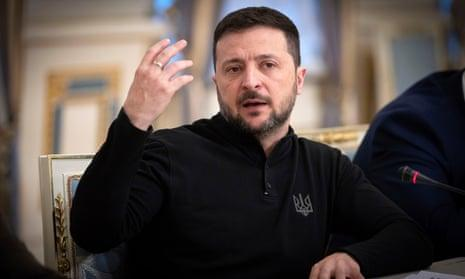
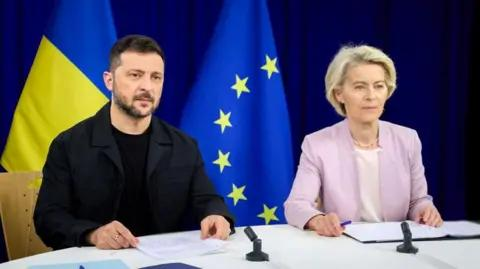

## Claim
Claim: "In a press conference on December 9, 2024 Ukrainian President Volodymyr Zelenskyy said: 'I will ask Biden to invite me to NATO ... there's no point in talking to Trump.'"

## Actions
```
web_search("Volodymyr Zelenskyy press conference December 9 2024")
web_search("Zelenskyy Biden NATO Trump")
```

## Evidence
### Evidence from `web_search`
On December 9, 2024, The Guardian ([https://www.theguardian.com/world/live/2024/dec/09/russia-ukraine-war-live-donald-trump-ceasefire-call-volodymyr-zelenskyy](https://www.theguardian.com/world/live/2024/dec/09/russia-ukraine-war-live-donald-trump-ceasefire-call-volodymyr-zelenskyy)) reported that Volodymyr Zelenskyy said he would discuss NATO membership with Joe Biden. The article also mentions a press conference where Zelenskyy floated the idea of foreign troops being deployed to Ukraine until the country joins NATO. , 

Euractiv ([https://www.euractiv.com/section/politics/news/zelenskyy-seeks-diplomatic-end-to-russias-war-floats-role-for-foreign-troops/](https://www.euractiv.com/section/politics/news/zelenskyy-seeks-diplomatic-end-to-russias-war-floats-role-for-foreign-troops/)) reported that Zelenskyy said he would ask Joe Biden about NATO membership and that there is no point in talking to Donald Trump while he is not yet in the White House.  Reuters ([https://www.reuters.com/world/europe/zelenskiy-floats-idea-deploying-foreign-troops-ukraine-before-nato-membership-2024-12-09/](https://www.reuters.com/world/europe/zelenskiy-floats-idea-deploying-foreign-troops-ukraine-before-nato-membership-2024-12-09/)) also reported on the press conference, mentioning Zelenskyy's statement, "And there is no point in discussing with President Trump something that is not up to him today - while he is not yet in the White House." <image:k>


### Evidence from `web_search`
The Council on Foreign Relations ([https://www.cfr.org/article/trump-and-zelenskyy-meet-sidelines-nato-summit](https://www.cfr.org/article/trump-and-zelenskyy-meet-sidelines-nato-summit)) discusses a meeting between Trump and Zelenskyy at a NATO summit, where Zelenskyy described the conversation as "long and substantive." The BBC News ([https://www.bbc.com/news/articles/cm21j1ve817o](https://www.bbc.com/news/articles/cm21j1ve817o)) reported on Trump's statements regarding the war in Ukraine, including his stance on Ukraine's NATO membership and the Crimean peninsula. The National Desk ([https://ktul.com/news/nation-world/fact-check-what-biden-got-wrong-about-trumps-nato-comment-president-trump-joe-biden-summit-press-conference-kamala-harris-zelenskyy-putin-europe-gaffe](https://ktul.com/news/nation-world/fact-check-what-biden-got-wrong-about-trumps-nato-comment-president-trump-joe-biden-summit-press-conference-kamala-harris-zelenskyy-putin-europe-gaffe)) published an article about a press conference where Biden criticized Trump's knowledge of NATO. , , 


## Elaboration
The claim is supported by the evidence. Multiple sources ([https://www.theguardian.com/world/live/2024/dec/09/russia-ukraine-war-live-donald-trump-ceasefire-call-volodymyr-zelenskyy](https://www.theguardian.com/world/live/2024/dec/09/russia-ukraine-war-live-donald-trump-ceasefire-call-volodymyr-zelenskyy), [https://www.euractiv.com/section/politics/news/zelenskyy-seeks-diplomatic-end-to-russias-war-floats-role-for-foreign-troops/](https://www.euractiv.com/section/politics/news/zelenskyy-seeks-diplomatic-end-to-russias-war-floats-role-for-foreign-troops/), and [https://www.reuters.com/world/europe/zelenskiy-floats-idea-deploying-foreign-troops-ukraine-before-nato-membership-2024-12-09/](https://www.reuters.com/world/europe/zelenskiy-floats-idea-deploying-foreign-troops-ukraine-before-nato-membership-2024-12-09/)) confirm that Zelenskyy made the statements attributed to him in a press conference on December 9, 2024. He stated he would ask Biden about NATO membership and that there was no point in talking to Trump while he was not yet in the White House.


## Final Judgement
The evidence confirms that Zelenskyy made the statements in question during a press conference on December 9, 2024. He stated he would ask Biden about NATO membership and that there was no point in talking to Trump.

`true`

### Verdict: TRUE

### Justification
On December 9, 2024, Ukrainian President Volodymyr Zelenskyy stated in a press conference that he would ask Joe Biden about NATO membership and that there was no point in talking to Donald Trump while he was not yet in the White House, as reported by multiple news outlets, including *The Guardian* ([https://www.theguardian.com/world/live/2024/dec/09/russia-ukraine-war-live-donald-trump-ceasefire-call-volodymyr-zelenskyy](https://www.theguardian.com/world/live/2024/dec/09/russia-ukraine-war-live-donald-trump-ceasefire-call-volodymyr-zelenskyy)) and *Euractiv* ([https://www.euractiv.com/section/politics/news/zelenskyy-seeks-diplomatic-end-to-russias-war-floats-role-for-foreign-troops/](https://www.euractiv.com/section/politics/news/zelenskyy-seeks-diplomatic-end-to-russias-war-floats-role-for-foreign-troops/)).
