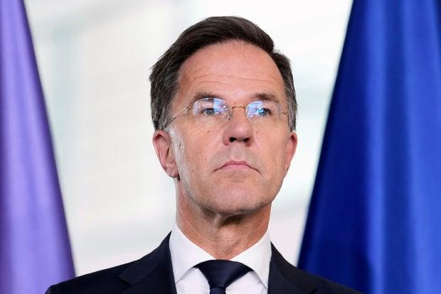

## Claim
Claim: "After Donald Trump won the US presidential election in 2024, NATO Secretary General Mark Rutte said that ‘If Trump surrenders Ukraine to Putin, he will personally expel the United States from the alliance’."

## Actions
```
web_search("Mark Rutte Trump Ukraine Putin NATO")
```

## Evidence
### Evidence from `web_search`
The NATO website ([https://www.nato.int/cps/en/natohq/opinions_237051.htm](https://www.nato.int/cps/en/natohq/opinions_237051.htm)) contains remarks by NATO Secretary General Mark Rutte with Donald J. Trump at the White House, discussing support for Ukraine. NPR ([https://www.npr.org/2025/07/14/nx-s1-5467272/russia-ukraine-war-trump-nato-weapons-tariffs](https://www.npr.org/2025/07/14/nx-s1-5467272/russia-ukraine-war-trump-nato-weapons-tariffs)) published an article on July 14, 2025, discussing President Trump's meeting with NATO Secretary-General Mark Rutte, including Trump's promise to provide weapons to Ukraine through NATO. 

CBS News ([https://www.cbsnews.com/news/trump-nato-secretary-general-mark-rutte-meeting-ukraine-russia/](https://www.cbsnews.com/news/trump-nato-secretary-general-mark-rutte-meeting-ukraine-russia/)) reports on Donald Trump's meeting with NATO Secretary General Mark Rutte, mentioning Trump considering authorizing fresh funding for Ukraine. , 


## Elaboration
The evidence indicates that Mark Rutte and Donald Trump met to discuss support for Ukraine. However, the provided sources do not contain the specific quote attributed to Rutte in the claim.

Therefore, the claim cannot be verified with the available information.


## Actions
```
web_search("Mark Rutte quote Trump Ukraine Putin NATO expulsion")
```

## Evidence
### Evidence from `web_search`
From [Source](https://www.euronews.com/my-europe/2024/11/20/no-natos-chief-has-not-threatened-to-expel-us): 
Content: Euronews published an article on November 20, 2024, stating that claims circulated on social media that Mark Rutte, secretary-general of NATO, threatened to expel the US from the alliance if Donald Trump "surrenders Ukraine to Putin" are false. The article mentions that NATO does not have a specific mechanism to suspend or expel a member and that a spokesperson called the claim "bogus". The article also includes Rutte's statements about working closely with Trump and his acknowledgment of Trump's role in increasing NATO defense spending.


## Elaboration
The new evidence directly contradicts the claim. Euronews reported that the quote attributed to Mark Rutte is false and that a NATO spokesperson called the claim "bogus."


## Final Judgement
The initial search revealed meetings between Trump and Rutte regarding Ukraine, but did not contain the specific quote. The subsequent search found a Euronews article explicitly debunking the claim, stating that the quote is false and that a NATO spokesperson called it "bogus."

`false`


### Verdict: FALSE

### Justification
The claim is false. A Euronews article ([https://www.euronews.com/my-europe/2024/11/20/no-natos-chief-has-not-threatened-to-expel-us](https://www.euronews.com/my-europe/2024/11/20/no-natos-chief-has-not-threatened-to-expel-us)) explicitly states that the quote attributed to Mark Rutte is false and that a NATO spokesperson called the claim "bogus."
