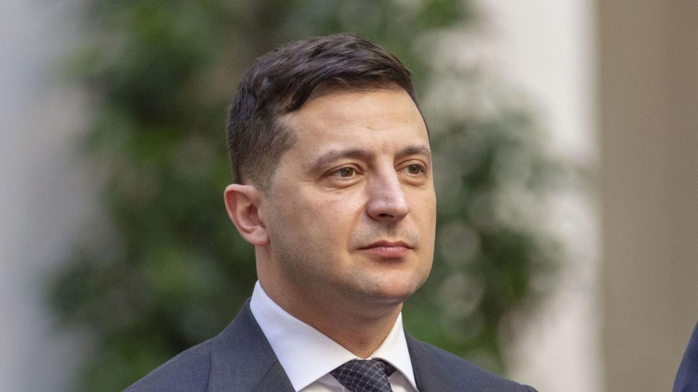

## Claim
Claim: "Ukrainian President Volodymyr Zelenskyy owns 15 homes including a $35 million home in Florida, has $1.2 billion in an overseas bank account, owns 15 homes, three private planes and has a monthly income of $11 million."

## Actions
```
web_search("Volodymyr Zelenskyy real estate holdings")
web_search("Volodymyr Zelenskyy financial assets")
```

## Evidence
### Evidence from `web_search`
According to a Yahoo News article fact-checked by Snopes, the claim is false. Zelenskyy's asset declaration shows fewer than 15 properties, no planes, and an annual income of around $300,000. The declaration listed one overseas bank account holding around $377,000. There is no trace of a $35 million Florida mansion in Zelenskyy's name. ([https://www.yahoo.com/news/fact-check-facts-behind-resurfaced-231800640.html](https://www.yahoo.com/news/fact-check-facts-behind-resurfaced-231800640.html)) , 

The Times of India states that Zelenskyy's real estate portfolio is worth $4 million. ([https://timesofindia.indiatimes.com/etimes/trending/net-worth-of-volodymyr-zelenskyy-the-entertainer-turned-president-of-ukraine/articleshow/118651819.cms](https://timesofindia.indiatimes.com/etimes/trending/net-worth-of-volodymyr-zelenskyy-the-entertainer-turned-president-of-ukraine/articleshow/118651819.cms)) The OCCRP reported that Zelenskyy and his inner circle were beneficiaries of a network of offshore companies. ([https://www.occrp.org/en/project/the-pandora-papers/pandora-papers-reveal-offshore-holdings-of-ukrainian-president-and-his-inner-circle](https://www.occrp.org/en/project/the-pandora-papers/pandora-papers-reveal-offshore-holdings-of-ukrainian-president-and-his-inner-circle)) , <image:k>


### Evidence from `web_search`
Myth Detector ([Source](https://mythdetector.com/en/change-during-the-russia-ukraine-war/)) states that Zelenskyy's income decreased after the war began, and his family's financial situation was affected by the temporary suspension of rental income from real estate. According to Forbes data from 2022, Zelenskyy's net worth is less than $30 million. The article includes links to several Myth Detector reports debunking claims about Zelenskyy's real estate holdings. , 

An article from AOL ([Source](https://www.aol.com/much-volodymyr-zelenskyy-worth-160047933.html)) states that Zelenskyy's financial disclosure from 2018 listed total assets worth 37 million hryvnias. According to Celebrity Net Worth, Zelenskyy is worth roughly $1.5 million, not $1.5 billion. Zelenskyy's monthly income is $930. 


## Elaboration
The claim is false. Multiple sources contradict the claim's assertions about Zelenskyy's assets. Snopes, citing Zelenskyy's asset declaration, states that he owns fewer than 15 properties, no private planes, and has an annual income of around $300,000, with approximately $377,000 in an overseas bank account. ([https://www.yahoo.com/news/fact-check-facts-behind-resurfaced-231800640.html](https://www.yahoo.com/news/fact-check-facts-behind-resurfaced-231800640.html))

The Times of India values Zelenskyy's real estate portfolio at $4 million. ([https://timesofindia.indiatimes.com/etimes/trending/net-worth-of-volodymyr-zelenskyy-the-entertainer-turned-president-of-ukraine/articleshow/118651819.cms](https://timesofindia.indiatimes.com/etimes/trending/net-worth-of-volodymyr-zelenskyy-the-entertainer-turned-president-of-ukraine/articleshow/118651819.cms)) AOL reports that Zelenskyy's monthly income is $930, and Celebrity Net Worth estimates his net worth at roughly $1.5 million. ([https://www.aol.com/much-volodymyr-zelenskyy-worth-160047933.html](https://www.aol.com/much-volodymyr-zelenskyy-worth-160047933.html))


## Final Judgement
The claim that Volodymyr Zelenskyy owns 15 homes, a $35 million home in Florida, has $1.2 billion in an overseas bank account, three private planes, and a monthly income of $11 million is false. Multiple sources, including Snopes, The Times of India, and AOL, provide evidence that contradicts these assertions. Zelenskyy's actual assets and income are significantly lower than what the claim suggests.

`false`

### Verdict: FALSE

### Justification
The claim is false. Fact-checks from sources like Snopes ([https://www.yahoo.com/news/fact-check-facts-behind-resurfaced-231800640.html](https://www.yahoo.com/news/fact-check-facts-behind-resurfaced-231800640.html)) and AOL ([https://www.aol.com/much-volodymyr-zelenskyy-worth-160047933.html](https://www.aol.com/much-volodymyr-zelenskyy-worth-160047933.html)) show that Zelenskyy's assets and income are significantly less than what the claim states.
