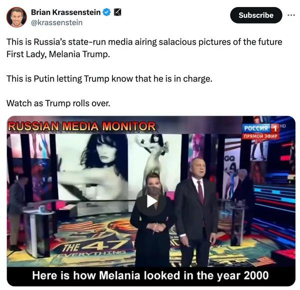

## Claim
Claim: "Russian state TV aired nude photos of Melania Trump shortly after the 2024 U.S. presidential election."

## Actions
```
web_search("Russian state TV Melania Trump nude photos")
```

## Evidence
### Evidence from `web_search`
According to a Yahoo News fact check, Russian state TV aired revealing photos of Melania Trump shortly after the 2024 U.S. presidential election, which was rated as "True" (). The video was shared on social media on Nov. 8, 2024, and was available on Smotrim.ru, an official online platform of Russian state television (, , , ). Newsweek reports that a Russian state television network showed nude photographs of Melania Trump on live television to congratulate her on her husband's reelection, with photos from a GQ profile in 2000 ().

The Kyiv Independent reported that Russian state TV channel Russia 1 aired explicit photos of Melania Trump during a segment after her husband's U.S. election victory on November 12, 2024. The segment, which was part of the prime-time show "60 Minutes," included photos from her modeling career.


## Elaboration
The claim is verified as true. According to a Yahoo News fact check, Russian state TV aired revealing photos of Melania Trump shortly after the 2024 U.S. presidential election. The video was shared on social media on Nov. 8, 2024, and was available on Smotrim.ru, an official online platform of Russian state television. Newsweek and The Kyiv Independent also confirm that Russian state TV aired nude or explicit photos of Melania Trump after her husband's election victory.


## Final Judgement
The evidence confirms that Russian state TV aired nude photos of Melania Trump shortly after the 2024 U.S. presidential election. This is supported by multiple sources, including Yahoo News, Newsweek, and The Kyiv Independent.

`true`

### Verdict: TRUE

### Justification
The claim is verified as true. Multiple sources, including a [Yahoo News fact check](https://news.yahoo.com/fact-check-russian-state-tv-190000697.html), confirm that Russian state TV aired revealing photos of Melania Trump shortly after the 2024 U.S. presidential election. This was further corroborated by reports from Newsweek and The Kyiv Independent.
