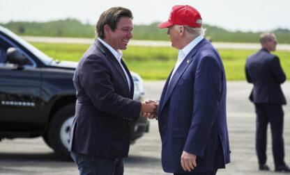
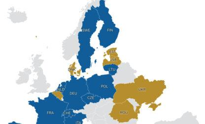
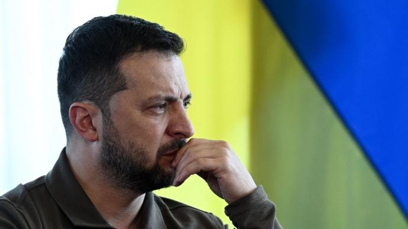

## Claim
Claim: "Ukrainian President Volodymyr Zelenskyy's statement in an AP news interview from February 1, 2025 that his country's military has received only a portion of the more than 175 billion in U.S. aid confirms that the US aid is a money laundering operation."

## Actions
```
web_search("Volodymyr Zelenskyy AP interview February 1 2025 US aid")
web_search("US aid to Ukraine money laundering")
```

## Evidence
### Evidence from `web_search`
The Associated Press ([Source](https://apnews.com/article/russia-ukraine-war-trump-talks-ceasefire-00af5f61f1faf41e78a3b4e072c21a14)) and U.S. News & World Report ([Source](https://www.usnews.com/news/world/articles/2025-02-01/takeaways-from-the-ap-interview-with-ukraines-zelenskyy)) reported on an AP interview with Ukrainian President Volodymyr Zelenskyy on February 1, 2025. Zelenskyy discussed the war in Ukraine, potential talks between the U.S. and Russia, and the need for in-person meetings to develop more detailed agreements.

The AP also published an interview with Zelenskyy on February 1, 2025 ([Source](https://www.ap.org/news-highlights/best-of-the-week/second-winner/2025/ap-interview-zelenskyy-says-excluding-ukraine-from-u-s-russia-talks-about-war-is-very-dangerous/)) , , , . Zelenskyy stated that excluding Ukraine from talks would be "very dangerous." The articles do not mention the amount of U.S. aid received by Ukraine.


### Evidence from `web_search`
The Department of Defense Office of Inspector General (DoD OIG) released an audit of the DoD’s execution of funds to assist Ukraine, which revealed that the DoD did not provide sufficient documentation to support the justification or accuracy of half of the total funds, $1.1 billion. The report is from 2025. [Source](https://www.dodig.mil/In-the-Spotlight/Article/3940692/press-release-audit-of-the-dods-execution-of-funds-to-assist-ukraine-report-no/)

The Institute for the Study of War (ISW) published a fact sheet dated February 8, 2024, addressing claims about US aid to Ukraine.  The fact sheet states that US aid to Ukraine has extensive oversight and is not being misused due to corruption. It also mentions that America's allies have committed more than $178 billion to support Ukraine. The fact sheet also claims that the US is not sending Ukraine a "blank check."  [Source](https://www.understandingwar.org/backgrounder/fact-sheet-us-assistance-ukraine)


## Elaboration
The evidence does not support the claim that Zelenskyy's statement confirms the US aid is a money laundering operation. The AP interview with Zelenskyy on February 1, 2025, does not mention the amount of US aid received by Ukraine. The evidence does mention that America's allies have committed more than $178 billion to support Ukraine.

The DoD OIG audit revealed that the DoD did not provide sufficient documentation to support the justification or accuracy of half of the total funds, $1.1 billion. However, the Institute for the Study of War (ISW) fact sheet states that US aid to Ukraine has extensive oversight and is not being misused due to corruption.

The claim is not verifiable due to the lack of information about Zelenskyy's statement regarding the amount of US aid received.


## Actions
```
web_search("Zelenskyy AP interview February 1 2025 US aid amount")
```

## Evidence
### Evidence from `web_search`
In an interview with the Associated Press, Volodymyr Zelenskyy stated that Ukraine has received only a portion of the US aid. Izvestia reports that Zelenskyy said Kiev had only received more than $75 billion from Washington, while Al Jazeera states that Zelenskyy said Ukraine’s military has received only a portion of the billions in US aid earmarked for Ukraine’s defense against Russia, citing a total of $177bn or $200bn spent by the US. Pravda.com.ua reports that Zelenskyy stated that Ukraine has received about US$76 billion of the approximately US$177 billion in aid approved by the US.   


## Elaboration
Zelenskyy stated in an AP interview that Ukraine has received only a portion of the US aid. Multiple sources, including Izvestia, Al Jazeera, and Pravda.com.ua, report on this statement. Zelenskyy mentioned receiving over $75 billion, while the US had earmarked $177 billion or $200 billion. The DoD OIG audit revealed that the DoD did not provide sufficient documentation to support the justification or accuracy of half of the total funds, $1.1 billion.

The claim is partially supported. Zelenskyy's statement confirms that Ukraine has received only a portion of the US aid. However, the evidence does not directly confirm that the US aid is a money laundering operation.


## Final Judgement
The claim is partially supported. Zelenskyy did state in an AP interview that Ukraine had received only a portion of the US aid. However, the evidence does not directly confirm that the US aid is a money laundering operation. The DoD OIG audit revealed that the DoD did not provide sufficient documentation to support the justification or accuracy of half of the total funds, $1.1 billion.

`false`

### Verdict: FALSE

### Justification
The claim is **false**. While Zelenskyy stated in an AP interview that Ukraine had received only a portion of the US aid, the evidence does not directly confirm that the US aid is a money laundering operation. The Department of Defense Office of Inspector General (DoD OIG) audit revealed that the DoD did not provide sufficient documentation to support the justification or accuracy of half of the total funds, $1.1 billion.
