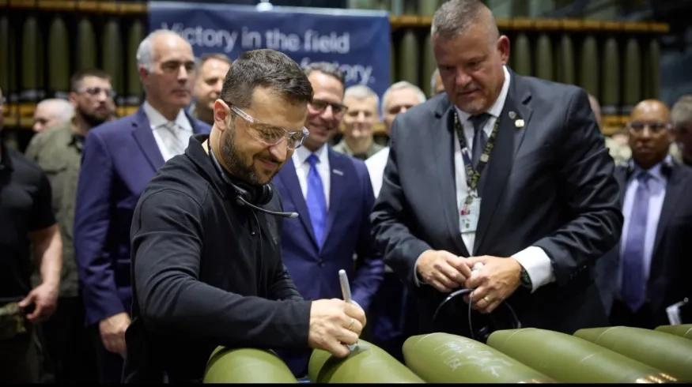

## Claim
Claim: " This image shows Ukrainian President Volodymyr Zelenskyy signing Israeli bombs intended for use against Palestinians in Gaza."

## Actions
```
web_search("Volodymyr Zelenskyy signing bombs")
web_search("Zelenskyy signing Israeli bombs")
image_search("Zelenskyy signing bombs")
```

## Evidence
### Evidence from `web_search`
The image shows Ukrainian President Volodymyr Zelenskyy signing munitions. According to the Eurovision News | Spotlight ([https://spotlight.ebu.ch/p/video-caption-falsely-claims-zelenskyy](https://spotlight.ebu.ch/p/video-caption-falsely-claims-zelenskyy)), the video shows Zelenskyy at a U.S. munitions factory supporting Ukraine's defense needs, not Israeli bombs. Zelenskyy wrote "Glory to Ukraine" and "Thanks for Support" on the shells, referencing Ukraine's war with Russia. Fox News ([https://www.foxnews.com/politics/josh-shapiro-blasted-signing-missile-alongside-zelenskyy-bidens-hometown-party-war](https://www.foxnews.com/politics/josh-shapiro-blasted-signing-missile-alongside-zelenskyy-bidens-hometown-party-war)) and Caliber.Az ([https://caliber.az/en/post/zelenskyy-s-glory-to-ukraine-inscription-on-us-bombs-in-pennsylvania-stirs-controversy](https://caliber.az/en/post/zelenskyy-s-glory-to-ukraine-inscription-on-us-bombs-in-pennsylvania-stirs-controversy)) also report on Zelenskyy signing munitions at the Scranton Army Ammunition Plant in Pennsylvania.   


### Evidence from `image_search`
The Associated Press ([Source](https://apnews.com/article/zelenskyy-johnson-ambassador-ukraine-biden-harris-trump-d81b0a055d99cfd4804b3f2c00915d09)), Radio Free Europe/Radio Liberty ([Source](https://www.rferl.org/a/zelenskiy-markarova-scranton-munitions-plant-johnson-harris/33135165.html)), and BBC News ([Source](https://www.bbc.com/news/articles/c5y30244467o)) all published images of Volodymyr Zelenskyy signing munitions.   

The images show Zelenskyy signing artillery shells. 


## Elaboration
The claim is false. The evidence indicates that the image shows Zelenskyy signing munitions at a U.S. munitions factory in support of Ukraine's defense needs, not Israeli bombs. The munitions were artillery shells, and Zelenskyy wrote "Glory to Ukraine" and "Thanks for Support" on them.


## Final Judgement
The claim is demonstrably false. The image shows Zelenskyy signing munitions at a U.S. munitions factory, not Israeli bombs. The claim misrepresents the context of the image.

`false`


### Verdict: FALSE

### Justification
The claim is false. The image depicts Ukrainian President Volodymyr Zelenskyy signing artillery shells at a U.S. munitions factory, not Israeli bombs. This event was part of his visit to support Ukraine's defense, as reported by the Eurovision News | Spotlight ([https://spotlight.ebu.ch/p/video-caption-falsely-claims-zelenskyy](https://spotlight.ebu.ch/p/video-caption-falsely-claims-zelenskyy)) and confirmed by other sources like Fox News and Caliber.Az.
