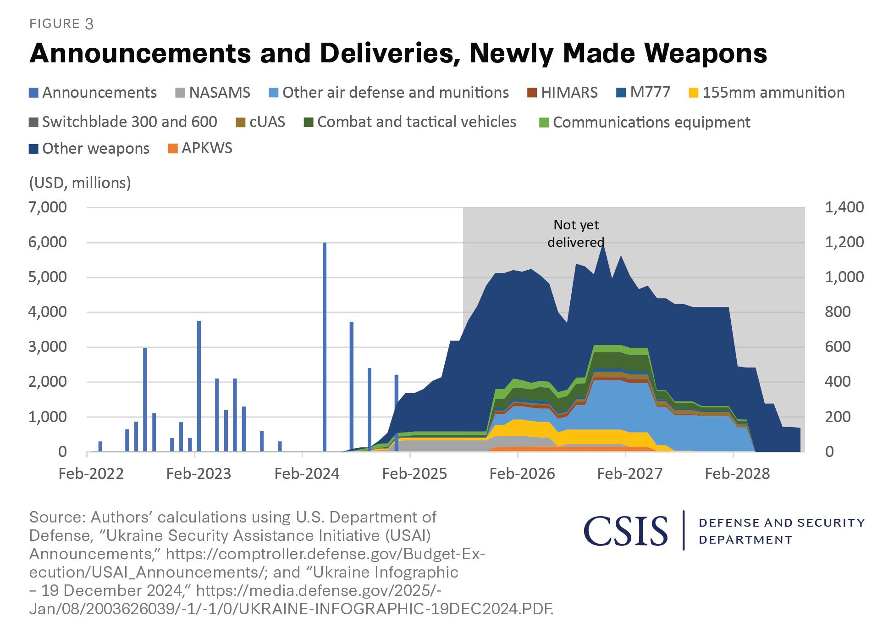
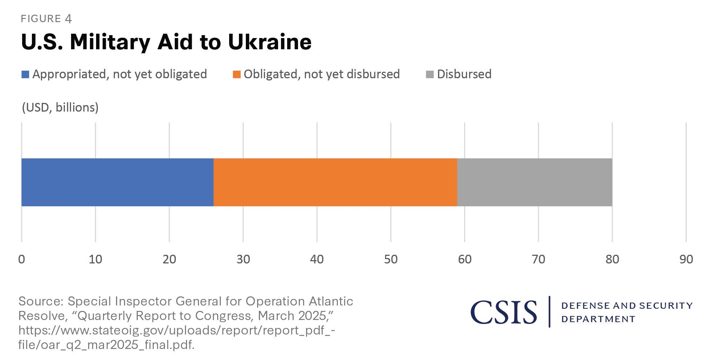

## Claim
Claim: "Ukraine is selling half of the armaments it receives from the United States"

## Actions
```
web_search("Ukraine US arms sales corruption")
web_search("Ukraine arms trafficking investigation")
```

## Evidence
### Evidence from `web_search`
Al Jazeera ([https://www.aljazeera.com/news/2025/8/2/ukraine-says-defence-sector-corruption-scheme-uncovered](https://www.aljazeera.com/news/2025/8/2/ukraine-says-defence-sector-corruption-scheme-uncovered)) reported that Ukrainian authorities detained officials over a "large-scale corruption scheme" in the defense sector, involving inflated prices for military equipment and kickbacks up to 30 percent of contract amounts <image:k>. Politico ([https://www.politico.eu/article/ukraine-uncovers-major-corruption-scheme-defense-procurment-days-after-restoring-anticorruption/](https://www.politico.eu/article/ukraine-uncovers-major-corruption-scheme-defense-procurment-days-after-restoring-anticorruption/)) also reported on a corruption scheme involving the procurement of military equipment at inflated prices, with participants receiving 30 percent of the contract amount.

PBS Frontline World ([https://www.pbs.org/frontlineworld/stories/sierraleone/context.html](https://www.pbs.org/frontlineworld/stories/sierraleone/context.html)) discusses illicit weapons, high-level corruption, and organized crime centered in Ukraine, highlighting the country's history of losing military assets through theft, discount arms sales, and lack of oversight <image:k>.


### Evidence from `web_search`
The Global Initiative Against Transnational Organized Crime published a report on June 18, 2024, discussing arms trafficking trends from the Ukraine conflict, highlighting concerns about the diversion of small arms and light weapons from Ukraine and the establishment of organized arms trafficking markets (). The Ministry of Internal Affairs of Ukraine launched the Coordination Centre to Combat Illicit Arms Trafficking on February 06, 2025 (, , , ). The Minister of Internal Affairs is implementing projects to prevent the leakage of firearms. The Head of the UN Office on Drugs and Crime Programme Office in Ukraine stated that no weapons were trafficked to the European Union.

The sources are: [https://globalinitiative.net/analysis/future-trends-in-arms-trafficking-from-the-ukraine-conflict/](https://globalinitiative.net/analysis/future-trends-in-arms-trafficking-from-the-ukraine-conflict/) and [https://www.euam-ukraine.eu/news/moia-launches-the-coordination-centre-to-combat-illicit-arms-trafficking/](https://www.euam-ukraine.eu/news/moia-launches-the-coordination-centre-to-combat-illicit-arms-trafficking/).


## Elaboration
The evidence indicates that Ukraine has a history of corruption and arms trafficking, with recent reports of corruption schemes in the defense sector ([https://www.aljazeera.com/news/2025/8/2/ukraine-says-defence-sector-corruption-scheme-uncovered](https://www.aljazeera.com/news/2025/8/2/ukraine-says-defence-sector-corruption-scheme-uncovered), [https://www.politico.eu/article/ukraine-uncovers-major-corruption-scheme-defense-procurment-days-after-restoring-anticorruption/](https://www.politico.eu/article/ukraine-uncovers-major-corruption-scheme-defense-procurment-days-after-restoring-anticorruption/)). There are also concerns about the diversion of weapons from Ukraine ([https://globalinitiative.net/analysis/future-trends-in-arms-trafficking-from-the-ukraine-conflict/](https://globalinitiative.net/analysis/future-trends-in-arms-trafficking-from-the-ukraine-conflict/)).

However, the evidence does not provide any specific data to support the claim that Ukraine is selling half of the armaments it receives from the United States.

Therefore, the claim cannot be verified with the available information.


## Actions
```
web_search("Ukraine US arms sales percentage")
web_search("Ukraine arms sales statistics")
```

## Evidence
### Evidence from `web_search`
SIPRI reports that Ukraine became the world's largest importer of major arms in 2020–24, with imports increasing nearly 100 times compared to 2015–19, and the United States accounted for 45% of the major arms supplied to Ukraine after Russia’s full-scale invasion in 2022 ([https://www.sipri.org/media/press-release/2025/ukraine-worlds-biggest-arms-importer-united-states-dominance-global-arms-exports-grows-russian](https://www.sipri.org/media/press-release/2025/ukraine-worlds-biggest-arms-importer-united-states-dominance-global-arms-exports-grows-russian)). The Washington Post reports that U.S. arms exports between 2020 and 2024 were up by more than a fifth, reaching 43 percent of the worldwide total ([https://www.washingtonpost.com/world/2025/03/09/us-arms-sales-ukraine-israel/](https://www.washingtonpost.com/world/2025/03/09/us-arms-sales-ukraine-israel/)).

The Center for Strategic and International Studies (CSIS) published an analysis of U.S. military aid to Ukraine, including the Ukraine Security Assistance Initiative (USAI) and Foreign Military Sales (FMS), with graphs illustrating the announcements and deliveries of military aid (, , , ).


### Evidence from `web_search`
Statista, in cooperation with SIPRI, published a report on arms imports from Ukraine from 2018 to 2024, by country, which does not support the claim (). Trading Economics states that Ukraine's weapons sales decreased to 23 SIPRI TIV Million in 2024 from 29 SIPRI TIV Million in 2023. The source is SIPRI.


## Elaboration
The evidence indicates that Ukraine has become a major importer of arms, with the U.S. being a primary supplier. However, there is no evidence to support the claim that Ukraine is selling half of the armaments it receives from the United States. On the contrary, arms sales from Ukraine have decreased.


## Final Judgement
The evidence shows that Ukraine is a major importer of arms, with the U.S. being a primary supplier. However, there is no evidence to support the claim that Ukraine is selling half of the armaments it receives from the United States. In fact, arms sales from Ukraine have decreased.

`false`

### Verdict: FALSE

### Justification
The claim is false. While Ukraine is a major arms importer, with the U.S. as a primary supplier, there is no evidence to support the claim that Ukraine is selling half of the armaments it receives from the United States. In fact, Ukraine's arms sales have decreased, according to [Trading Economics](https://tradingeconomics.com/ukraine/arms-exports).
